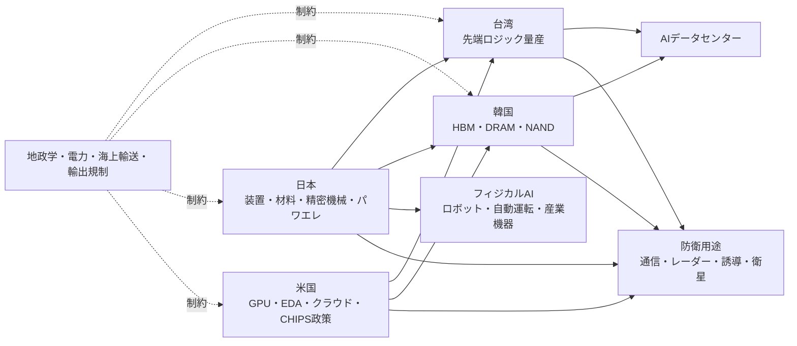
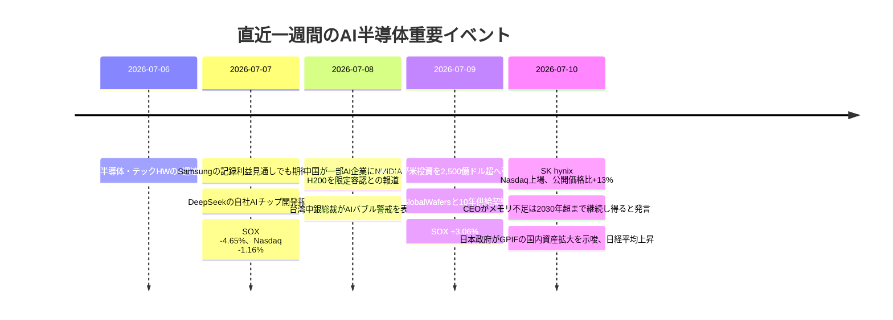

# 参考資料・素材（全文）

本セッションで扱った参考資料・素材を、省略・要約せずに全文で保存したもの。

---

## 【素材1】企画ネタ: 株 AI半導体 7-10.md

# AI半導体の直近動向と投資判断の多面的分析

## エグゼクティブサマリー

本レポートの結論を先に述べると、直近のAI半導体株の急落は、**バリュエーション調整・AI投資持続性への疑念・金利上昇懸念・地政学リスク**が同時に重なった「ポジション整理主導のスピード調整」であり、ファンダメンタルズ崩壊ではありませんでした。実際、戻り局面では、Micronの巨額投資・長期供給契約、MetaのAIチップ内製前進、TSMC/ASMLの高水準CapEx・受注残、韓国メモリーの需給期待が、**“成長の実需”が依然として強い**ことを再確認させました。Goldman Sachsも、現状は過去のバブルと韻を踏む面はあるが、主導企業の利益成長・財務体質・競争構造はドットコム期と異なると整理しています。 citeturn34search3turn34news30turn20view0turn15view0turn16view0turn40view0

投資判断としては、**コアAI半導体は「全面バブル」ではなく、「中核ボトルネック資産は強気維持、周辺テーマは選別強化」**が妥当です。とくに、先端製造・装置・HBM・先端パッケージング・電源/冷却・ロボティクス/エッジAIに近い銘柄群は、需給の物理制約と政策資本の両方で支えられています。一方で、円安・JGB利回り上昇・BOJ独立性への市場懸念は、日本株の割引率を押し上げ得るため、**日本では「円安メリットが利益に直結する輸出AI銘柄」と「国内設備投資の恩恵銘柄」を分けて見る必要**があります。 citeturn12view2turn13view1turn17view1turn20view0turn43view4turn24view1turn24view2

文中の各出典はクリック可能で、元URLに遷移できます。一次資料は各社IR、政府公表資料、BlackRock/Goldman Sachs公式、BOJ、Reutersを優先しています。 citeturn25view0turn25view3turn12view2turn40view0

## 主要結論

- **短期の投資判断**  
  先週から本日にかけての下落は、需給悪化というより「AI相場のスピード調整」です。7月7日のSOX指数下落は、AIラリー持続性への疑念、Samsung決算への失望、DeepSeekの自社AIチップ報道、Fed高金利観測が重なったことが主因でした。その後の7月9日から10日にかけては、Micronの対米大型投資、戦略顧客契約、MetaのAIチップ進展、SK Hynixの大型上場期待が反発の中心でした。 citeturn34search3turn34search0turn36news11turn36news12

- **中期の投資判断**  
  オーバーウェイト維持は、**TSMC、ASML、東京エレクトロン、Advantest、Micron、韓国HBM系、さらに日本のロボティクス/エッジAI関連**です。理由は、受注の長期化、設備増強の不可逆性、政策補助、技術ロックイン、サプライチェーン代替の難しさです。 citeturn17view1turn17view2turn20view0turn16view0turn44view0turn32search1

- **バブル判定**  
  「AI株全体」は一部過熱ですが、**AI半導体の中核層はドットコム型の空洞バブルではない**という見方が妥当です。Goldman Sachsは、現相場は高集中・高バリュエーション・資本集約化というバブル類似要素を認めつつも、主導企業の業績伸長と強いBS、競争の集中を相違点として挙げています。 citeturn40view0turn40view2

- **日本株の見方**  
  日本は、先端半導体の設備・材料に加え、**フィジカルAIの社会実装で不可欠な「精密機械、モーション、センサー、品質保証、電源・受動部品」**を握っています。高市政権の成長戦略、METIのAI・半導体エコシステム政策、日米のTechnology Prosperity Dealは、日本企業の設備投資と案件創出を後押しし得ます。円安局面では、Advantestのように利益感応度が高い銘柄が有利ですが、国内金利上昇が割引率を押し上げる点には注意が必要です。 citeturn25view4turn44view0turn32search1turn24view1turn43view4

## 直近相場の急落と反発

直近1週間のAI半導体株の値動きは、単一要因ではなく、**期待の修正と確信の再構築**が数日単位で交錯した相場でした。先行シグナルは6月23日の広範な半導体売りで、ReutersによればSOX指数は約8%下落し、Nvidiaも約4%下げました。7月7日には疑心暗鬼が再燃し、SOX指数は4.65%安、Micronは4.7%安、Sandiskは7.3%安となり、背景には「AIデータセンター需要の飽和懸念」「Samsung決算が高い期待を満たさなかったこと」「中国DeepSeekの自社AIチップ報道」がありました。7月9日には一転してSOX指数が3.06%上昇し、Micronの4.5%高を中心に反発。7月10日の東京市場前場でも、日経平均は1.77%高、SUMCOは15%超高、Advantestと東京エレクトロンは3%超高でした。 citeturn36search4turn34search3turn34search0turn34news30turn37view0

financeturn2finance0

### 時系列整理

| 日付 | 市場反応 | 主因 | 定量ファクト |
|---|---|---|---|
| 6月23日 | 半導体全面安 | 高値警戒、Fed高金利観測、利益確定 | SOXほぼ8%安、Nasdaq 2.2%安、Nvidia約4%安。 citeturn36search4turn34search1 |
| 7月6日 | 半導体に一時安心感 | BroadcomとAppleの2031年までの提携延長 | Apple向け売上はBroadcom年商の約20%。長期供給安心感が支援。 citeturn34news31 |
| 7月7日 | 急落再開 | AI投資継続性への疑念、Samsung決算失望、DeepSeek報道 | SOX 4.65%安、Micron 4.7%安、Sandisk 7.3%安、Nasdaq 1.16%安。米株出来高は175億株で20日平均233億株を下回る。 citeturn34search3turn34search6 |
| 7月8日 | アジア・欧州で波及安 | メモリー期待の剥落、AIプレミアム圧縮 | Samsung 7.6%安、SK Hynix 5.2%安。欧州テックも売られ、ASML下落がセンチメント悪化を増幅。 citeturn1news36turn1news37turn1search8 |
| 7月9日 東京 | 日本株反発 | 米半導体高、Nvidia H200の対中販売一部容認報道、MetaのカナダDC報道 | 日経平均 1.38%高、東証プライム売買代金 9.60兆円。AI・半導体株が主導。ただしETF分配金捻出売り警戒は約1兆円。 citeturn35view0 |
| 7月9日 米国引け | 反発本格化 | Micronの対米大型投資、MetaのAIチップ進展、SK Hynix ADR期待 | SOX 3.06%高、Micron 4.5%高、Applied 3.2%高、Sandisk 7.6%高。 citeturn34news30turn36news11 |
| 7月10日 東京前場 | 続伸 | 前日の米ハイテク高、KOSPI急伸、年金資金の国内投資拡大観測 | 日経平均 1.77%高、一時6万9000円回復。SUMCO 15%超高、Advantest/TEL 3%超高、前場売買代金 5.28兆円。 citeturn37view0turn43view2 |

### 主要銘柄の比較

| 銘柄 | 急落局面の論点 | 反発局面の論点 | 投資上の含意 |
|---|---|---|---|
| Micron | AIメモリー需要のピーク懸念に最も敏感で、7月7日に4.7%安。 citeturn34search3 | 7月9日は大型投資計画と戦略顧客契約で4.5%高。Q3 2026売上は414.6億ドル、Q4ガイダンスは500億ドル±10億ドル。 citeturn36news11turn20view1 | 需給ひっ迫が続く限り高ベータで上向くが、メモリーは循環性が大きい。 |
| Broadcom | 7月初にApple依存不安が残存。 citeturn34news31 | Appleとの2031年までの供給契約延長で安心感。 citeturn34news31 | カスタムAI ASICと非AI事業の分散が強み。 |
| TSMC | AI供給逼迫への期待は強いが、グローバル景気やコスト増が重荷。 citeturn17view1 | AI需要を受けてCapEx上積みを継続。高度実装も「very tight」。 citeturn15view0turn17view2 | 先端ロジックと先端パッケージのボトルネック保有者。 |
| ASML | バリュエーション調整時に売られやすい装置大手。欧州テック安の象徴。 citeturn1search8 | 2025年末受注残388億ユーロ、Q4受注132億ユーロが下値支え。 citeturn16view0 | 短期ノイズでも中期受注残が厚い。 |
| Samsung・SK Hynix | 高期待に対し決算・需給期待が届かず7月8日に急落。 citeturn1news36turn1news37 | 7月10日にはKOSPI急伸、SK Hynix米上場期待がセンチメント改善。 citeturn36news12 | HBM主導の回復余地は大きいが、価格期待修正に脆弱。 |
| Advantest・東京エレクトロン | 日本のAI/半導体代表株としてボラティリティが高い。 citeturn35view0 | 7月9〜10日に日本市場の指数上昇をけん引。 citeturn35view0turn37view0 | 日本株の中ではAI需要を最も直接的に利益へ変換するグループ。 |

今回の反発が重要なのは、戻りの材料が「ショートカバー」だけではなく、**設備投資・長期契約・製品投入・政策連携**という、将来CFに直接つながるイベントだった点です。言い換えると、相場は「AI capexは過熱か」という問いから、「どの企業が実需と契約でその投資を回収できるか」という問いへ移りつつあります。 citeturn20view0turn20view2turn34news30turn37view0

## 設備投資継続の根拠とバブル判定

### 設備投資が止まらない理由

企業が投資を継続する理由は、単なる「強気の経営者心理」ではありません。第一に、**需給のひっ迫と長期可視性**です。Micronは、2026年HBM供給について価格・数量契約を完了済みとし、その後さらに、戦略顧客契約に基づく**220億ドルの金融コミットメント（うち約180億ドルが現金預託）**を見込むと開示しました。これは同社の2026年見込みCapEx約270億ドルの約67%を事実上前受け資金でカバーし得る規模で、外部資金依存を大きく下げます。 citeturn15view1turn20view0

第二に、**先端製造・実装の物理制約**です。TSMCは2026年CapExを**520億〜560億ドルレンジの高位**に引き上げ、Q1時点で「全社稼働率が想定以上に高い」と説明しました。加えて、先端パッケージング能力は「very tight」で、AI需要を満たすためクリーンルーム建設と工具調達の前倒しを進めています。これは供給制約が短期で解けないことを意味します。 citeturn17view1turn15view0turn17view2

第三に、**装置側の長い受注残**です。ASMLの2025年末受注残は**388億ユーロ**で、2025年売上327億ユーロの**約1.19倍**に達しました。Q4受注は132億ユーロ、そのうちEUVが74億ユーロでした。AI向けロジック・メモリーの微細化が進むほど露光回数が増えるため、AI普及そのものがASMLの装置需要を増やす構造です。 citeturn16view0turn15view2

第四に、**大企業顧客側の巨額投資継続**です。BlackRockは、米大手テックの2026年AI関連支出が**約8,000億ドル**に達し、2030年までの累積額が**10兆ドル**規模になり得ると見ています。Goldman Sachsも、AI相場の主導企業は従来型バブルと違って強いバランスシートを持ち、投機一本槍ではないと評価しています。つまり、供給側の投資は、需要側の資金調達能力と整合的です。 citeturn12view2turn40view0

### 投資継続の定量比較

| 企業 | 需要可視性 | 投資額・受注残 | 稼働・需給の示唆 | 投資上の含意 |
|---|---|---|---|---|
| TSMC | AIアクセラレータ需要の長期CAGRを「50%台後半」と説明。 citeturn17view2 | 2026年CapExは520億〜560億ドルの高位。Q1 CapExは111億ドル。 citeturn17view1turn18view0 | Q1は全社稼働率が想定以上、先端パッケージは「very tight」。 citeturn17view1turn17view2 | 供給制約を抱えたまま成長、価格決定力が維持されやすい。 |
| Micron | 2026年HBM供給の価格・数量合意済み。戦略契約にボリューム拘束。 citeturn15view1turn20view0 | 2026年CapEx約270億ドル。戦略顧客契約の金融コミットメント220億ドル、うち現金預託180億ドル。 citeturn20view0 | 需給タイトは2026年超まで持続と会社説明。Q3時点で記録的業績。 citeturn15view1turn20view1 | 需給悪化シナリオへの耐性が同業比で高い。 |
| ASML | AI採用拡大で半導体産業は強いと説明。 citeturn15view2 | 2025年末受注残388億ユーロ、Q4受注132億ユーロ。2026年売上見通し360億〜400億ユーロ。 citeturn16view0turn15view2 | EUV/DUVの装置供給は長サイクル。短期ノイズより中期需給に左右。 | 装置セクターの中核ボトルネック。 |
| NVIDIA | FY2026売上2159億ドル、FY2027 Q1売上816億ドル。 citeturn14search7turn14search3 | 高収益で自己資金創出力が非常に大きい。 | 需要側も強いFCFで供給チェーン投資を可能にする。 | サプライチェーン全体の投資継続を支える起点。 |

簡易感度分析を置くと、Micronの**180億ドル現金預託 ÷ 270億ドルCapEx ≒ 67%**であり、仮にAI需要が短期的に1割鈍化しても、すでに拘束された長期契約があるため、設備投資の回収見通しは一気には崩れません。ASMLも、受注残が前年売上の1.19倍あるため、仮に今後の新規受注が1割減っても、直近年度の売上には即時にフルインパクトしにくい構造です。TSMCは高CapExですが、Q1時点で営業CFがTWD6990億、Q1 CapExがTWD3510億で、**営業CFの約半分を投資に回しても配当を維持**しています。つまり、設備投資継続は「楽観」ではなく「契約とCF」に支えられています。 citeturn20view0turn16view0turn18view0

### バブルか否か

結論として、**AI半導体のコア領域は「バブルではない」と断言するのではなく、「ドットコム型の空洞バブルではまだない」**という表現が最も適切です。Goldman Sachsは、絶対バリュエーション上昇・市場集中・資本集約化・ベンダーファイナンスなど、過去のバブルに似た要素を認めつつも、現状のテック上昇は「将来夢想」より**実際の利益成長**に支えられており、主導企業のBSが強いこと、競争が少数の既存大手に集中していることを差異として挙げています。 citeturn40view0

Stanford HAIの2026 AI Indexは、生成AIの人口普及率が**3年で53%**に達し、PCやインターネットより速いと示しました。また、米国のAI民間投資は2025年に**2859億ドル**、米国内のデータセンターは**5427カ所**で、主要AIチップの大半が台湾TSMCに依存していると指摘しています。これは、AIがドットコム期の「将来使われるかもしれない技術」ではなく、すでに実装が進み、しかも物理供給制約を伴うインフラ産業化の段階にあることを示します。 citeturn40view3

| 論点 | ドットコム期 | 現在のAI半導体相場 | 投資判断 |
|---|---|---|---|
| 収益性 | 利益なき成長企業が多く、IT投資拡大に占めるドットコム要因は一部だった。 citeturn39search1 | NVIDIA FY2026売上2159億ドル・粗利率71.1%、TSMC Q1粗利率66.2%、ASML 2025粗利率52.8%、Micron Q3粗利率84.6%。 citeturn14search7turn18view0turn16view0turn20view1 | コア層は現実の利益を伴う。 |
| 顧客実装 | ネット利用の普及は速かったが、事業化の質が未成熟。 | 生成AI普及率53%、消費者便益も年1720億ドル相当。 citeturn40view3 | 実装の厚みは過去より大きい。 |
| ハード制約 | 主にソフト・通信・広告。供給ボトルネックは限定的。 | HBM、先端露光、先端パッケージ、電力・冷却が制約。 citeturn17view2turn12view2 | 供給制約が参入障壁になる。 |
| サプライチェーン | 比較的分散。 | 先端AIチップの多くが台湾の単一大手ファウンドリ依存。 citeturn40view3 | 地政学プレミアムが不可避。 |
| 国家介入 | 産業政策は現在ほど強くない。 | CHIPS、輸出規制、補助金、戦略投資が前提。 citeturn30search3turn25view4turn30search2turn30search5 | 政策が収益機会とリスクの両方。 |

したがって、投資実務では「AIはバブルか」という二分法より、**どのレイヤーが“価格だけ先行”で、どのレイヤーが“供給ボトルネック＋契約＋政策”の三重支援を持つか**で切り分けるべきです。前者は周辺ソフト・物語株、後者は先端製造・装置・HBM・ロボティクス実装群です。 citeturn40view0turn12view2turn20view0

## 半導体戦争と国家戦略

半導体をめぐる各国の政策は、景気対策ではなく、**産業競争力・経済安全保障・軍事優位の同時追求**です。日本のMETIは半導体を「産業のコメ」と位置づけ、2026年改訂戦略で**AI技術利活用・フィジカルAI・半導体製造・デジタルインフラ・サイバー・人材**を一体で見るエコシステム戦略へ移行しました。高市政権下の日本成長戦略でも、AI・半導体は17の戦略分野の筆頭に置かれています。 citeturn44view0turn12view1

米国は、半導体を16の重要インフラすべてに不可欠と位置づけ、軍事・エネルギー・通信・医療での依存を国家安全保障問題として扱っています。商務省は2026年1月時点で、台湾系・技術系企業による対米直接投資を少なくとも**2500億ドル**とし、さらに商務長官の説明では半導体案件の累計公表投資は**2790億ドルから5550億ドルへ倍増**したとしています。韓国は**26兆ウォン**規模の半導体エコシステム支援策を打ち出し、台湾は**37.7億台湾ドル**の12インチ先端パイロットラインなどで“先端製造の戦略的パートナー”としての地位維持を狙っています。 citeturn30search3turn28search1turn28search9turn30search2turn30search5

### なぜ四カ国が注力するのか

| 国 | 歴史的背景 | 直近の政策論理 | 投資家にとっての意味 |
|---|---|---|---|
| 日本 | 1980年代のメモリー覇権から後退したが、装置・材料・製造品質で優位を保持。半導体不足と経済安全保障で再投資へ。 citeturn44view0turn28search10 | AI・半導体を成長戦略の最上位分野に置き、フィジカルAIまで含む戦略に拡張。 citeturn12view1turn44view0 | 装置・素材・ロボティクス・パワエレが再評価されやすい。 |
| 米国 | 設計・EDA・クラウドで優位だが製造空洞化への危機感。 | 半導体は重要インフラと軍事力の基盤。国内製造回帰と同盟再編を推進。 citeturn30search3turn30search7turn28search1 | 設計と政策補助の両面で主導。だが対中規制と台湾依存がリスク。 |
| 韓国 | DRAM/NAND/HBMの圧倒的蓄積。輸出主導の国家戦略産業。 | 26兆ウォン支援でエコシステム全体を強化し、世界半導体競争で主導権維持。 citeturn30search2 | HBMサイクルの最重要市場。高βだが供給規律が鍵。 |
| 台湾 | 先端ファウンドリ集積で世界AI供給の心臓部。 | 研究機関運営の先端パイロットライン整備と装置産業育成でリーダー維持。 citeturn30search5turn30search1 | 地政学的リスクは最大だが、ボトルネック価値も最大。 |

### 半導体戦争の構図



防衛面では、日米の公的資料が、半導体・マイクロエレクトロニクスをAI・5G・次世代兵器・レーダー・慣性誘導・GPS・衛星・製造制御の中核と位置づけています。日本の防衛省有識者レポートは、各国が半導体を最重要技術とみなし、懸念国依存を避けようとしていると指摘し、米国防総省は、半導体不足が先進兵器システムを遅らせたと認めています。つまり、半導体戦争は商業競争であると同時に、**軍民両用の基盤技術をめぐる安全保障競争**です。 citeturn28search2turn29search3turn29search8turn29search17

### 金融機関レポートと高市政権の政策評価

BlackRockは、2026年のAI投資を「速度と希少性」のテーマで捉え、**テック単独ではなく、電力・インフラ・アジア供給網に投資レンズを拡張すべき**と示唆しています。同社は、AI普及で米大手テックのAI支出が2026年に約8000億ドル、2030年までに累計10兆ドルに達し得るとみる一方、メモリー需給は少なくとも2年間、需要が供給を20〜30%上回ると分析しています。日本企業にとっては、半導体そのものだけでなく、電源、冷却、設備、部材、FAまで含めた周辺レイヤーに長期案件が波及するという意味です。 citeturn12view2turn13view1

Goldman Sachsは、AI相場にバブル類似要素を認めつつも、「今のところはバブルではない」として、上昇が**実際の利益成長・強いBS・少数 incumbents 主導**に支えられていると評価しました。これは、日本企業に当てはめると、物語株よりも、事業基盤・契約・現場導入のある企業が優位という解釈になります。 citeturn40view0turn40view2

高市政権の政策面では、第一に、2026年の日本成長戦略会議でAI・半導体を17の戦略分野の最上位とし、分野横断課題として投資促進・金融・人材を並行処理する枠組みが導入されました。第二に、Reutersが確認した経済青写真では、戦略分野への官民投資を**2040年度までに370兆円超**へ拡大する方針が示され、AI・半導体はその中核です。第三に、施政方針演説でも、地域クラスター形成・インフラ整備・行政AI化が打ち出されました。総合すると、政策は「補助金単発」ではなく、**長期の案件創出、国内立地、国内調達、データセンター、地方製造拠点形成**を促す方向です。 citeturn25view3turn25view4turn25view0turn12view1

## フィジカルAIと日本企業

フィジカルAIの社会実装で日本が重要になる理由は、AIモデル開発力よりも、**現場実装に必要な精密機構・センサー・画像認識・制御・アクチュエーション・高信頼量産**を厚く持っているからです。METIは2026年改訂戦略でフィジカルAIを明示的に政策対象に入れ、Stanford HAIは先端AIチップ供給が台湾単一大手に依存する一方、社会実装には電力・設備・産業機器まで含む広いエコシステムが必要と示しています。 citeturn44view0turn40view3

ロボティクスでみると、日本は2024年の産業用ロボット導入で世界第2位、稼働ストックは45万台超です。さらにIFRによれば、日本は依然として世界有数のロボット生産国であり、製造現場の自動化ノウハウと部品供給力の蓄積が厚い。これはヒューマノイドやAMRだけでなく、**工作機械、物流、半導体搬送、検査、車載組立**など、フィジカルAIの現実的立ち上がり局面に強いことを意味します。 citeturn33search5turn33search12

米国が日本に「ものづくり」を期待する理由も、同盟関係だけではありません。2025年の日米首脳共同声明、2025年のU.S.-Japan Technology Prosperity Deal、2026年の日米戦略投資イニシアティブは、AI、先端半導体、量子、重要鉱物、サプライチェーン強靭化を共通課題としています。米国は設計・クラウド・研究を、そして日本は装置・材料・精密実装・量産品質を担うという、**機能分業型の同盟産業政策**が見えてきています。 citeturn33search3turn32search1turn32search4turn32search8

### 注目の日本企業

| 企業 | 業種別役割 | 事業内容・強み | 関連製品 | 主な投資リスク |
|---|---|---|---|---|
| FANUC | 産業ロボット・CNC | FA、ROBOT、ROBOMACHINEを一体提供できる総合力。工場自動化の標準インフラ企業。 citeturn45search4 | 産業用ロボット、CNC、サーボ | 設備投資循環、中国景気、FA受注の振れ。 |
| 安川電機 | モーション制御・ロボット | MOTOMANとACドライブ/サーボの接続性向上を進める、ロボットと駆動の強い統合プレーヤー。 citeturn45search1 | MOTOMAN、ACサーボ、インバータ | 中国依存、FAサイクル、競争激化。 |
| キーエンス | 視覚AI・工場検査 | ルールベースとAIを組み合わせた画像検査に強く、ダウンタイム削減と歩留まり改善に直結。 citeturn33search2turn33search6 | AIビジョン、センサー、コード読取 | 高評価バリュエーション、設備投資鈍化時のマルチプル圧縮。 |
| オムロン | 制御・モバイルロボット | AI搭載コントローラ、i-BELT、モバイルロボットで“現場データ→制御”の閉ループを持つ。 citeturn45search2turn45search5 | AIコントローラ、AMR、制御機器 | 収益改善の継続性、競合との価格競争。 |
| ルネサス | エッジAI半導体 | Edge AI・Physical AIを資本市場説明会で明示。プロセッサ、電源、アナログ、接続をまとめて出せる。 citeturn45search3turn45search6turn45search9 | MCU、SoC、産業/車載Edge AI | 車載・産業需要の循環、統合後シナジー実行。 |
| 村田製作所 | センサー・エッジAIモジュール | 小型高信頼モジュール化が得意で、Edge TPU搭載MCMや車載MEMS/レーダー周辺に強い。 citeturn46search0turn46search6turn46search12turn46search21 | Edge AIモジュール、MEMS、mmWave | スマホ比率、価格競争、顧客集中。 |
| THK | 精密モーション・ヒューマノイド部材 | LMガイド、ボールねじ、アクチュエータで“動きの品質”を担う。ヒューマノイド開発も進める。 citeturn46search14turn46search5turn46search2 | LMガイド、アクチュエータ、ロボット部材 | 工作機械循環、量産立上げの時間差。 |
| ニデック | モーター・駆動系 | AI社会基盤、半導体搬送ロボット、精密減速機、サーボ領域まで展開。モーター起点の実装力。 citeturn46search4turn46search7turn46search10turn46search16 | 精密モーター、ロボット用駆動、e-Axle | M&A統合、収益性ばらつき、EV需要変動。 |
| アドバンテスト | テスト・品質保証 | AIの戦略的重要性拡大を見込み、中計目標を引き上げ。AIサーバー用SoC/HBMのテスト需要を享受。 citeturn22search6turn24view1 | SoCテスタ、メモリテスタ | 半導体投資サイクル、高評価、顧客集中。 |
| 東京エレクトロン | 半導体製造装置 | 輸出は円建て中心で為替影響が小さく、AI半導体向けWFE需要の質で勝負できる。 citeturn24view2turn21search6 | 成膜、エッチング、洗浄、塗布現像 | WFE循環、輸出規制、最先端投資のタイミングずれ。 |

私の見立てでは、フィジカルAIで日本企業が最も強いのは、**「頭脳」より「身体」を構成するレイヤー**です。つまり、センサー、視覚、モーション、精密搬送、品質保証、エッジ実装です。米国が日本に期待するのもこの部分で、米国がアルゴリズム、モデル、クラウド、先端設計を押さえ、日本が量産品質・部材・装置・機械を押さえる役割分担は、経済合理性と地政学合理性の双方に合致しています。 citeturn32search1turn32search4turn44view0turn33search5

## 円安政策と投資インパクト

「なぜ日本は円安を止める気がないのか」という問いに対しては、厳密には、**日本は円安を放置しているのではなく、止めるコストが高すぎるため、急速な是正を選んでいない**という理解が適切です。BOJは2026年6月に政策金利を**1%**へ引き上げており、これは31年ぶりの水準です。ただし、Reutersによれば、高市政権は積極財政と慎重な利上げ志向を持ち、市場ではBOJ独立性への懸念から10年JGB利回りが**2.865%**と30年ぶり高水準まで上昇しました。つまり、円安是正のために大幅利上げを急げば、国債市場と財政に逆風が出る構図です。 citeturn43view4turn42search2turn43view1

政策面では、高市政権の経済青写真は、BOJに「より強い経済」を支えるよう求める文言を残しつつ、独立性への言及を後から補強するという綱渡りになっています。Reutersは、政府が従来の単年度PB黒字目標を外し、債務GDP比の安定的低下を主目標へ切り替える方向だと報じています。これは、利上げで需要を抑えるより、**名目成長と投資で債務負担を相対的に薄める戦略**に近い。結果として、通貨防衛より成長と投資を優先していると市場に映りやすいのです。 citeturn25view4turn43view3turn43view4

一方で、政府は円安対策を完全に諦めたわけでもありません。7月10日には、GPIFを含む年金基金の**国内資産投資拡大**という、為替介入ではなく資本フロー構造を変えるアプローチが報じられ、円は162円近辺から161.285円まで戻しました。これは、短期のドル売り介入よりも、**国内資産への恒常的な資金還流で円を支える**発想です。 citeturn43view2

### 為替感応度の投資インパクト

日本のAI・半導体関連株では、円安の効き方がかなり異なります。Advantestは2026年度の会社前提として、**対ドル1円の円安で営業利益が約40億円増加**すると開示しています。これをそのまま使えば、たとえば想定為替150円/ドルに対し実勢が160円/ドルなら、単純計算で営業利益押上げは**約400億円**です。他方、東京エレクトロンは、輸出売上を原則円建てとしており、通常の範囲では為替影響は「軽微」と説明しています。Renesasは2Q 2026見通しで、**対ドル1円の変動が売上約180億円、営業利益約80億円**に相当する感応度を示しています。 citeturn24view1turn24view2turn24view0

| 企業 | 為替感応度 | 投資上の読み方 |
|---|---|---|
| Advantest | 対ドル1円の円安で営業利益 +40億円。 citeturn24view1 | 円安継続の最大受益銘柄の一つ。 |
| Renesas | 1円変動で売上 +約180億円、営業利益 +約80億円相当の感応度テーブルを開示。 citeturn24view0 | 為替が業績弾性を大きく左右。 |
| 東京エレクトロン | 輸出は円建て中心で利益影響は軽微。 citeturn24view2 | 為替よりWFEサイクルが主因。 |
| 日本の内需・小売 | 円安はコスト増・消費圧迫要因。Fast Retailingも4Qへの悪影響を警戒。 citeturn41news34 | 円安“勝ち組/負け組”の選別が必要。 |

投資判断としては、円安が続く間、日本のAI・半導体では**輸出比率が高く、為替感応度が明示されている企業**を優先しやすい一方、JGB利回り上昇と日銀・政府の政策不透明感は、日本株全体の割引率上昇要因です。したがって、2026年後半の日本株戦略は、「円安メリット × AI需要直結 × 政策支援」の三条件を満たす銘柄に絞るのが最も合理的です。 citeturn43view4turn24view1turn44view0turn25view4

---

## 【素材2】企画ネタ: 株 AI半導体 7-11.md

# AI半導体投資アップデート

## エグゼクティブサマリー

今回の急落は、**ファンダメンタルズ崩壊ではなく、AI半導体に対する「高すぎる期待」の巻き戻し**として理解するのが最も正確です。起点は、サムスン電子の記録的な利益見通しですら投資家の期待を満たせなかったこと、DeepSeekの自社AIチップ開発報道がNVIDIA依存の長期持続性に疑義を投げかけたこと、そしてヘッジファンドが半導体・テックハードウェアを4週連続で売っていたことです。しかも7/7の下落は、米株全体の売買代金が20日平均を大きく下回る「軽い出来高」で起きており、投げ売りというより**混み合ったロングの整理**でした。Reutersによれば7/7のPHLX半導体指数は4.65%下落し、米国取引所の総出来高は175億株と20日平均233億株を下回りました。 citeturn43view2turn45search2

7/9〜7/10の戻りも、単なる自律反発ではありません。**買い手は長期資金・ETF・セクター資金で、材料は「供給不足が続く」という確信の再確認**でした。Micronは7/9に米国内投資計画を2035年までに2,500億ドル超へ引き上げ、同日にGlobalWafersとの10年供給契約も公表しました。7/10にはSK hynixのNasdaq上場が公開価格比13%高で着地し、同社CEOはメモリ供給不足が2030年を超えて続く可能性を示しました。あわせて、7/8週には米国株ファンドへ249.7億ドル、米テックファンドへ97.1億ドル、グローバル技術セクターへ114.9億ドルの資金流入が確認されています。 citeturn12search0turn12search1turn12search4turn13news24turn45news15turn45news13

したがって、企業が設備投資を止めない理由は明快です。**需要見通しが鈍っていないから**です。TSMCは2026年の設備投資見通しを520億〜560億ドルへ引き上げ、AI需要を「極めて力強い」と述べました。ASMLは2026年売上見通しを360億〜400億ユーロへ引き上げ、需要が供給を上回るとしています。Micronは220億ドルの受注を確認し、自動車向けではGM・Fordと戦略契約、原材料ではGlobalWafersと10年契約を結びました。SK hynixは「2027年に史上最悪の供給不足」とまで述べています。つまり今の投資は、景気敏感な循環投資というより、**AI計算資源・HBM・先端製造能力という“構造的不足資産”への前倒し投資**です。 citeturn13search0turn13search1turn13search2turn13search5turn12search1turn12search3turn13news24

バブルかどうかについての私の結論は、**「インデックス全体としてはドットコム型バブルではないが、個別銘柄とテーマの一部には明らかな過熱がある」**です。BlackRockは重要なのは歴史的バリュエーションの高さではなく将来利益の持続性だと論じ、S&P500の12カ月先予想PERは約21倍と説明しています。UBSはPHLX半導体指数のフォワードPERを約26倍とし、ドットコム期ピークの150倍超とは構造が異なると述べます。Goldman Sachsも、今のAI相場はファンダメンタル成長・強いバランスシート・少数の既存覇者に支えられている点で、通常のバブル形成と異なると整理しています。ただし、Taiwan中央銀行総裁が7/9にAIバブル・レバレッジのリスクへ警鐘を鳴らした通り、**“良い産業”と“良い株価”は別問題**です。 citeturn42view0turn42view5turn31search6turn30news31

日本株の観点では、最も重要なのは**「フィジカルAIは日本の勝ち筋に直結する」**という政策・産業の一致です。7/10の高市内閣・人工知能戦略本部資料は、バーティカルAIとフィジカルAIを明示的に日本の重点領域と位置付け、国内で開発・製造されるAIインフラ、半導体、ロボティクス、多用途ロボット、自動運転の研究開発と社会実装を加速するとしています。半導体だけでなく、精密位置決め、サーボ、減速機、画像検査、FAセンサー、ロボットSI、現場データを一体で持つ日本企業群は、**“AIが物理世界に降りる局面”で不可欠なサプライヤー**です。 citeturn19view0turn20view0turn20view1turn20view2

## 直近一週間の市場変動

本稿では、ユーザー指定に従い**2026-07-04〜2026-07-11 JST**を「先週から今日」までの期間として整理します。足元の終値ベースでは、NVIDIAは210.96ドル、SMHは611.03ドル、SOXXは581.34ドルで、7/10時点の日経平均は68,557.73円でした。7/7に米半導体が大きく崩れた一方、7/9〜7/10にかけて米国ではPHLX半導体指数が3日続伸、日本では年金国内回帰観測とAI関連の再評価が重なり、日経平均も上昇しました。 citeturn27finance0turn27finance4turn27finance5turn29search4turn43view1

financeturn27finance5



上のタイムラインが示す通り、急落と反発は同じ根っこを持っています。すなわち、**AI需要そのものではなく、その需要の“継続期間”と“誰が儲けるか”の再価格付け**です。7/7は「利益は出ているが期待がさらに上だった」局面、7/9〜7/10は「やはり供給不足は長く続く」局面でした。 citeturn43view2turn9search16turn11search16turn13news24turn29news15

### 急落した理由

最も直接的なトリガーは7/7の米国市場です。Reutersによれば、Samsungの“19倍増益”級の強いガイダンスでも投資家は満足せず、Micronが4.7%安、Sandiskが7.3%安、PHLX半導体指数が4.65%安となりました。背景には、AIデータセンター投資の伸びの持続性に対する疑念と、「良い決算でも上がらない」ほど高くなった期待値がありました。Reutersはこの日の米市場総出来高が175億株と20日平均233億株を下回ったと伝えており、**需給主導のリスク削減**色が強かったことが分かります。 citeturn43view2

これに重なったのが、7/7のDeepSeek自社AIチップ開発報道です。これはすぐにNVIDIAの売上を剥落させる話ではありませんが、投資家には「モデル層・クラウド層・大口顧客が内製へ進むなら、GPUの超過利潤は将来どこまで続くのか」という問いを突き付けました。AI相場の本質は絶対需要ではなく、**誰が利益プールを独占するか**なので、この種の報道は株価には大きく効きます。 citeturn43view2turn9news21

ポジショニング面では、Goldman Sachsのプライムブローカレッジ・データを引用したReuters系報道で、**ヘッジファンドがテックハードウェアと半導体を4週連続で売っていた**ことが意識されました。私はこれを、景気後退を織り込むディフェンシブ回転というより、H1までのAI勝ち組ポジションを守るための利益確定とみています。つまり、下落の本体は“弱気の新規建て”より“過密ロングの縮小”です。 citeturn45search2turn45search1

オプション市場も、全面崩壊のシグナルというより**ヘッジを伴った強気残存**を示していました。Cboeの7/7オプション市場総出来高は6,725万契約でした。個別ではNVDAのオープンインタレスト・ベースのプット/コール比率は0.82、7/7時点の30日出来高ベースのプット/コール比率は0.2605、足元セッションの出来高ベースでは0.44、内訳はプット74.6万枚・コール167.8万枚でした。定義の異なる指標を横並びで読む際には注意が必要ですが、**プット買いが増えても、コール優位そのものは崩れていない**というのが実態です。これは、暴落を見込むより「上昇テーマを持ちながらヘッジを厚くした」取引像と整合的です。 citeturn44search1turn44search0turn44search11turn44search14

### 戻った理由

7/9の戻りは、Micronが市場心理を一気に変えたことが大きいです。Reutersによれば、Micronは米国内投資を2035年までに2,500億ドル超へ引き上げ、同時に最大30億ドルの米サプライチェーン強化投資、GlobalWafers向け5億ドル支援、さらに**10年の生シリコンウエハ供給契約**を打ち出しました。これは単なる設備増強ではなく、**原材料から長期調達を固定し、AIメモリ不足を前提に供給網を押さえにいく行動**です。市場はこの日、Nasdaqが1.30%高、PHLX半導体指数が3.06%高で反応しました。 citeturn12search0turn12search1turn11search16turn8view1

加えて、7/8には中国がAlibaba、ByteDance、DeepSeekなど一部の中国AI企業にNVIDIA H200を限定的に認める方向と報じられました。数量は限定的でも、重要なのは**中国売上がゼロに向かうシナリオが後退した**ことです。NVIDIAにとって中国は数量・エコシステム・競争上の重要市場であり、このニュースは需給の最悪ケースを和らげました。 citeturn9search16turn9search5

7/10にはSK hynixのNasdaq上場が公開価格149ドルに対して170ドルで引け、13%高で着地しました。さらに同社CEOは、メモリ供給不足が2027年に「最悪水準」となり、その後も2030年を超えて需要が供給を上回る可能性を示しました。HBMサイクルの中心企業がこの見方を示したことで、Micron、Samsung、装置・材料株まで含めた**メモリ供給鎖全体のマルチプル再拡大**が起きやすくなりました。 citeturn43view1turn13news24

買い手の性格も重要です。週次フローでは、7/8までの1週間に米国株ファンドへ249.7億ドル、米テクノロジー・セクターファンドへ97.1億ドル、グローバルではテクノロジー・セクターへ114.9億ドルの流入がありました。いっぽう、ヘッジファンドは前段で売っていたため、7/9〜7/10の反発は、**長期資金・ETF・セクターファンドの押し目買いとショート／アンダーウエートの買い戻し**が主体だった可能性が高い、というのが私の見立てです。これは推論ですが、ファンドフロー統計とGoldman系のポジション情報はその解釈を支持します。なお、7/10の米市場総出来高は145億株と20日平均224億株を下回っており、反発は本格的な“総強気復帰”よりも**選択的な再参入**でした。 citeturn45news15turn45news13turn45search2turn43view1turn27finance4turn27finance5

## 設備投資継続とバブル論

### 企業が設備投資を止めない理由

TSMCは2026年4月に、通年売上見通しを引き上げ、**2026年設備投資を520億〜560億ドルへ増額**しました。さらに6月の株主総会では、CEOが「AI需要は極めて力強く、緩和の兆しはない」と述べています。先端ロジックの実需に対してボトルネックは依然として製造能力側にあり、顧客はNVIDIA、Apple、AMDなど巨大顧客で、注文の質も高い。したがって、TSMCが投資を止める理由は現在ほぼありません。 citeturn13search0turn13search1turn13search6

ASMLも同じ景色を見ています。Q1 2026で同社は2026年売上見通しを360億〜400億ユーロへ引き上げ、ReutersによればAI起因の需要が供給を上回ると説明しました。CFOは2026年のLow-NA EUV出荷を60台へ増やす計画に言及しています。つまり、EUV装置のような最上流のボトルネックすら**解消方向ではなく、逼迫継続**です。 citeturn13search2turn13search5

Micronはさらに踏み込んでいます。6/24の決算後に同社は**220億ドルの受注**を確認し、7/1にGM、7/6にFordと自動車向け長期メモリ供給契約を結び、7/9にはGlobalWafersと10年の供給契約を伴う戦略投資を公表しました。これは、需要・顧客・原材料の三層で将来を固定しに行く動きであり、設備投資の継続を財務的・契約的に裏打ちしています。ここまで長期契約が入るサイクルは、典型的な半導体バスト局面の直前には通常見られません。 citeturn12search1turn12search3turn12search4turn11search16

SK hynixのメッセージも重い意味を持ちます。7/10のReuters報道でCEOは、世界のメモリ供給不足が2027年に史上最悪となり、**2030年以降も需要が供給を上回り得る**と述べました。UBSも、AIワークロード需要は中期的に強く、ハードウェア供給制約が価格決定力を支えると説明しています。これは投資家にとって、「増設してもすぐ供給過剰になる」のではなく、**数年単位で不足が続く市場**という認識を補強します。 citeturn13news24turn42view6

政府支援も継続投資の重要な柱です。米国ではCHIPS and Science Actが半導体研究・製造・人材へ500億ドル規模を用意しています。日本ではMETIが半導体復活戦略を掲げ、高市政権はAI・半導体を含む17戦略分野に2040年まで370兆円超の官民投資を見込む枠組みを打ち出しました。韓国はK-Chips法改正で税額控除率を大企業20%、中小30%へ引き上げ、さらに50兆ウォンのハイテク戦略産業ファンドを設けています。台湾もIC Taiwanの下で先端半導体R&Dセンターと12インチ先端試作ラインを立ち上げています。**企業はもはや単独で賭けているのではなく、国家戦略の一部として賭けている**のです。 citeturn24search5turn15view2turn26search0turn26search7turn25search9turn25search16

### バブルか否かとドットコム期との構造差

結論から言えば、**「産業は本物、株価の一部は過熱」**です。BlackRockは7/6の週次コメントで、問題は歴史比較のバリュエーションではなく、AIが将来利益を持続可能な形で生むかどうかだとし、S&P500の12カ月先予想PERは約21倍で“利益期待の伸び”を考慮すれば極端ではないと論じました。UBSも7/6時点でPHLX半導体指数は高値から約14%調整したが、フォワードPERは約26倍で、ドットコム期ピークの150倍超とは隔たりが大きいと整理しています。Goldman Sachsは、今のAI相場はファンダメンタル主導、強いバランスシート、少数の既存覇者支配という点で、典型的バブルと異なると述べています。 citeturn42view0turn42view5turn31search6

ドットコム期との最重要な差は、**資金調達と収益の質**です。Morgan Stanleyは、2028年までに約2.9兆ドルのAI関連インフラ投資が流れると推計し、その多くがまだ先に残っている一方、資金の1.4兆ドル分はハイパースケーラーのキャッシュフローで賄えると示しています。J.P. Morgan Asset Managementも、2026年の米5社ハイパースケーラーCAPEXを6,970億ドルと試算しつつ、半導体セクターの2026年利益成長率は98%としています。つまり、今は「売上のない夢」に資金が集まっているというより、**巨額の現金を持つ既存企業が、実際に設備を建て、注文を出し、部材を押さえている**局面です。 citeturn42view2turn42view3

ただし、楽観一色ではありません。台湾中央銀行総裁は7/9、AI関連での投機と過剰借り入れに警戒を示しましたし、Reutersは7/7の急落を「AIデータセンター建設に関わる株が高くなり過ぎた」という懸念の表出と説明しています。したがって、投資戦略としては、**半導体“すべて”を買う相場ではなく、供給不足・受注残・長期契約・寡占性が確認できる銘柄へ絞る相場**だと考えるべきです。 citeturn30news31turn43view2

| 論点 | ドットコム期 | 今回のAI半導体相場 | 投資含意 |
|---|---|---|---|
| 利益の有無 | 赤字企業の時価総額先行が多かった | 主要勝者は高利益・高FCF・高シェア企業が中心 | 指数より寡占勝者を選ぶ局面 citeturn42view0turn42view2 |
| 資金源 | エクイティ依存が大きい | 既存大企業の営業CF・社債・JV資金で調達 | 金利高でも即崩れしにくいが、ROI検証は必要 citeturn42view2turn42view3 |
| 供給構造 | 参入障壁が相対的に低い領域が多かった | 先端ファウンドリ、HBM、EUVは強い寡占 | 装置・材料・HBM・テストの“ボトルネック”が有利 citeturn13search1turn13search5turn13news24 |
| 政策の位置づけ | 民間ITブーム中心 | 経済安全保障・国策・補助金・現地生産が一体化 | 国家支援が下値を支える一方、地政学リスクは増幅 citeturn24search5turn15view2turn26search7turn25search9 |

## 半導体地政学と日本の戦略的重要性

半導体製造が各国で「産業政策」から「国家安全保障」へ昇格したのは、供給網の細さとAI・軍事・通信基盤への直結性が明確になったからです。米国は設計と装置では依然優位でも、製造の海外依存是正を狙ってCHIPSを実施しています。日本は1980年代のメモリ優位から凋落した後、今は経済安全保障と先端製造回帰を軸に再建を進めています。韓国はメモリ輸出立国としての優位を守るため、税制・資金・巨大クラスターで支援を強化し、台湾は国家主導の産官学連携とITRI／Hsinchuクラスター、そしてTSMCを核に、世界の先端製造を実質的に引き受ける体制を築いてきました。 citeturn24search5turn24search0turn26search0turn26search7turn26search6turn25search9turn25search12

台湾の地政学的重要性は、典型的な「シリコンシールド」論だけでは捉え切れません。Reutersは台湾中銀総裁のAIバブル警戒報道の中で、台湾が世界AIサプライチェーンの中心であり、NVIDIAやAppleといった大手が台湾へ依存していると指摘しました。つまり台湾は単に“守るべき島”なのではなく、**世界のAI投資収益率そのものを左右する供給ハブ**です。米・日・韓が国内生産へ走るのは、台湾代替というより、台湾依存を少しでも下げる「耐遮断性」構築です。 citeturn13news25

日本がここで有利なのは、最先端ロジックの“量”ではなく、**装置・部材・精密モーション・現場実装**における厚みです。高市内閣のAI基本計画案は7/10、国内で開発・製造されるAIインフラ、データセンター、計算基盤、半導体の生産能力拡大と供給能力拡大を明記し、さらに「産業用ロボットや自動車産業で培った我が国サプライチェーンの強み」を活用して多用途ロボットやAIロボティクスを推進するとしました。これは、AIの主戦場がチャットから物理世界へ移るほど、**日本の相対優位が増す**ことを政府自身が認識していることを意味します。 citeturn19view0turn20view1

高市政権の政策インパクトは三つあります。第一に、AI・半導体を含む17戦略分野へ2040年まで370兆円超の官民投資枠を示したことで、企業の投資予見可能性が上がること。第二に、7/10のAI戦略本部でバーティカルAI・フィジカルAIを重点化し、官民投資集中を打ち出したことで、**工場・物流・医療・防災・行政**といった日本の得意領域にAI導入補助・規制改革・標準整備が波及すること。第三に、政府・自治体へのAI率先導入やデータ連携基盤構築が、国内企業にとって最初の大型需要になることです。半導体装置・FA・ロボット・センサー・エッジ半導体企業にとっては、これが**国内市場の立ち上がり**になります。 citeturn15view2turn18view0turn19view0turn20view0turn20view2

エネルギー面も重要です。METIの戦略エネルギー計画は、十分な脱炭素電源を確保できなければ、日本はデータセンターや半導体工場への投資機会を失うと明記しています。AIの社会実装は、計算資源だけでなく電力と送配電の問題です。したがって、半導体・ロボットだけでなく、電力制御、冷却、産業ソフト、設備保全を含む広い日本企業群が、**フィジカルAI・データセンター投資の二次受益者**になります。 citeturn24search8

主要な政府一次資料のURLは以下です。

```text
https://www8.cao.go.jp/cstp/ai/ai_hq/5kai/5kai.html
https://www8.cao.go.jp/cstp/ai/ai_hq/5kai/shiryo1_1.pdf
https://www8.cao.go.jp/cstp/ai/ai_hq/5kai/shiryo2_1.pdf
https://japan.kantei.go.jp/105/statement/202602/20shiseihoshin.html
https://www.nist.gov/chips
https://www.meti.go.jp/english/policy/index_information_policy.html
https://english.moef.go.kr/pc/selectTbPressCenterDtl.do?boardCd=N0001&seq=6117
https://english.moef.go.kr/pc/selectTbPressCenterDtl.do?boardCd=N0001&seq=6109
https://www.moea.gov.tw/MNS/doit_e/news/News_En.aspx?kind=6&menu_id=5673&news_id=121889
```

## フィジカルAIで注目の日本企業

下表は、**「AI半導体の恩恵を受ける」だけでなく、AIが現実世界を動かす局面で実際に必要になる日本企業**を、装置・検査・制御・ロボット・精密機構の観点から並べたものです。設備投資額は直近公表ベースを採用し、アクセス可能な公開資料で金額特定が難しいものは**未指定**と明記しました。主要顧客は会社が一般に開示する顧客群・用途ベースで記載しています。 citeturn19view0turn20view1turn20view2

| 企業 | 業種 | フィジカルAIでの役割 | 関連事業売上比率 | 直近設備投資 | 主要顧客層・用途 | 競争優位 | 投資着眼点 | 出典 |
|---|---|---|---|---|---|---|---|---|
| 東京エレクトロン | 前工程装置 | 先端ロジック/HBM向け成膜・エッチング・塗布現像 | 半導体製造装置が中核 | 未指定 | ファウンドリ・メモリ・IDM | 幅広い前工程ポートフォリオとプロセス統合力 | TSMC・HBM増設の最上流受益 | 会社IR・事業説明 citeturn24search0 |
| アドバンテスト | 半導体テスタ | AI GPU/HBM/SoCの高性能試験 | 実質100% | 未指定 | ロジック/メモリメーカー、OSAT | テスタ本体＋デバイスインターフェースのエコシステム | AI SoC複雑化で単価・台数とも追い風 | FY24決算説明会 citeturn34search9 |
| SCREEN HD | 洗浄装置 | 先端ノード・先端パッケージ向け洗浄 | 半導体製造装置が主力 | 半導体製造装置事業で127.67億円 | ファウンドリ・メモリ・先端パッケージ | 洗浄工程での高シェアと消耗サービス基盤 | 露光高度化ほど洗浄重要度が増す | 有報・統合報告書 citeturn34search10turn34search2 |
| DISCO | 切断・研削 | HBM、先端パッケージ、SiCで不可欠なダイシング/グラインディング | 100% | 2025年度開示で290.62億円、前年度698.35億円 | 半導体メーカー・OSAT | 装置＋砥石の高収益モデル | パッケージ高度化の直撃恩恵 | IR・有報 citeturn34search11turn34search7 |
| レーザーテック | 検査装置 | EUVマスク欠陥検査・先端検査 | 半導体関連装置76.6% | 未指定 | 先端ロジック・EUV導入顧客 | 代替困難なEUVマスク検査技術 | EUV世代の継続投資とサービス比率上昇 | 業績報告 citeturn41search0turn41search1 |
| FANUC | 産業用ロボット/CNC | 工場自動化、加工機・ロボット制御の中核 | 100% | 未指定 | 自動車、電子、一般機械 | 圧倒的なCNC/ロボットの実装基盤 | “AIの現場化”でロボット更新需要 | FY2025決算資料 citeturn35search3 |
| 安川電機 | サーボ/ロボット | 産業機械・搬送・アームの精密モーション制御 | モーションコントロール44%＋ロボット等 | 未指定 | 半導体、自動車、物流、一般産業 | サーボ・インバータとロボットを一体で供給 | フィジカルAIの“筋肉”に相当 | 有報・インベスターズガイド citeturn35search6turn35search8 |
| ハーモニック・ドライブ・システムズ | 精密減速機 | 協働ロボット・ヒューマノイド・半導体装置向け精密減速機 | 実質100% | 2024年度支払額37.6億円 | ロボット、半導体装置、医療機器 | 波動歯車装置の高精度・高耐久 | ヒューマノイド化で数量レバレッジ大 | HDS Report 2025 citeturn35search2 |
| THK | 直動部品 | リニアガイド・アクチュエータでロボット/装置の精密移動を担う | 産業機械61% | 未指定 | FA、半導体製造装置、工作機械 | 高剛性・長寿命・高精度のブランド力 | ロボット化と装置更新の両方に効く | Integrated Report 2025 citeturn36search2turn36search8 |
| キーエンス | FAセンサー/画像 | 画像検査・センシング・トレーサビリティの中核 | 実質100% | FY2025 4Qの設備投資133億円 | 電子、自動車、食品、薬品、機械 | 高付加価値センサー、ファブレス高収益モデル | “見るAI”の現場導入で最有力 | Annual Report 2025・FY2025決算資料 citeturn40search0turn40search1turn40search5 |

私の見方では、この10社は二つのグループに分かれます。前半の**TEL、Advantest、SCREEN、DISCO、Lasertec**は「AI半導体を作るためのボトルネック供給者」で、需要の一次受益者です。後半の**FANUC、安川、ハーモニック、THK、キーエンス**は「AIを物理空間へ実装するためのボトルネック供給者」で、導入フェーズが本格化した時に利益の弾性が高い。政策がフィジカルAIへ寄るほど、後者の相対評価余地が大きくなるとみています。 citeturn20view1turn20view2

## 日経平均10万円シナリオと円安政策の多面的分析

達成時期はユーザー未指定のため、ここでは**2030年前後**を中心に検証します。7/10終値の日経平均68,557.73円から10万円までは約45.9%の上昇が必要です。Reutersの5月調査ではアナリストの中央値は2027年69,000円程度、J.P. Morganは4月に年末目標を70,000円へ引き上げました。したがって**10万円は現時点では非コンセンサス**ですが、数学的には十分射程内です。 citeturn29search4turn29search5turn29search6

私の強気シナリオでは、第一にAI・半導体・ロボティクスの利益成長が日本の指数利益を押し上げること、第二に高市政権の370兆円投資枠・AI重点化・GPIF国内資産シフトが国内株への恒常需要を作ること、第三に円安とインフレ定着が名目売上・名目GDP・税収を押し上げること、第四に日本企業のROE改善と自社株買いが続くことが条件です。Nikkeiがすでに年初来36%上昇したこと自体、AI・円安・国内回帰期待の組み合わせが指数を大きく押し上げうることを示しています。 citeturn29news14turn15view2turn29news15

逆に言えば、10万円シナリオの本質はバリュエーションだけではありません。**指数EPSの大幅拡大**が必要です。私見では、Nikkei 10万円は「EPSが現在比で大きく伸び、かつPERが過度に縮まらない」ケースでのみ成立します。これは、AI半導体・装置・ロボット・電力設備・金融の複合相場が必要であり、単純な半導体一本足では到達しません。したがって投資戦略上は、指数全体よりも**指数利益寄与の大きい設備・部材・金融・TOPIX大型株**を合わせて持つ必要があります。これは本稿の推論ですが、現在の政策・フロー・利益トレンドから導かれる現実的な組み立てです。 citeturn15view2turn29search6turn29news15

円安については、「日本は円安を止める気がない」というより、**急速な円高を実現する政策選択が現政権にとって高コストすぎる**と見るべきです。6/16のBOJは政策金利を1%程度へ引き上げた後も、金融環境はなお緩和的で、今後も経済・物価・金融情勢を見ながら利上げを続けるとしました。しかしReutersが指摘するように、日本の政策金利は依然として他国より低く、Nomuraは「円安を止めるにはBOJの協力が必要」と述べています。つまり、**円安を本気で止めるには、より急ピッチの利上げが要る**のですが、それは景気・財政・債券市場に大きな負担をかけます。 citeturn22view4turn22view3

財政面でも急な円高志向は難しい。高市政権の経済青写真は、成長分野への戦略支出、名目GDP拡大、低金利志向を色濃く持ち、7/8にはBOJ独立性への懸念から長期金利が30年ぶり高水準に達しました。政府が真っ向から円高を目指して利上げを促せば、巨額債務の利払い増、株高の失速、設備投資減速を招きやすい。だからこそ政策は、口先介入や機動的介入を残しつつ、**GPIFの国内資産回帰のような構造的な円支え**へ軸足を移し始めています。 citeturn22view1turn22view2turn22view0turn21news34

また、政治経済的には円安の便益が無視できません。円安は輸出企業の円建て利益を押し上げ、株価と税収を支えます。Reutersによれば、政府はAI・半導体・宇宙などを通じて2040年にGDP1,100兆円近くを目指しており、この構想では**名目成長の維持**が極めて重要です。もちろん、輸入物価上昇や円安関連倒産が増えていることから、政府は円安を「完全放置」しているわけではありません。しかし政策の優先順位は、短期的な通貨正常化より、**成長・投資・株価・財政の同時安定**に置かれていると読むのが妥当です。 citeturn15view2turn22view2

## 大手機関資料の要約と投資含意

以下は、今回の相場を読むうえで有用性が高い**公的・公開の大手機関資料を5本に限定**して整理したものです。

| 機関 | 資料の要点 | 市場への含意 | 原典URL |
|---|---|---|---|
| BlackRock | AIバブル論の核心は歴史的高PERではなく、利益の持続性。S&P500の12カ月先PERは約21倍で、Earningsが価格上昇に追随している。 | 「高いから売る」ではなく、**利益継続性の高い供給不足領域へ集中**すべき。 citeturn42view0 | `https://www.blackrock.com/us/individual/insights/blackrock-investment-institute/weekly-commentary` |
| Goldman Sachs | 現時点ではAI相場は「まだバブルではない」。理由は、成長が実績に支えられ、主導企業のバランスシートが強く、少数インカンベントが支配しているため。 | 過熱を認めつつも、**ドットコム型全面崩壊と断定するのは早い**。 citeturn31search1turn31search6 | `https://www.goldmansachs.com/insights/top-of-mind/ai-in-a-bubble` |
| Morgan Stanley | 2028年までにAI関連インフラ投資は約2.9兆ドル。うち多くはこれからで、資金源の大きな部分はハイパースケーラーのCF。 | AI投資は投機というより**産業インフラ建設**。半導体・電力・DC関連を中長期で支える。 citeturn42view2 | `https://www.morganstanley.com/insights/articles/ai-market-trends-institute-2026` |
| J.P. Morgan Asset Management | 2026年の米5社ハイパースケーラーCAPEXは6,970億ドル見通し。半導体の利益成長は2026年に98%と、ハイパースケーラーを大きく上回る。 | 目先の不確実性はあるが、**AI供給鎖の利益弾性は依然半導体側が高い**。 citeturn42view3 | `https://am.jpmorgan.com/dk/en/asset-management/institutional/insights/market-insights/investment-outlook/technology-and-ai/` |
| UBS | AI向け半導体は調整後もフォワードPER約26倍で、ドットコム期150倍超とは違う。需要・供給制約・価格決定力が継続。 | 相場は揺れやすいが、**売却より分散と銘柄選別**が適切。装置・メモリ・プロセッサ優先。 citeturn42view5turn42view6turn42view4 | `https://www.ubs.com/global/en/wealthmanagement/insights/chief-investment-office/house-view/daily/2026/latest-06072026.html` |

私の解釈では、これら5社の見方は細部こそ違っても、共通点があります。第一に、**AI需要そのものを否定していない**こと。第二に、論点は需要の有無ではなく、ROIの配分とタイミングだということ。第三に、投資妙味は“AI一般”ではなく、**供給不足・寡占・価格決定力を持つボトルネック企業**にあるということです。これは日本株でいえば、前工程装置、検査、テスタ、精密モーション、FAセンシングへストレートに接続します。 citeturn42view0turn42view2turn42view3turn42view6

最後に、機関投資家としての実務的な結論を一文で言うなら、**「AI半導体の急落はトレンド終了ではなく、期待値の再基準化であり、押し目買い対象は“AI勝者”ではなく“不可欠なボトルネック供給者”である」**、です。直近のボラティリティは続くはずですが、需給・契約・国策・供給制約の四拍子が揃う限り、AI半導体とフィジカルAIの中核銘柄群は、依然としてグローバル株式市場の主要超過収益源であり続ける公算が大きいと判断します。 citeturn12search1turn13news24turn42view6turn19view0turn20view1

---

## 【素材3】企画ネタ: AI半導体株_6月23日から7月10日_日経平均とTOPIX比較.md

# AI・半導体株の急落から反発まで  
## 2026年6月23日〜7月10日：日経平均型とTOPIX型の資金移動

## 結論

- **下落開始：6月23日**
- **一時反発：6月25日**
- **二段目の急落：6月26日**
- **TOPIX優位が鮮明：7月2日〜8日**
- **AI・半導体株の底打ち：おおむね7月8日**
- **日経平均優位へ短期転換：7月9日〜10日**

ただし、7月9〜10日にAI・半導体株が反発した後も、6月22日からの累積ではTOPIX型銘柄が優位だった。

---

## 1. 指数と7社平均の推移

### 対象銘柄

**AI・半導体7社**

- アドバンテスト
- 東京エレクトロン
- ソフトバンクグループ
- TDK
- 信越化学工業
- キオクシアホールディングス
- フジクラ

**TOPIX型7社**

- 三菱UFJフィナンシャル・グループ
- 三井住友フィナンシャルグループ
- みずほフィナンシャルグループ
- トヨタ自動車
- ホンダ
- 三菱商事
- 東京海上ホールディングス

> 7社平均は、各銘柄を同額保有した場合の単純平均であり、正式な指数ウエートによる計算ではない。

| 日付 | 日経平均 | TOPIX | AI・半導体7社平均 | TOPIX型7社平均 | 相場の状態 |
|---|---:|---:|---:|---:|---|
| 6/22 | 72,353.96円 | 4,095.05 | 基準 | 基準 | 急落前 |
| 6/23 | 69,788.38円（-3.55%） | 3,990.38（-2.56%） | **-4.49%** | -1.50% | AI株の急落開始 |
| 6/25 | 72,366.34円（+4.61%） | 4,016.47（+1.33%） | **+6.87%** | -0.25% | 一時的な急反発 |
| 6/26 | 69,360.88円（-4.15%） | 3,963.36（-1.32%） | **-7.75%** | **+1.13%** | 二段目の急落 |
| 7/2 | 68,733.15円（-2.47%） | 4,014.98（+0.09%） | **-5.68%** | **+2.69%** | TOPIX優位が決定的 |
| 7/6 | 69,737.69円（-0.01%） | 4,101.96（+0.92%） | -0.63% | **+2.19%** | TOPIX最高値圏 |
| 7/8 | 66,819.05円（-2.11%） | 4,006.43（-1.37%） | **-2.65%** | -0.85% | AI株の安値圏 |
| 7/9 | 67,743.85円（+1.38%） | 4,020.37（+0.35%） | **+3.69%** | -0.52% | 日経平均型へ転換 |
| 7/10 | 68,557.73円（+1.20%） | 4,036.08（+0.39%） | **+3.34%** | -0.19% | AI株の反発継続 |

---

## 2. AI・半導体関連7社

最大下落率は、急落前の**6月22日終値から期間中の終値安値まで**で計算。

| 銘柄 | 6/22終値 | 6/23騰落率 | 期間中の終値安値 | 7/10終値 | 最大下落 | 安値から反発 | 6/22→7/10 |
|---|---:|---:|---:|---:|---:|---:|---:|
| アドバンテスト | 32,170円 | -2.30% | 27,545円（7/8） | 29,830円 | **-14.38%** | +8.30% | -7.27% |
| 東京エレクトロン | 77,800円 | **-6.22%** | 67,350円（7/8） | 72,940円 | **-13.43%** | +8.30% | -6.25% |
| ソフトバンクG | 7,244円 | **-10.09%** | 5,757円（7/9） | 6,370円 | **-20.53%** | **+10.65%** | -12.07% |
| TDK | 4,063円 | -2.95% | 3,298円（7/8） | 3,389円 | **-18.83%** | +2.76% | -16.59% |
| 信越化学 | 7,307円 | -0.08% | 6,835円（6/26） | 7,320円 | -6.46% | +7.10% | **+0.18%** |
| キオクシアHD | 108,700円 | **-15.10%** | 71,870円（7/8） | 77,000円 | **-33.88%** | +7.14% | **-29.16%** |
| フジクラ | 6,161円 | +5.29% | 4,824円（7/8） | 5,150円 | **-21.70%** | +6.76% | -16.41% |

### 特徴

- キオクシアは6月22日から7月8日までに約34%下落。
- ソフトバンクG、フジクラ、TDKも約19〜22%下落。
- アドバンテストと東京エレクトロンは約13〜14%下落。
- 信越化学は7月10日時点で急落前の水準をほぼ回復。

---

## 3. TOPIX型7社

| 銘柄 | 6/22終値 | 6/23騰落率 | 期間中の終値安値 | 7/10終値 | 最大下落 | 安値から反発 | 6/22→7/10 |
|---|---:|---:|---:|---:|---:|---:|---:|
| 三菱UFJ | 3,333円 | -1.98% | 3,205円（6/24） | 3,461円 | -3.84% | +7.99% | **+3.84%** |
| 三井住友FG | 6,645円 | -2.81% | 6,340円（6/25） | 6,814円 | -4.59% | +7.48% | **+2.54%** |
| みずほFG | 8,043円 | -2.77% | 7,652円（6/29） | 8,307円 | -4.86% | +8.56% | **+3.28%** |
| トヨタ | 2,741.5円 | -1.29% | 2,686円（6/24） | 2,823円 | -2.02% | +5.10% | **+2.97%** |
| ホンダ | 1,413.5円 | -1.13% | 1,391.5円（6/24） | 1,495.5円 | -1.56% | +7.47% | **+5.80%** |
| 三菱商事 | 4,609円 | -0.39% | 4,344円（7/1） | 4,409円 | -5.75% | +1.50% | -4.34% |
| 東京海上HD | 7,298円 | -0.14% | 6,850円（6/25） | 7,609円 | -6.14% | **+11.08%** | **+4.26%** |

### 特徴

- AI・半導体株が大幅下落した一方、銀行、自動車、保険株の下落は限定的だった。
- 7月10日時点では、TOPIX型7社のうち6社が6月22日終値を上回った。
- TOPIX型7社の単純平均は、6月22日から7月10日までで**+2.62%**。

---

## 4. 期間全体の比較

| 対象 | 6/22→7/8 | 7/8→7/10 | 6/22→7/10 |
|---|---:|---:|---:|
| AI・半導体7社平均 | **-18.28%** | **+7.06%** | **-12.51%** |
| TOPIX型7社平均 | **+3.39%** | -0.74% | **+2.62%** |
| 日経平均 | **-7.65%** | +2.60% | **-5.25%** |
| TOPIX | -2.16% | +0.74% | **-1.44%** |

7月9〜10日は明確に日経平均型銘柄が反発したが、6月23日から続いた下落を完全には取り戻していない。

---

## 5. 相場の変化を文章化

2026年6月23日から7月10日にかけての日本株市場では、AI・半導体株から銀行、自動車、保険などのTOPIX型銘柄へ資金が移動し、その後7月9日からAI・半導体株に買い戻しが入るという、大きな物色転換が起きた。

最初の変化が表れたのは6月23日だった。日経平均は前日比2,565円安、3.55%下落して6万9,788円となり、TOPIXの下落率2.56%を大きく上回った。選定したAI・半導体関連7社の平均騰落率も4.49%安となり、TOPIX型7社の1.50%安より下落が大きかった。特にキオクシアは1日で15.10%、ソフトバンクグループは10.09%、東京エレクトロンは6.22%下落した。

6月25日にはAI・半導体株が急反発し、日経平均は4.61%上昇した。AI・半導体7社も平均6.87%上昇し、一時的に日経平均型銘柄へ資金が戻った。しかし、この上昇は持続せず、結果的には一時的な買い戻しだった。

翌6月26日には再びAI・半導体株が急落した。日経平均は4.15%下落した一方、選定したAI・半導体7社は平均7.75%下落した。半面、TOPIX型7社は平均1.13%上昇しており、この日からAI・半導体株を売り、自動車、銀行、内需、割安株へ資金を移す動きが鮮明になった。

TOPIX優位が決定的になったのは7月2日から8日にかけてである。7月2日は日経平均が2.47%下落した一方、TOPIXは0.09%上昇した。AI・半導体7社は平均5.68%下落したのに対し、TOPIX型7社は平均2.69%上昇した。

7月6日には、日経平均がほぼ横ばいだった一方、TOPIXは0.92%上昇した。市場の中心が、値がさのAI・半導体株から、銀行、自動車、保険などのTOPIX型銘柄へ移ったことが確認できる。

AI・半導体株の下落は7月8日前後に底を付けた。6月22日から7月8日までに、キオクシアは約34%、フジクラは約22%、ソフトバンクグループは約20%、TDKは約19%、アドバンテストと東京エレクトロンは約13〜14%下落した。AI・半導体7社の単純平均も18.28%下落した。

流れが再び変わったのは7月9日である。東京市場でAI・半導体株に買い戻しが入り、日経平均は1.38%上昇した一方、TOPIXの上昇率は0.35%にとどまった。AI・半導体7社は平均3.69%上昇した一方、TOPIX型7社は平均0.52%下落した。

7月10日も日経平均型銘柄の反発が続き、日経平均は1.20%上昇した。ソフトバンクグループ、フジクラ、キオクシア、アドバンテスト、東京エレクトロンなどが上昇し、AI・半導体7社は平均3.34%高となった。

したがって、今回の物色の変化は、6月23日にAI・半導体株の調整が始まり、6月26日からTOPIX型銘柄への資金移動が本格化した。その後、7月2日から8日にかけてTOPIX優位が最も鮮明になり、7月9日から10日にかけてAI・半導体株が反発し、短期的に日経平均優位へ戻ったと整理できる。

ただし、6月22日から7月10日までの累積では、日経平均が5.25%下落したのに対してTOPIXは1.44%安にとどまっている。AI・半導体7社も平均12.51%安で、TOPIX型7社は平均2.62%高だった。したがって、7月9日からの動きは現時点では「日経平均型銘柄への短期的な買い戻し」であり、期間全体のTOPIX優位を完全に覆したとはまだ判断できない。

---

## 6. 要約

**6月23日にAI・半導体株の調整が始まり、6月26日からTOPIX型へ本格的に資金が移動。7月8日前後にAI株が底打ちし、7月9〜10日に日経平均型へ短期反転した。**

---

## 参考リンク

- 日経平均 時系列  
  https://finance.yahoo.co.jp/quote/998407.O/history
- アドバンテスト  
  https://finance.yahoo.co.jp/quote/6857.T/history
- 東京エレクトロン  
  https://finance.yahoo.co.jp/quote/8035.T/history
- 三菱UFJフィナンシャル・グループ  
  https://finance.yahoo.co.jp/quote/8306.T/history


---

## 【素材4】参考台本: 【日経平均7万円突破！】米国・イラン終戦で日本株に歴史的チャンス到来？.md

# 【日経平均7万円突破！】米国・イラン終戦で日本株に歴史的チャンス到来？

> 構成下敷き：競合「投資のすゝめ」`日本株は今後もヤバい_日経平均TOPIX_台本整形_2026-05-13.md`
> 設計メモ：`競合調査/米国イラン終結.md`
> 目標：約12,000字／競合比率（5理由45%・処方箋29%が二本柱）
>
> 進捗：
>
> - ① 導入・フック
> - ② 冷却1（PERでバブル中和）
> - ③ 冷却2（日経の歪み）
> - ④ 再定義＋二度目の不安
> - ⑤ 5つの構造理由（理由1〜5＋まとめ）
> - ⑥ 処方箋（日経 vs TOPIX）
> - ⑦ 着地（日本株比率）

---

## ① 7万円突破で揺れる投資判断

日経平均株価が、6月16日、取引時間中として初めて、7万円台に乗せました。

つい数年前まで、日経平均が2万円台、3万円台で動いていたことを思えば、これは本当に歴史的な水準です。

こうなると、多くの方の頭には、相反する2つの気持ちが浮かんできます。

ここから日本株を買うのは、さすがにもう遅いのではないか。いや、ここで買わないと、この上昇に取り残されてしまうのではないか。

期待と不安、この2つの間で揺れている方が、今、とても多いと思います。

結論から言います。日本株は、短期では上下しながらも、まだまだ上がります。

ただし、これから日本株に投資するのであれば、必ず知っておくべきファクトがあります。

実は、日経平均が7万円を超えたこの日でさえ、東京市場では値上がりした銘柄より、値下がりした銘柄の方が多かったのです。指数は最高値、でも自分の持ち株は上がっていない。そう感じている方は、決して気のせいではありません。

今回の動画では、大きくこちらの3つについて解説します。

1つ目、米国とイランの戦闘終結に向けた合意で、日本株が今後も強いと言える5つの構造的な理由。

2つ目、新NISAで日本株を買うなら、日経平均とTOPIX、どちらを選ぶべきか。

3つ目、日本株は、ポートフォリオ全体の何パーセントにするべきか。

「7万円は高すぎるのか」「今からでも間に合うのか」という、あなたの迷いに、最後まで見ればハッキリ答えが出ます。ぜひ最後までご視聴ください。

---

## ② 7万円という水準をどう見るか

まず最初に、この7万円という株価が、そもそもバブルなのかというところからお話しします。

バブル絶頂期、1989年の日経平均の最高値は3万8915円でした。今の7万円という水準は、あの伝説的な高値を、すでに1.8倍近く上回っていることになります。

数字だけ見ると、誰もがこう思うはずです。さすがにこれは、バブルなのではないかと。

ここで、正直にお伝えします。今の日本株は、確かに少し割高です。

その理由が、PER、株価収益率という指標です。

PERというのは、その会社の利益で、投資したお金を回収するのに何年かかるかを示す数字だと思ってください。

日経平均のPERは、平常時なら16倍から17倍前後が1つの目安とされます。ところが今は、おおむね20倍ほどまで上がっています。

普段なら16年から17年分の利益で買われるものを、今は20年分くらい先払いしている状態。決して安いとは言えません。

ただし、これをバブルと呼ぶのは、少し違います。

1989年のバブル期、日経平均のPERは60倍から70倍まで上がっていました。今が20年分の利益を先払いしている状態だとすれば、当時は60年分、70年分を先払いしていた状態です。

つまり、今の日本株は、少し割高ではあるものの、1989年のバブルのような異常な割高水準とは、まったく違うということです。本当に怖いのは、利益が伴わないのに価格だけが何十年分も先走ることであって、今の水準は、まだその領域には入っていません。

---

## ③ 最高値の日に起きていた市場のズレ

ただし、ここで注意していただきたいことがあります。

日経平均が7万円に乗せたこの6月16日、実は、東京市場の中身はそれほど派手ではありませんでした。

東証プライム市場で値上がりした銘柄は449。それに対して、値下がりした銘柄は1079。つまり、日経平均は史上最高値なのに、実際には下がった銘柄の方が、倍以上多かったのです。

さらに、同じ日にTOPIXはわずかに下落しています。日経平均だけが上に飛び出して、市場全体はむしろ伸び悩んでいたわけです。

個別株を持っている方が、「日経平均は最高値と言われても、自分の持ち株は全然上がっていない」と感じるのは、気のせいではありません。これは、事実です。

ではなぜ、こんなことが起きるのか。

理由は、日経平均という指数の構造にあります。

今の日経平均の上昇は、アドバンテストやキオクシアといった、AI・半導体に関連する一部の値がさ株、つまり株価そのものが高い銘柄に、強く引っ張られています。実際、上位のわずか数銘柄だけで、日経平均全体の4割近くを動かしてしまうほど、影響が偏っています。

加えてこの日は、海外の短期的な資金による先物買いも、指数を押し上げる大きな要因になりました。

言い換えると、日経平均7万円は、日本株全体が一斉に買われた結果ではなく、ごく一部の主役が指数を引き上げた姿だということです。

ただ、この歪みは、見方を変えればチャンスでもあります。

なぜなら、まだ上がっていない銘柄、たとえばTOPIXに広く含まれる内需株や高配当株には、ここから恩恵を受ける余地が残されているということだからです。

そして、この「日経平均とTOPIXは、実は中身が全然違う」という事実こそ、動画の後半で、どちらを買うべきかを考えるときの、最大のヒントになります。

---

## ④ 相場を動かした本当の材料

次に、そもそもなぜ、米国とイランの戦闘終結に向けた合意というニュースが、ここまで日本株を動かしているのか。その正体をお話しします。

今回、日本株を動かしている本当の正体は、「戦争が終わった」という出来事そのものではありません。市場が恐れていたのは、ホルムズ海峡の封鎖、原油急騰、米インフレ再燃、FRBの追加利上げという、最悪の連鎖です。

今回の合意は、その引き金をひとまず外しました。だから原油への警戒が和らぎ、金利の不安が後退し、投資マネーが株式に戻りやすくなった。動いているのは、戦争そのものではなく、原油と金利という相場の土台なのです。

とはいえ、ここまで聞いても、こう思っている方は多いはずです。

戦闘終結の合意なんて、どうせ一時的なニュースだろう。また中東がもめれば、すぐ元に戻るんじゃないか。そんな一回のニュースで、7万円まで来た日本株を、今から買って大丈夫なのか、と。

結論から言います。今回の上昇は、一過性のニュース相場だけでは、終わりにくい。

なぜなら、動いているのは「戦争が終わった」という一回きりの出来事ではなく、原油、金利、企業の利益、海外マネー、そして政策という、もっと根の深い5つの構造だからです。

その5つを、これから順番に解き明かしていきます。理由はこちらです。

1つ目、原油高リスクの後退で、日本企業の利益環境が改善すること。

2つ目、インフレと金利の不安が和らぎ、世界の投資マネーがリスクオンに戻りやすいこと。

3つ目、今回の上昇が、半導体だけでなく、意外な業種にまで広がっていること。

4つ目、海外投資家が、日本株を見直す条件がそろっていること。

5つ目、政策と企業改革が、日本株の下値を支えやすいこと。

順番に説明していきます。

---

## ⑤ 日本株を支える5つの追い風

### 理由1：原油リスクの変化

理由の1つ目は、原油高リスクの後退です。日本は資源輸入国なので、原油高への警戒が和らぐだけでも、企業コストには大きな追い風になります。

まず、いちばん直接的に効くのが、企業です。たとえば航空会社は、燃料費がコストの大きな部分を占めるので、原油安はそのまま利益の改善につながります。自動車、建設、化学や素材といった業種も、エネルギーや原材料のコストが下がることで、利益が出やすくなります。株価を動かすのは、最終的には企業の利益ですから、このコストの軽減は、日本株にとって、いちばん大事な追い風になります。

そして、その追い風は、私たちの家計にも広がります。電気代やガソリン代は、原油の価格に直結しています。原油が落ち着けば、家計の負担が和らぎ、消費に回せるお金が増える。そしてその消費が、めぐりめぐって、また企業の売上を押し上げていきます。

実際、今回の合意をきっかけにした上昇では、航空、自動車、建設、素材といった、原油安の恩恵を受ける業種に、はっきりと買いが入りました。

ただ、ここで1つ、見落としてはいけない点があります。

原油が下がったからといって、こうした銘柄が毎日上がり続けるわけではありません。現に、6月16日の相場では、トヨタやソニーグループといった大型株は、むしろ軟調でした。

つまり、原油安は「すべての株が今すぐ上がる理由」ではありません。そうではなく、「日本企業全体の利益が、中長期で出やすくなる土台」が整った、と捉えるのが正しい見方です。

短期の値動きに一喜一憂するのではなく、今回の合意による原油高リスクの後退が、日本企業の利益を、じわじわと底上げしていく。これが、日本株がここから強いと言える、1つ目の構造的な理由です。

### 理由2：金利不安の変化

理由の2つ目は、インフレと金利の不安が和らぎ、世界のお金が株式に戻りやすくなっていることです。

先ほど、市場が本当に恐れていたのは戦争ではなく、原油高から金利上昇へという連鎖だったとお話ししました。ここからお話しするのは、その連鎖が逆回転すると、何が起きるのかという話です。

原油が下がると、まずアメリカの物価、つまりインフレが落ち着きやすくなります。インフレが落ち着けば、アメリカの中央銀行であるFRBが、もう一度利上げに踏み切る理由が弱まります。

ここで、誤解しないでいただきたいことがあります。FRBの利上げが、完全になくなったわけではありません。正確に言うと、今回の合意で原油高の不安が和らいだことで、FRBが急いで追加利上げをする理由が弱まった、ということです。

では、利上げを急がなくなると、なぜ株が買われるのか。少しだけ専門的になりますが、かみ砕いて説明します。

たとえば、同じ100万円でも、「今すぐもらえる100万円」と、「10年後にもらえる100万円」では、価値が違いますよね。多くの方は、今すぐの100万円を選ぶはずです。

金利が高い世界というのは、この「将来もらえるお金」の価値が、強く割り引かれてしまう世界です。とくに、まだ利益が小さくて、これから大きく稼ぐことを期待されている成長株、つまりAIや半導体のような銘柄ほど、金利が高いとダメージを受けます。利益の多くが「将来」にあるからです。

逆に、金利の上昇不安が和らぐと、この割引が小さくなり、将来の利益が大きく評価し直されます。だから、金利の不安が後退した瞬間に、真っ先に買われやすいのが、AI・半導体などの成長株なのです。

実際、それを裏づける動きがありました。6月15日、アメリカの半導体株の動きを示すSOX指数、フィラデルフィア半導体株指数が、1日で5%を超えて上昇し、最高値を更新したのです。原油安と金利不安の後退を、世界の投資家がはっきりと好感した形です。

この流れを受けて、日本でも、アドバンテストやキオクシアといったAI・半導体関連の一角に、強い買いが入りました。

ただし、ここでも正直にお伝えします。半導体ならどれでも無条件に強い、という話ではありません。同じ日、前日までに大きく買われていた東京エレクトロンやソフトバンクグループには、むしろ利益確定の売りが出ています。

これは、相場が弱くなったからではありません。前日に急騰したばかりの銘柄が、日経平均7万円という分かりやすい目標に到達したことで、短期の投資家から「いったんここで利益を確定しておこう」という売りを浴びた、という反動です。ロイターも、この日の日経平均について、日銀の会合を無難に通過して一時7万円台に乗せたあと、達成感から上げ幅を縮めた、と報じています。

つまり、起きているのは「半導体すべての全面高」ではなく、「金利の不安が和らいだことで、世界のお金が成長株に戻り始めた」という、相場の土台の変化です。この追い風が日本株にも届いている。これが、2つ目の構造的な理由です。

### 理由3：今回の上昇が、半導体以外にも広がった

理由の3つ目は、今回の上昇が、半導体という一部の銘柄だけでなく、もっと広い業種に広がっていることです。

ここまで聞いて、こう思った方もいるかもしれません。結局それは、AIと半導体だけのバブルなんじゃないか、と。

確かに、6月16日に7万円を超えたあの日だけを切り取れば、その印象は間違っていません。すでにお話しした通り、あの日は先物買いと、値がさ半導体株の一角が、指数を引っ張った相場でした。

ですが、今回のテーマを正しく見るには、7万円を超えた6月16日の当日ではなく、その前日、6月15日の月曜日の動きを見る必要があります。実は、戦闘終結への期待が一気に広がったこの6月15日、日本株は半導体だけでなく、まったく性格の違う業種にまで、はっきりと買いが入っていたのです。

具体的に見てみましょう。

まず、金利の不安が和らいで買われた、AI・半導体・電子部品のグループです。イビデンがプラス19.1%、村田製作所がプラス17.5%、キオクシアがプラス12.0%、アドバンテストがプラス7.7%、東京エレクトロンがプラス7.0%。これは、先ほどお話しした、金利の不安が和らいで成長株が見直される動き、そのものです。

ですが、買われたのは、そこだけではありません。

原油安で燃料やコストが軽くなるグループも、しっかり買われています。日本航空がプラス7.5%、ANAホールディングスがプラス6.0%、トヨタがプラス4.6%、大成建設がプラス13.4%、鹿島がプラス11.0%。航空は燃料費の低下、自動車や建設はコスト上昇への不安が和らいだことに加えて、景気敏感株として買い戻されました。

さらに、原油そのものが原材料になる化学のグループ。三井化学がプラス6.1%、三菱ケミカルグループがプラス4.4%。原油やナフサといった原材料のコストが下がることが、そのまま利益の改善につながりやすい業種です。

ここで注目していただきたいのは、買われた業種の「顔ぶれ」です。半導体、航空、自動車、建設、化学。普段はバラバラに動く、まったく性格の違う業種が、同じタイミングで一斉に買われました。

もし、ただのAI・半導体バブルなら、買われるのは半導体だけのはずです。ですが実際には、原油安で得をする業種、金利不安の後退で得をする業種が、同時に反応した。これは、一部の人気銘柄に投機マネーが群がっただけの相場ではなく、原油と金利という、相場の土台の変化が、複数の業種にまたがって効いている証拠なのです。

もちろん、これらの個別銘柄を「今すぐ買うべきリスト」として挙げているわけではありません。あくまで、今回の上昇が、半導体だけの狭い相場ではなく、日本経済の広い範囲に追い風が届いている、その証拠としてご覧ください。

上昇の裾野が広い。これが、3つ目の構造的な理由です。

### 理由4：海外投資家が、日本株を見直す条件がそろっている

理由の4つ目は、海外の投資家が、日本株を見直す条件がそろっていることです。

日本株が本格的に上がるかどうかは、最終的に、海外マネーが日本株を買うかどうかにかかっています。相場を動かす一番の主役は、実は海外のお金だからです。

では、その海外マネーから見て、今の日本に、お金を置きたくなる条件はそろっているのか。順番に見ていきます。

1つ目は、地政学の安定です。

今、世界中の企業や投資マネーが、生産拠点やお金の置き場所を、中国から外す動きを強めています。アメリカと中国の対立は、10年単位で続く流れだからです。その移し先として、東南アジアは政情やインフラに不安があり、台湾は有事リスクを抱えている。安定したインフラと、地政学的な安全性。その両方を備えたアジアの国は、事実上、日本くらいしかありません。今回、中東での戦闘終結に向けた合意で世界全体のリスクが一段下がったことは、こうした「安全な置き場所」としての日本の価値を、さらに高めます。

2つ目は、円の水準です。

この数年で、円はドルに対して大きく価値を下げました。海外の投資家から見ると、日本の土地も、企業も、人件費も、世界の他の先進国に比べて割安に見えます。円安が続く限り、日本は「世界一安い先進国」であり、海外マネーにとっては、買い場に見えやすい状態が続いています。

3つ目は、サプライチェーン、つまり、ものづくりの土台です。

日本には、東京エレクトロン、アドバンテスト、信越化学といった、半導体づくりに欠かせない装置や素材のメーカーが集まっています。世界がAIと半導体に巨額の投資を続ける限り、その供給網の中心にいる日本企業には、お金が落ち続けます。

そして、これは抽象的な話ではありません。実際に、世界最大級のIT企業が、日本へのAI・クラウド投資を、具体的な金額で次々と発表しています。

まず、Amazonのクラウド部門であるAWSです。AWSは公式発表で、2023年から2027年にかけて、東京と大阪のクラウドインフラに、2兆2,600億円を投資すると明らかにしています。ロイターも、これは生成AIサービスを支えるクラウド基盤を広げるための投資だと報じています。

次に、Microsoftです。ロイターによると、Microsoftは2026年から2029年にかけて、日本のAIインフラとサイバー防衛の分野に、100億ドル、日本円でおよそ1兆6,000億円規模を投資する計画です。

さらに、Oracleです。Oracleの公式発表やロイターの報道によると、日本国内のAI・クラウド需要に対応するため、今後10年で80億ドル超、円換算でおよそ1兆2,000億円を投じる計画です。

そしてGoogleも、日本とアメリカを結ぶ2本の海底ケーブルに10億ドルを投資し、千葉県印西市には日本初のデータセンターを開設しています。

AWS、Microsoft、Oracle。この3社が発表している分だけでも、合計でおよそ5兆円という規模になります。これは、日本がもはや単なる消費市場ではなく、AI時代のインフラ拠点として、世界から再評価されていることの表れです。

そして、その裏側では、データセンター、電力、冷却設備、通信、そして半導体の装置や素材といった分野に、長期の需要が生まれます。だからこそ、先ほど挙げた東京エレクトロン、アドバンテスト、信越化学のような企業や、データセンター・電力インフラに関わる日本企業にも、このAI投資の追い風が届く可能性があるのです。

地政学の安定、割安な円、そして強いサプライチェーン。この3つがそろった日本に、世界のお金が向かいやすくなっている。しかも今回、戦闘終結に向けた合意で世界全体がリスクオンに傾けば、その流れはさらに後押しされます。

10年単位で続く、海外マネーが日本株を見直す流れ。これが、4つ目の構造的な理由です。

### 理由5：政策と企業改革が、日本株の下値を支えやすい

理由の5つ目は、政策と企業改革が、日本株の下がりにくさ、つまり下値を支えやすくなっていることです。

ここまでは、原油、金利、業種の広がり、海外マネーという、相場を「押し上げる力」の話をしてきました。最後の理由5は、相場が崩れにくい、「下を支える力」の話です。

まず、多くの方が気にされている、日銀の金融政策です。

実は今回、日銀は追加の利上げを決定しました。こう聞くと、「利上げなら株にはマイナスでは」と不安になる方もいると思います。

ですが、ここは丁寧に見る必要があります。今回の利上げは、市場にとって、ほぼ想定通りの、無難な内容と受け止められました。むしろ、警戒していたイベントが波乱なく通過したことで、買いの安心感が広がった面があります。

そもそも利上げは、株にとって一律にマイナスというわけではありません。立場によって、効き方が正反対になります。

たとえば、銀行にとっては追い風です。銀行のビジネスは、私たちから預かったお金を、企業や個人に貸し出して、その金利の差で儲ける商売です。金利がほぼゼロの世界では、お金を貸しても得られる利息が少なく、銀行はなかなか稼げませんでした。ですが、金利が上がると、貸し出しで受け取る利息が増えます。つまり、利ざやが広がり、銀行の利益は増えやすくなる。だから、金利が上がる局面では、銀行株が買われやすくなるのです。

一方で、成長株にとってはやや重荷になります。先ほどの割引率の話の通り、金利が上がると、将来の利益の価値が割り引かれてしまうからです。このように、利上げの効き方は業種によって分かれます。ただ、相場全体として見れば、警戒していた日銀イベントを無難に通過できたこと自体が、下値を支える材料になりました。

次に、アメリカ側の事情です。

アメリカは、今年11月に中間選挙を控えています。これは、トランプ大統領本人を選ぶ選挙ではありませんが、下院の435議席すべてと、上院の一部が改選される、非常に重要な選挙です。トランプ政権にとっては、共和党が議会の多数派を維持できるかどうかが問われる、天王山の選挙です。

ここで、もし景気が悪くなったり、株価が崩れたり、企業の業績が悪化したりすれば、政権にとっては大きな逆風になります。だから市場は、トランプ大統領と共和党側が、中間選挙の前に、できるだけ景気や株価を支えようとするのではないか、と見ています。

もちろん、これは断定できる話ではありません。ただ、投資家の間では、トランプ政権は中間選挙に向けて、経済をできるだけ強く見せたいはずだ、という見方が広がっています。

ここで、さきほどの金利の話を思い出してください。原油が下がってアメリカのインフレ不安が和らげば、FRBが追加利上げを急ぐ理由は弱まる、というお話です。実際、FRBのウォーシュ議長と、金利を決める会合であるFOMCは、インフレが残る中でも、直近では利上げを急がず、金利を据え置くとの見方が強まっています。加えて、トランプ大統領自身も、かねてからFRBに対して、低い金利を求めてきました。

つまり、市場から見ると、政権は中間選挙前に景気を守りたい。FRBも、原油高によるインフレ再燃が落ち着けば、追加利上げを急ぐ必要が弱まる。この2つが、同じ方向に重なるわけです。

金利の面では、利上げ懸念の後退。政治の面では、中間選挙前の景気下支えへの期待。この2つが同じ方向に働くことで、株式市場の下値は固くなりやすい。これが、今の株高を足元で支えている、大きな背景です。

そして最後に、日本企業自身の改革です。これは、日本株を語るうえで、いちばん見落とされがちで、いちばん大事な変化かもしれません。

2023年3月、東京証券取引所が、プライム市場とスタンダード市場の上場企業に対して、「資本コストや株価を意識した経営をしてください」と求めました。簡単に言えば、「株価が安いまま放置する経営は、もう見直してください」という宣告です。

この背景にあったのが、PBR1倍割れの企業があまりに多いことでした。

PBRというのは、会社が持っている純資産に対して、株価がどれくらい評価されているかを示す指標です。PBR1倍というのは、会社の純資産と、株式市場での評価が、ちょうど同じくらいの状態。これが1倍を割れているということは、会社が持っている資産の価値よりも、市場での評価の方が低い、という状態です。かなりかみ砕いて言えば、投資家から「この会社は資産を持っているのに、それをうまく利益に変えられていない」と見られている状態です。

これまでの日本企業は、バブル崩壊と長いデフレの影響で、現金をため込み、投資や株主還元に慎重な会社が多くありました。その結果、利益は出ているのに、株価が安いまま放置される企業が多かったのです。そこで東証は、余ったお金をただ持つのではなく、成長投資、賃上げ、配当、自社株買いに回して、企業価値を高めるよう促したわけです。

そして、変化は数字に表れています。2026年5月末の時点で、この要請に対応する取り組みを開示、または検討中の企業は、プライム市場で94%、1,459社。スタンダード市場でも54%、849社まで増えています。

なかでも分かりやすいのが、自社株買いです。自社株買いとは、企業が市場から自分の会社の株を買い戻すこと。市場に出回る株数が減るので、1株あたりの価値が上がりやすくなり、株価を直接支える力になります。日本企業の自社株買いは、2025年4月から12月だけで14.2兆円。前の年度は18.7兆円規模と、いずれも過去最高クラスの水準です。

しかも、この流れは、後半でお話しするTOPIXにも直結します。TOPIXは日本株全体を映す代表的な指数で、ETFや年金など、およそ110兆円もの資金が連動しています。TOPIXに入っている企業が、PBR1倍割れを解消し、資本効率を高めて株価を上げていけば、それはそのまま日本株全体を押し上げる力になります。さらにTOPIXは、2026年10月から銘柄の定期的な入れ替えも始まり、評価の低い企業は指数の中での存在感が下がっていく可能性があります。企業が改革をサボれない仕組みが、できあがりつつあるのです。

つまり、今の日本株高は、AIや半導体だけの話ではありません。日本企業そのものが、株価や資本効率を意識する経営へと、根っこから変わり始めている。これが、日本株全体を下から支える、大きな構造変化です。

利上げを無難に通過した日銀。景気を崩したくないアメリカの政権。そして、資本効率を意識し始めた日本企業。これらが、相場が下がろうとしたときに、下から支える役割を果たしてくれます。

押し上げる力だけでなく、下を支える力もそろっている。これが、5つ目の構造的な理由です。

### 5つの理由のまとめ

ここまでの5つは、バラバラの話ではありません。原油、金利、業種の広がり、海外マネー、政策と企業改革がつながって、日本株の土台を支えています。

では、その追い風にどう乗るのか。ここからは、新NISAで日本株を買うなら、日経平均とTOPIXのどちらを選ぶべきかを整理します。

---

## ⑥ 日経平均とTOPIXの選び方

新NISAで日本株を買おうとする方が、最も悩むポイント。それが、日経平均とTOPIX、どちらを選べばいいのか、です。

日経平均が連日最高値を更新しているなら、日経平均でいいのではないか。いや、長期投資の王道はTOPIXではないか。ネットで両方の意見を見て、結局決めきれない。

ここから、両者の違いを4つの角度で整理して、最後に、どんな人にどちらが向いているのかをハッキリさせます。順番に見ていきましょう。

### 1. 計算方式の違い

まず、いちばん根っこにある、計算方式の違いです。ここが、両者の性格のすべてを決めています。

日経平均は、「株価平均型」という方式です。日本を代表する225銘柄の株価を、ざっくり言えば足し合わせて、ならして計算しています。

この方式の特徴は、株価そのものが高い銘柄、いわゆる「値がさ株」の影響を、極端に強く受けることです。

たとえば、ファーストリテイリング、ユニクロを運営する会社ですが、この株価は1株で数万円します。一方、トヨタは1株で数千円台です。会社の規模、つまり世の中での価値の合計で言えば、トヨタの方がはるかに大きい。ところが日経平均では、株価が高いファーストリテイリングの方が、トヨタよりも大きな影響を持ってしまうのです。

一方のTOPIXは、「時価総額加重型」という方式です。時価総額とは、株価かける発行している株数、つまり会社全体の市場価値のこと。この会社全体の価値が大きいほど、指数への影響も大きくなります。

実はこれ、皆さんがよく知っているS&P500や、オルカンが採用しているMSCI ACWIと、まったく同じ考え方です。世界の主要な指数は、ほとんどがこの時価総額加重型です。だから海外の機関投資家は、日経平均ではなく、TOPIXを重視します。

整理すると、日経平均は値がさ株の影響が大きい指数。TOPIXは、会社の規模に応じて影響が決まる指数。これが、すべての違いの出発点です。

### 2. 構成銘柄と業種バランスの違い

2つ目は、中身の銘柄、つまり業種のバランスの違いです。

日経平均の上位には、アドバンテスト、東京エレクトロン、ファーストリテイリング、ソフトバンクグループ、キオクシアといった銘柄が並びます。直近の日経平均プロフィルによると、この上位5銘柄だけで、日経平均全体の合計41.75%を占めています。つまり日経平均は、日本株全体がまんべんなく上がっているかを見る指数というより、一部の値がさ株、とくにAI・半導体関連株の影響を、強く受ける指数なのです。

ここで、動画の前半を思い出してください。6月16日、日経平均が一時7万円に乗せたのに、TOPIXは小幅安で、東証プライムでは値下がり銘柄の方が多かった、というお話をしました。これこそ、日経平均が、先物買いと、ごく一部の値がさ半導体株に引っ張られた結果です。日経平均が最高値でも、自分の持ち株が上がっていない。その正体は、この指数の構造にあったわけです。

一方、TOPIXは、東証プライムを中心に、日本株を広くカバーする指数です。上位には、トヨタ、三菱UFJ、ソニー、日立、三菱商事といった、メガバンク、自動車、商社、電機、内需株まで、幅広い業種が並びます。1位のトヨタでも、TOPIX全体に占める割合は数%程度。日経平均のように、一部の銘柄だけで大きく動く構造ではありません。

つまり、日経平均は、AI・半導体・値がさ株に強く寄った指数。TOPIXは、日本経済全体の縮図のような、広く分散された指数。同じ「日本株」でも、性格はまったく違うのです。

### 3. リターンとリスクの違い

3つ目は、過去のリターンとリスクです。

正直にお伝えすると、ここ十数年のパフォーマンスは、日経平均の方がTOPIXより強く出てきました。理由は、これまで説明してきた通り、半導体、AI、グローバル輸出企業、一部の値がさ株が、日本株を力強く引っ張ってきたからです。日経平均は、こうした銘柄の影響を強く受けるので、上昇相場では、TOPIXより大きく伸びやすいのです。

ただし、これには裏があります。大きく伸びやすいということは、下がるときも大きく振れやすい、ということです。日経平均は、上にも下にも値動きが激しい指数です。

それに対してTOPIXは、派手さでは日経平均に劣る場面もありますが、業種が広く分散されているぶん、比較的、値動きが安定しています。さらに、配当の利回りは、一般的にTOPIXの方が高くなりやすい。銀行、商社、自動車、保険といった、株主への還元に積極的な企業を、幅広く含んでいるからです。

整理すると、リターンを狙って攻めるなら日経平均。分散と安定感、そして配当も意識するならTOPIX、ということになります。

ただし、ここで1つ、強く申し上げておきたいことがあります。過去に日経平均が勝ってきたからといって、これからも必ず日経平均が勝つとは限りません。AI・半導体の相場が続けば日経平均は強い。ですが、もし金利の上昇、円高、景気の減速、半導体サイクルの反転が起きれば、広く分散されたTOPIXの方が、崩れにくい可能性があります。だからこれは、「どちらが絶対に正解か」という話ではないのです。

### 4. 米国株・オルカンとの組み合わせ

そして4つ目。これが、いちばん大事な視点かもしれません。日経平均とTOPIXは、単体ではなく、すでに持っている米国株やオルカンとの「組み合わせ」で考える必要があります。ご自身が今、何を主軸にしているかで、答えが変わります。3つのケースに分けてお話しします。

まず、NASDAQ100やFANG+を主軸にしている方。これらは、Apple、Microsoft、NVIDIAといった、米国のハイテク・AI・半導体に、強く集中した指数です。ここに日経平均を足すと、どうなるか。日経平均の上位も、東京エレクトロンやアドバンテストなど、AI・半導体の関連企業です。つまり、同じAI・半導体というテーマへの、二重投資になってしまいます。国は違っても、リスクの源は1本につながっているのです。だからNASDAQ100やFANG+が主軸の方は、日経平均よりTOPIXを組み合わせた方が、分散の効果がはっきり出やすくなります。

次に、S&P500を主軸にしている方。S&P500は、情報技術の比率こそ高いものの、ヘルスケア、金融、生活必需品、エネルギーなど、幅広く分散されています。NASDAQほどテックに偏ってはいません。ですから、日経平均を組み合わせても、極端にAI・半導体だけに偏るわけではない。日本側からAI・半導体の成長を取りに行く、攻めの選択として、日経平均も有効です。もちろん、安定を重視するならTOPIX。攻めと分散のバランスを取りたいなら、両方を半分ずつ、という選び方もあります。

最後に、オルカンを主軸にしている方。オルカンには、すでに日本株が、5%前後だけ含まれています。つまり、オルカンを持っている時点で、ご自身はすでに、少しだけ日本株に投資しているのです。しかも、その中身はMSCI Japanという、TOPIXにかなり近い性格の指数です。ですから、オルカンを持っている方が、安定的に日本株比率を増やしたいならTOPIX。攻めの要素、AI・半導体の色を足したいなら日経平均、という整理になります。

このように、正解は人によって違います。大事なのは、自分がすでに何を持っているかを、まず確認することです。

### 5. 新NISAで買える投資信託

では最後に、具体的にどの商品を買えばいいのか、です。

ここで大事なのは、複雑に考えすぎないことです。日経平均に投資したいなら、日経平均に連動する、低コストのインデックスファンド。TOPIXに投資したいなら、TOPIXに連動する、低コストのインデックスファンド。それで十分です。

代表的な候補としては、eMAXIS Slim 国内株式の日経平均型と、TOPIX型があります。どちらも信託報酬、つまり保有中にかかるコストが、年率0.143%程度と、国内株式のインデックスファンドの中ではかなり低い水準です。新NISAの、つみたて投資枠でも、成長投資枠でも買えます。

ただし、「eMAXIS Slim一択です」とまでは言いません。今は各社から、低コストのインデックスファンドが出ています。

だから、選ぶときに見るべきポイントは、シンプルです。信託報酬が低いか。純資産総額が十分に大きいか。そして、自分が使っている証券会社の新NISAで買えるか。この3つで選べば、大きく外すことはありません。

すでに、つみたて投資枠をオルカンやS&P500で埋めている方は、成長投資枠で日本株を上乗せする方法もあります。商品選びで悩みすぎるよりも、まずは、自分が日経平均型の攻めを取りたいのか、TOPIX型の分散を取りたいのか。そこを決める方が、ずっと大事です。

---

## ⑦ 日本株をどれくらい持つか

ここまで、日経平均とTOPIX、どちらを選ぶべきかを見てきました。ただ、最後にもう一段だけ、大きな視点で考えてほしいことがあります。それは、日本株を、資産全体の中でどれくらい持つべきか、という話です。

ここで大事なのは、日本株だけを単独で考えないことです。資産全体には、それぞれ役割があります。

まず、現預金です。現預金は、お金を増やすための資産ではありません。病気、失業、急な出費、そして暴落時の生活費を守るための、安全資金です。一般的には、生活費の3か月から6か月分くらいは、すぐ使える現預金で置いておく、というのが基本の考え方になります。

次に、インデックス投資です。ここでいうインデックスとは、オルカン、S&P500、NASDAQ100、FANG+などのことです。ただし、同じインデックスでも、中身はまったく違います。オルカンは世界中の株式に広く分散されています。S&P500は米国の主要企業に分散されています。一方で、NASDAQ100やFANG+は、AI、ハイテク、半導体、大型グロース株への集中度がかなり高い商品です。つまり、オルカンやS&P500は資産形成の土台。NASDAQ100やFANG+は、攻めの上乗せ枠として考える方が自然です。

そして、ここに日本株をどう組み合わせるかが、重要になります。

なぜなら、日本に住み、日本円で生活し、将来も日本円でお金を使う私たちが、資産のほとんどを米国株やオルカンだけに置くと、知らないうちに、大きな為替リスクを背負うことになるからです。

たとえば、1ドル160円のときに米国株を買って、その後1ドル130円まで円高が進んだら、株価がまったく変わらなくても、円に戻したときの価値はおよそ19%下がります。これは、株で負けたわけではありません。為替だけで資産が目減りする、ということです。

もちろん、米国株やオルカンが悪いわけではありません。長期の資産形成では、今でも非常に有力な選択肢です。ただ、オルカンの中に含まれる日本株は、全体のおよそ5%にすぎません。つまり、オルカンを持っているだけでは、日本株を十分に持っているとは、言いにくいのです。

では、日本株はどれくらい持つべきなのか。1つの目安としては、総資産の10%から25%程度です。

かなり攻めたい人、米国株や全世界株の成長を大きく取りに行きたい人なら、日本株は10%から15%程度でもいいと思います。一方で、為替リスクを抑えたい人、日本円で使う将来のお金を守りたい人、そして日本企業の構造改革や高配当株にも乗りたい人なら、日本株を15%から25%程度まで持つ、という考え方も十分にあります。

ここで大事なのは、日本株を50%、60%と大きく持つことではありません。日本株だけに偏れば、今度は日本経済への集中リスクが出ます。逆に、米国株やオルカンだけに偏れば、為替リスクと、米国大型株への集中リスクが残ります。

だから、現実的なバランスの目安としては、現預金を20%から30%、インデックス投資を45%から55%、日本株を15%から25%、ゴールドを5%から10%程度。このあたりが、1つの参考になります。

この場合、インデックスの中身は、オルカンやS&P500を中心にして、NASDAQ100やFANG+は入れても一部にとどめる。日本株は、TOPIX型で広く持つのか、日経平均型でAI・半導体寄りに攻めるのか、あるいは高配当株や個別株を組み合わせるのかを考えていく。こう整理すると、自分のポートフォリオが、かなり見通しやすくなります。

最後に、いちばん大事なことをお伝えします。

現預金だけでは、インフレに負ける可能性があります。米国株やオルカンだけでは、為替リスクがあります。NASDAQ100やFANG+だけでは、米国ハイテクへの集中リスクがあります。ゴールドだけでは、企業の成長を取りにくい。そして、日本株をまったく持たないことも、日本円で生活する人にとっては、リスクになります。

つまり、日本株は、米国株やオルカンの代わりではありません。外貨建ての成長資産に偏りすぎたポートフォリオを、日本円ベースで安定させるための、補完資産なのです。

だからこそ、日経平均かTOPIXかを考える前に、まずは資産全体の中で、日本株をどれくらい持つのかを決める。先ほどお伝えした目安を1つの基準にして、自分がすでに持っているオルカン、S&P500、NASDAQ100、FANG+、現預金、ゴールドとのバランスを、一度、見直してみると良いかもしれません。

今回の動画は、以上となります。少しでも参考になったと思っていただけたら、高評価やチャンネル登録をしていただけると、とても励みになります。それではまた、次の動画でお会いしましょう。ご視聴いただき、ありがとうございました。

---

## 【素材5】台本再現マニュアル【高値更新型】（全文）

---
種別: 台本再現マニュアル（自チャンネルの型・パターンライブラリ第1号）
パターン名: 高値更新型（過熱警戒×乗り遅れ不安）
元台本: 【日経平均7万円突破！】米国・イラン終戦で日本株に歴史的チャンス到来？（13万再生）
構成の系譜: 競合「投資のすゝめ」日本株は今後もヤバい型を下敷きに、承認型の冷却と厚い処方箋を独自進化させたもの
参考: _台本再現マニュアル_なぜその順番か_2026-06-06.md（投資のすゝめ原理）／ハイブリッド型台本作成マニュアル_暴落型_2026-07-08.md（兄弟パターン）
作成日: 2026-07-11
---

# 台本再現マニュアル【高値更新型】
## ──「もう遅いのでは」と「乗り遅れるのでは」の間で揺れる視聴者を、承認→中和→構造→枠組みの順で運ぶ型

---

## 0. この型はどんなパターンか（パターンライブラリ用ヘッダ）

| 項目 | 内容 |
|---|---|
| パターン名 | **高値更新型（過熱警戒×乗り遅れ不安）** |
| 発動局面 | 指数・銘柄が史上最高値や大きな節目（7万円等）を突破し、「バブルでは？」の警戒と「今から間に合う？」のFOMOが**同時に**発生しているとき |
| 視聴者の感情起点 | **期待と不安の相反**（片方ではなく両方）。暴落型が「不安一色」から始まるのと決定的に違う |
| 感情曲線 | 揺れ（期待×不安）→ **承認**（あなたの警戒は正しい）→ 中和（でもバブルではない）→ 納得（構造5つ）→ 行動の枠組み（二択＋比率） |
| 尺・分量 | 約12,000字（35〜40分級）。二本柱は**構造理由45%＋処方箋29%** |
| 兄弟パターン | 暴落型ハイブリッド（不安→安心→欲望→行動）。高値更新型はその上昇局面版で、「安心させる」の代わりに「**警戒を承認したまま乗せる**」のが核 |

**この型の正体（1行で）**：高値圏の視聴者が抱く警戒を「否定して安心させる」のではなく、「**正しいと承認した上で、警戒を織り込んだまま参加できる枠組みを渡す**」型。

---

## はじめに：この型は「承認」で信頼を買い、「枠組み」で満足を作る

大前提として、高値更新のニュースに集まる視聴者は、暴落時の視聴者と頭の中が違う。暴落時は「逃げたい」一色だが、高値更新時は「**乗りたい、でも高値掴みが怖い**」という引き裂かれた状態で来る。しかも高値圏では「今が買い時です」と言う発信者が世の中に溢れるため、視聴者は**ポジショントークへの警戒レベルが最大**になっている。

だからこの型のすべての設計は、次の1点から逆算されている。

> **「強気を言う前に、視聴者の警戒が正しいことを、数字で先に認める」**

割高であること（PER20倍）、指数と持ち株がズレていること（値下がり銘柄のほうが倍以上多い）——発信者にとって不利な事実を**自分から先に**出す。これで「この人は売り込みに来ていない」という信頼が確定し、その後の強気の5理由が初めて素直に聞かれる。承認なしに強気を語れば、どれだけ根拠が良くても営業トークとして弾かれる。**この型は、承認ファーストの型である。**

---

## 全体設計：7ブロックと、その大きな並びの理由

> **① 導入・フック → ② 冷却1（割高の承認と中和） → ③ 冷却2（歪みの承認とチャンス反転） → ④ 再定義＋二度目の不安 → ⑤ 構造理由5つ（45%） → ⑥ 処方箋・二択の意思決定（⑤⑥⑦で29%） → ⑦ 着地・資産全体の枠組み**

**なぜ冷却を「2回」も、しかも冒頭側に置くのか。** 投資のすゝめの原理では、FOMO起点のとき冷却は後半に置く（惚れさせてから冷やす）。だがこの型の視聴者はFOMO**と**バブル警戒を同時に持っている。警戒を放置したまま魅力を語ると、全部が売り込みに聞こえる。だから順番を逆にして、**警戒側を先に2段階で処理する**——②で「割高か？」（バリュエーションの不安）を、③で「指数だけ上がってる？」（実感とのズレの不安）を。2つの警戒が中和されて初めて、視聴者は⑤の強気理由を聞く姿勢になる。**これがこの型と投資のすゝめの最大の分岐点。**

**なぜ構造理由（⑤）を45%と最長にするのか。** 「一時的なニュース相場ではない」と信じさせるのがこの動画の主戦場だから。ニュース（終戦合意）は1回きりの出来事で、視聴者もそれを知っている。だから「出来事」を「構造」に変換する作業に、動画の半分近くを投じる。ここが薄いと「結局イベントで上がっただけでしょ」で終わり、処方箋を聞く動機が生まれない。

**なぜ処方箋（⑥⑦）を29%も取るのか。** 投資のすゝめの急落回の処方箋は「積立を続けて」の実質2ブロックで終わる。この型はそこを3倍に厚くする。理由は、高値更新時の視聴者の本当の悩みが「上がるかどうか」ではなく「**で、自分はどう参加すればいいのか**」だから。納得だけ渡して帰すと「いい話だった」で終わるが、二択の意思決定（日経vsTOPIX）と比率（10〜25%）まで渡すと「自分専用の行動計画をもらった」に変わる。満足度・保存価値・コメント（「私はTOPIXにしました」等）の源泉はここ。

**なぜ着地でもう一段ズームアウトするのか（⑦）。** 「日経かTOPIXか」で終わらせず、最後に「そもそも資産全体の何%か」へ視点を引き上げる。ミクロの二択→マクロの配分、と最後に視野を広げて返すことで、「銘柄を売り込まれた」ではなく「資産の考え方を教わった」という読後感で終われる。これが高評価と登録の理由になる。

---

## ① 導入・フック ──「相反する2つの気持ち」を言い当て、不利な事実で信頼を先取りする

### 置く要素と順番

> 1手目：歴史的な事実（節目の数字＋「数年前は◯万円台だった」の落差）
> 2手目：**相反する迷いの代弁**（もう遅いのでは／取り残されるのでは）
> 3手目：結論先出し（「まだ上がる」＋「ただし知っておくべきファクトがある」）
> 4手目：**不利な事実のチラ見せ**（最高値の日に値下がり銘柄のほうが多かった／「気のせいではありません」）
> 5手目：品書き3つ（構造理由→二択→比率）＋ベネフィット（「あなたの迷いにハッキリ答えが出ます」）

### なぜこの順番なのか

**なぜ落差を「過去との比較」で作るのか。** 暴落型は「高値→急落」の落差で不安を作るが、高値更新には下げがない。代わりに「つい数年前まで2万円台・3万円台だった」という時間軸の落差で「歴史的な異常さ」を体感させる。驚きの作り方が兄弟パターンと対になっている。

**なぜ迷いを必ず「相反する2つ」にするのか。** この型の視聴者は警戒層とFOMO層の2種類が同じ動画に来る。「もう遅いのでは」だけだとFOMO層が、「乗り遅れるのでは」だけだと警戒層が「自分の話じゃない」と離脱する。両方を並べて初めて全員を掴める。しかもこの2つを並べること自体が「あなたは揺れている」という状態の言語化になり、「この人は分かってる」が最初の数十秒で成立する。

**なぜ結論のあとに「ただし」を付けるのか。** 「まだ上がります」だけで切ると、よくある強気煽り動画と区別がつかない。「ただし、必ず知っておくべきファクトがある」と条件を付けた瞬間、結論が「営業」から「情報」に変わる。そしてこの「ただし」が4手目の不利な事実への橋になる。

**なぜ導入で早くも不利な事実（値下がり銘柄のほうが多い）を見せるのか。★この型の発明部分。** 「指数は最高値なのに自分の持ち株は上がっていない」——これは視聴者が毎日体感しているのに誰も言語化してくれない違和感だ。それを冒頭で「気のせいではありません」と**数字ごと承認**する。効果は二重で、(1)「この人は都合の悪いことを隠さない」という信頼が開始1分で立つ、(2)「ではなぜそんなことが起きる？」という謎が生まれ、③まで引っ張る牽引力になる。

**なぜ品書きは3つで、この並び（理由→二択→比率）なのか。** 納得（なぜ強いか）→選択（どっちを買うか）→設計（いくら持つか）という、視聴者が実際に意思決定する順番そのまま。品書きの時点で「この動画は最後まで見ると行動まで落ちる」と予告している。

---

## ② 冷却1：割高の承認と中和 ──「確かに割高です」から入る理由

### 置く要素と順番

> 1手目：視聴者の疑いを最大化（1989年高値の1.8倍→「誰もがバブルと思うはず」）
> 2手目：**承認**（「正直にお伝えします。確かに少し割高です」＋PERの教育）
> 3手目：**相対化**（今のPER20倍 vs バブル期60〜70倍）
> 4手目：再定義（本当に怖いのは「利益が伴わない先走り」であり、今はその領域ではない）

### なぜこの順番なのか

**なぜ疑いを先に最大化するのか。** 「バブルでは？」という疑いは、放置すると以降の全パートを疑いの目で見させる毒になる。だから逃げずに正面から、しかも視聴者より強い言葉で（「誰もがこう思うはずです」）先に口に出す。反論したい相手を先に大きく描くのは投資のすゝめの「恐怖の最大化→論破」と同じ原理。

**なぜ「確かに割高です」と一度負けを認めるのか。★承認ファーストの核。** ここで「いいえ、割高ではありません」と突っぱねると、視聴者の実感（こんなに上がって高くないわけがない）と衝突して信頼を失う。「割高です」と認めた瞬間、視聴者は「え、認めるんだ」と警戒を解く。**認めた人の「ただし」は聞かれるが、認めない人の「実は」は聞かれない。** そのうえでPERという物差しを教育し（回収年数のたとえで初心者にも届く）、バブル期の60〜70倍と並べると、「割高」と「バブル」が別物だと視聴者が**自分で**判定できる。言い聞かせるのではなく、物差しを渡して自分で測らせる——だから納得が深い。

**なぜ最後に「本当に怖いのは◯◯」と恐怖を再定義するのか。** 「バブルか否か」の二択を「利益が伴っているか否か」という判定軸に置き換えて返す。視聴者は以後、この軸で相場を見られるようになる（賢くなった感①）。

---

## ③ 冷却2：歪みの承認とチャンス反転 ──ネガティブ情報を三度使い回す

### 置く要素と順番

> 1手目：導入で予告した謎の回収（値上がり449 vs 値下がり1079、TOPIXは小幅安）
> 2手目：**実感の承認**（「自分の持ち株は上がっていない、は気のせいではなく事実です」）
> 3手目：構造の種明かし（値がさ株偏重・上位数銘柄で4割・先物買い）
> 4手目：**チャンスへの反転**（「この歪みは、見方を変えればチャンス」＝まだ上がっていない側に余地）
> 5手目：**後半への伏線宣言**（「日経とTOPIXは中身が全然違う。これが後半の最大のヒント」）

### なぜこの順番なのか

**なぜ「指数の歪み」というネガティブ情報を、隠さず1ブロック丸ごと使うのか。** この情報は普通の強気動画では触れたくない不都合な事実だ。だがこの型ではこれが**三度働く**：(1)視聴者の実感を承認して信頼を深める、(2)「歪み＝まだ買われていない側に余地」とチャンスに反転する、(3)後半の日経vsTOPIXという二択の必然性を作る伏線になる。**ネガティブ情報の三毛作。** 1つの不都合な事実からこれだけ回収するから、12,000字が冗長にならない。

**なぜ反転（チャンス）を種明かしの後に置くのか。** 構造（なぜ歪むのか）を理解する前に「チャンスです」と言うと、ただの強引なポジティブ変換に聞こえる。「値がさ株だけが引っ張った→つまり他は買われていない→つまり余地がある」と、因果を辿った先に自然に置くから、反転が論理として成立する。

**なぜここで後半の予告（伏線宣言）をするのか。** 12,000字の長尺では、中盤の5理由（最長パート）に入る前に「この先にもっと実用的な答えがある」という予約券を発行しておく必要がある。導入の品書きだけでは忘れられる。中身に絡めた形でもう一度「後半の最大のヒント」と刻むことで、5理由パートの離脱を防ぐ。

---

## ④ 再定義＋二度目の不安 ──ニュースを構造に変換し、疑いをもう一度代弁してから本論へ

### 置く要素と順番

> 1手目：ニュースの再定義（動いているのは「戦争終結」ではなく「原油と金利という土台」）
> 2手目：**二度目の不安の代弁**（「どうせ一時的なニュースだろう、と思っている方は多いはず」）
> 3手目：結論の再提示（「一過性では終わりにくい。なぜなら根の深い5つの構造だから」）
> 4手目：5つの理由の目次を番号付きで先出し

### なぜこの順番なのか

**なぜニュースそのものを一度否定するのか（再定義）。** 「終戦合意で上がった」という表面の理解のままだと、「合意が揺らげば終わり」という不安が消えない。だから「動いているのは出来事ではなく土台（原油と金利）」と主語を差し替える。出来事は一回きりだが、土台は持続する——この差し替えが「一過性ではない」の論理的土台になる。投資のすゝめの「集約フック」（全部辿ると金利）と同じ技術を、下落ではなく上昇の説明に使っている。

**なぜここで「二度目の不安」をわざわざ蒸し返すのか。★この型の設計妙。** ②③で警戒は中和済みなのに、5理由の直前でもう一度「どうせ一時的だろう？」と疑いを代弁する。理由は2つ。(1)長尺では感情の緊張が一度緩むと眠くなる——本論前にもう一度緊張を作り直す。(2)5理由を「解説」ではなく「この疑いへの回答＝答え合わせ」として聞かせるため。反論すべき疑いを直前に立てておくから、5つの理由それぞれが「効いている」実感を持って聞ける。

**なぜ目次を番号付きで先出しするのか。** 45%を占める最長パートに入る前に、「あと5個で終わる」という見通しを渡す。番号は長丁場の道標（投資のすゝめ原理の継承）。

---

## ⑤ 構造理由5つ（45%）──各理由に「ただし」を内蔵させる多重補強

### 置く要素と順番

> 理由1：原油（企業コスト→家計→消費の循環。いちばん直接的なミクロ）
> 理由2：金利（割引率の教育＝100万円のたとえ。成長株が真っ先に買われる理屈）
> 理由3：裾野の広がり（業種別の実数で「半導体バブルだけではない」証拠）
> 理由4：海外マネー（地政学・円安・サプライチェーン＋巨大IT投資5兆円の実数）
> 理由5：下値支え（日銀通過・米政治・東証改革＝「下がりにくさ」）
> まとめ：5つは繋がっている（1本の構造として束ねる）

### なぜこの順番なのか

**なぜ「原油→金利→裾野→海外マネー→下値」の並びなのか。** 前半3つは「今回のニュースから直接説明できる話」（原油と金利は合意の直接効果、裾野はその証拠）、後半2つは「ニュースがなくても続く話」（海外マネーの10年トレンド、企業改革の構造変化）。**目先の説明→長期の構造**へと時間軸を広げていく並びで、聞き終わる頃には「終戦合意の解説」が「日本株の長期論」にすり替わっている。さらに理由1〜4が「押し上げる力」、理由5だけが「下を支える力」——上昇余地と下値の固さの両面を揃えることで、「上がるかもしれないが落ちるのが怖い」という高値圏特有の不安の**両側**に答えている。

**なぜ各理由の中に必ず「ただし」を内蔵させるのか。★この型の信頼エンジン。** 理由1では「トヨタやソニーはむしろ軟調でした」、理由2では「東京エレクトロンには利確売りが出ています」、理由3では「当日だけ見ればその印象（バブル）は間違っていません」——**強気の理由を語っている最中に、その理由に反するように見える事実を自分から出して、その場で解釈してみせる。** 効果は3つ。(1)視聴者が後で反例を見つけて「言ってたことと違う」となる芽を先に摘む、(2)反例を説明できる理論だけが信頼される——反例処理こそ説得力の本体、(3)「都合の良い日・銘柄だけ切り取っていない」という誠実さの継続的な証明。②の承認ファーストを、理由パートの中でも続けているということ。

**なぜ理由3は「銘柄名＋騰落率の実数」を大量に並べるのか。** 「裾野が広い」は言葉だけなら誰でも言える。イビデン+19.1%、日本航空+7.5%、大成建設+13.4%、三井化学+6.1%——**性格の違う業種の実数を並べること自体が証拠**になる。しかも「もしバブルなら半導体だけが買われるはず。だが実際は──」と、反実仮想との比較で読ませる。数字の羅列を「論証」に変える読ませ方。

**なぜ理由4で企業名と投資額（AWS2.26兆・Microsoft1.6兆・Oracle1.2兆＝約5兆円）まで出すのか。** 「海外マネーが日本を見直している」は抽象論になりやすい最弱パート。そこに公式発表・報道ソース付きの巨額の実数を積むことで、この型で最も規模の大きい話を、最も具体的な話に変換している。「抽象度が上がるほど数字を濃くする」のがこの型の鉄則。

**なぜ最後に「5つは繋がっている」と束ねるのか。** 5個をバラバラに覚えて帰る視聴者はいない。「原油→金利→業種→マネー→改革が1本の土台」と束ねることで、記憶に残るのは「構造」という1語になる。集約フックの理由パート版。

---

## ⑥ 処方箋：日経 vs TOPIX ──二択の意思決定を「4つの角度＋既保有との組み合わせ」で解く

### 置く要素と順番

> 導入：視聴者の決めきれなさの代弁（「ネットで両方の意見を見て、結局決めきれない」）
> 角度1：計算方式の違い（性格のすべてを決める根っこ）
> 角度2：構成銘柄・業種バランス（前半③の伏線をここで回収）
> 角度3：リターンとリスク（日経優位の過去を正直に→「今後も勝つとは限らない」の予防線）
> 角度4：**既保有との組み合わせ**（NASDAQ100/FANG+・S&P500・オルカン主軸別に答えを変える）
> 最後：商品の選び方（特定商品を推さず、3基準——信託報酬・純資産・自分の証券会社）

### なぜこの順番なのか

**なぜ「どっちが良いか」ではなく「4つの角度」で解くのか。** 二択を発信者が断定すると、外れたときの恨みを一身に受ける。角度を4つ渡して視聴者に判定させれば、選んだのは視聴者自身になる。しかも4角度は「仕組み→中身→実績→自分の状況」と、客観から主観へ降りていく並び。最後の角度4だけが「あなた次第」の変数で、そこに一番の紙幅を割く。

**なぜ角度2で前半③の伏線を明示的に回収するのか。** 「日経最高値なのに持ち株が上がらない——その正体はこの構造にあったわけです」と、冒頭の謎をここで完全に閉じる。40分級の長尺で前半の記憶を呼び戻すこの回収が、「1本の話を聞いた」という完結感を作る。伏線は張るだけでなく、**回収したと宣言する**こと。

**なぜ角度4（既保有との組み合わせ）が「いちばん大事な視点」なのか。★この型の最大の差別化。** 「NASDAQ100主軸の人が日経平均を足すと、AI・半導体への**二重投資**になる。国は違ってもリスクの源は1本」——この指摘は、AI半導体バブルを警戒している視聴者に対して「その警戒は捨てなくていい。警戒を織り込んだまま日本株に乗る方法（TOPIX）がある」と答えている。**不安の否定ではなく、不安と共存できる行動の提示。** これが承認ファーストの最終形であり、警戒層が「この動画は自分のための動画だった」と感じる瞬間。主軸別（NASDAQ100/FANG+・S&P500・オルカン）に答えを変えるのは、投資のすゝめの「立場別処方箋」の進化版——立場を「含み損/益」ではなく「何を主軸に持っているか」で切っている。

**なぜ商品名を出すのに「一択です」と言わないのか。** eMAXIS Slimを例示しつつ「一択とまでは言いません」と引き、選ぶ基準3つ（信託報酬・純資産・自分の証券会社で買えるか)を渡す。商品を推すと販売員になるが、基準を渡すと先生になる。保存価値もこちらのほうが高い（基準は商品が変わっても使える）。

---

## ⑦ 着地：資産全体の中の日本株 ──最後にもう一段ズームアウトして「枠組み」で返す

### 置く要素と順番

> 1手目：視点の引き上げ宣言（「最後にもう一段だけ、大きな視点で」）
> 2手目：資産の役割分担（現預金・インデックス・日本株・ゴールドの各役割）
> 3手目：**為替リスクの教育**（160円→130円で株価不変でも19%目減り＝「日本株ゼロもリスク」の論拠）
> 4手目：比率の目安（日本株10〜25%＋攻め/守りでの幅、全体配分の参考値）
> 5手目：再定義で締め（「日本株は米国株の代わりではなく、円ベースで安定させる補完資産」）
> 6手目：「見直してみると良いかもしれません」＋短いCTAで終了

### なぜこの順番なのか

**なぜ最後に日本株単体からポートフォリオ全体へ引き上げるのか。** 「日経かTOPIXか」まで答えた後、さらに「そもそも何%持つか」に進むことで、動画の主題が「日本株を売り込む話」から「あなたの資産全体を整える話」へ格上げされる。視聴者はテーマ（日本株）より大きいもの（資産の考え方）を持ち帰ることになり、この「もらいすぎた感」が高評価・登録・コメントの直接の動機になる。

**なぜ「日本株を持たないこともリスク」を最後に置くのか。** 為替の実数（19%目減り）で示すこの一撃は、様子見層の「何もしない」という選択肢に根拠ある疑問を突きつける、この動画で最も行動を促す札。投資のすゝめ原理の「不作為の封じ」と同じだが、この型では感情ではなく**為替の算数**で封じるので押し売り感が出ない。一番効く札を最後に置くのは決定打の原則どおり。

**なぜ比率を「10〜25%」と幅で渡すのか。** 断定の一点値（「20%にしなさい」）は助言になり、責任が発生する。幅＋選び方（攻めたい人は10〜15%、守りたい人は15〜25%）で渡せば、決めるのは視聴者になる。方向は明確に、最終判断は返す——投資のすゝめの着地原理をそのまま継承し、語尾も「見直してみると良いかもしれません」で閉じる。

---

## この型固有のルール（他パターンと共通でない部分の明文化）

1. **承認ファースト**：強気を語る前に、不利な事実（割高・指数の歪み）を自分から数字付きで先に認める。「認めた人のただしは聞かれる」。
2. **不安は否定せず、共存させる**：「バブルの心配は不要」ではなく「その警戒は正しい。警戒したままこう動ける」（二重投資回避のTOPIX等）を渡す。
3. **各理由に反例を内蔵**：強気の根拠を語る最中に、反するように見える事実（軟調な銘柄・利確売り）を自分から出してその場で解釈する。
4. **ネガティブ情報の多毛作**：不都合な事実は1回使って捨てず、信頼の担保→チャンスへの反転→後半の伏線、と複数回働かせる。
5. **抽象度が上がるほど数字を濃くする**：話が大きくなるパート（海外マネー等）ほど、企業名・金額・出典の実数を厚く敷く。
6. **二度目の不安**：最長パートの直前で疑いをもう一度代弁し、本論を「答え合わせ」に変える。
7. **処方箋は「既保有主軸別」で切る**：立場分けを「何を持っているか」で行い、二重投資の視点で答えを変える。
8. **着地は一段ズームアウト**：テーマ単体で終わらず、資産全体の枠組みで返して「もらいすぎた感」を作る。

---

## 文体エンジン（投資のすゝめ4接続詞＋この型固有の2フレーズ）

基本の心拍は継承：**「ところが」**（落とす）→**「ただし」**（戻す）→**「つまり」**（畳む）→**「だからこそ」**（動かす）。

この型はそこに固有のスイッチが2つ加わる。

- **「正直にお伝えします」**：承認ファーストの発火語。不利な事実の直前に必ず置く。元台本では②（割高です）と⑤理由2（利確売り）で使用。**1本で2〜3回まで**——多用すると「正直」の価値が下がる。
- **「気のせいではありません／これは事実です」**：視聴者の実感の承認語。データで裏付けられる実感にだけ使う。

---

## 再現チェックリスト（執筆後の点検用）

- [ ] 導入で相反する2つの迷いを両方代弁したか
- [ ] 結論に「ただし」の条件が付いているか
- [ ] 開始3分以内に不利な事実を1つ、数字付きで出したか
- [ ] 「割高か？」への回答が承認→物差しの教育→相対化の順になっているか
- [ ] ネガティブ情報が2回以上働いているか（信頼→反転→伏線）
- [ ] 最長パート直前に「二度目の不安」を置いたか
- [ ] 5理由のうち3つ以上に「ただし」の反例処理が内蔵されているか
- [ ] 理由パートに銘柄名・騰落率・投資額などの実数が十分あるか（抽象パートほど濃く）
- [ ] 処方箋に「既保有主軸別」の分岐があるか（二重投資の指摘を含む）
- [ ] 商品は推さず、選ぶ基準を渡したか
- [ ] 着地で資産全体へズームアウトし、比率は幅で渡したか
- [ ] 「不作為もリスク」の一撃が数字（為替等）で裏付けられているか
- [ ] 「正直にお伝えします」が3回以内か
- [ ] 比率目標：構造理由45%前後・処方箋（⑥⑦）29%前後になっているか

---

## まとめ：この型を貫く1つの問い

> **「今この瞬間、視聴者は何を警戒していて、それを否定せずに承認したまま、次の一歩をどう渡すか」**

- 冒頭で相反する迷いを並べるのは、警戒層とFOMO層の両方が来ているから。
- 不利な事実を先に出すのは、高値圏の視聴者はポジショントークへの警戒が最大だから。
- 「確かに割高です」と認めるのは、認めた人の「ただし」だけが聞かれるから。
- 理由に反例を内蔵するのは、反例を処理できる理論だけが信頼されるから。
- 処方箋を既保有別に切るのは、視聴者の警戒（バブル）と共存できる参加方法を渡すため。
- 最後にズームアウトするのは、テーマより大きいものを持ち帰らせて「もらいすぎた感」を作るため。

**暴落型が「逃げたい人を仕込みたい人に変える」型なら、高値更新型は「疑っている人を、疑ったまま参加できる人に変える」型である。**


---

## 【素材6】ユーザーが貼り付けた「②に入れるべき要素」（全文）

## 台本に入れるべき要素

### 1．最初に認めること

* 今の日本のAI半導体株は、明確に割高
* 日本株全体より高いPERで取引されている
* 主要銘柄は予想PER40～50倍台

  * アドバンテスト：約46倍
  * 東京エレクトロン：約46倍
  * レーザーテック：約55倍
* 「割高ではない」と否定すると、視聴者の実感とズレる

### 2．なぜ割高なのか

* 現在の利益だけではなく、数年先のAI需要まで株価が織り込んでいる
* Microsoft、Amazon、Google、MetaなどのAI設備投資継続を前提にしている
* NVIDIA、TSMC、HBMメーカーの増産が続くことを前提にしている
* 東京エレクトロンやアドバンテストの利益が、今後も高成長すると期待されている
* AI・半導体株に投資資金が集中している
* 日経平均は東京エレクトロンとアドバンテストの影響が大きく、指数連動資金も流入しやすい
* 実際の利益以上に「将来も成長が続く」という期待が上乗せされている

### 3．過去と比べても高い

* 2017～2018年の半導体スーパーサイクルでは、代表的な半導体関連株は概算20倍前後で評価される局面があった
* AI相場本格化前の2023年初め、アドバンテストの予想PERは24倍未満
* 2024年春には約48倍まで上昇
* AI相場によって、利益に対する評価倍率が約2倍に拡大した
* 現在の40～50倍台は、通常の半導体好況と比べても高い

### 4．それでも異常な株価とは言い切れない理由

* PERが高いだけで、直ちにバブルとは決まらない
* 実際に売上と利益が急拡大している
* アドバンテストの営業利益は、2024年3月期から約2年で大幅に増加
* 東京エレクトロンも売上・純利益が2024年より増えている
* ディスコなども最高益を更新している
* 株価だけでなく、EPSも株価を追いかけて上昇している
* 受注、設備投資、キャッシュフローという実体がある
* 2000年の赤字IT企業のように、利益がない状態で夢だけを買われているわけではない

### 5．2000年のドットコムバブルとの違い

* 2000年は利益を出していない企業も大量に上昇していた
* 主要テック企業のPERは3桁に達する例が多かった
* 現在の日本の主要半導体株は40～50倍台
* 現在も高いが、2000年最終局面の100倍超とは距離がある
* 現在AIへ投資している企業は、巨額の利益とキャッシュフローを持っている
* 日本の半導体装置・検査企業にも、実際の利益と受注がある
* 「中身のないバブル」ではなく、「高成長を先取りした高評価相場」

### 6．2021年の半導体不足相場との共通点

* 実際の需要が存在した
* 半導体企業の利益も増えていた
* 半導体不足が長期間続くと考えられていた
* 日本の半導体関連株も大きく上昇した
* 好業績を理由に高い株価が正当化された

### 7．2021年から学ぶべき注意点

* 利益が出ていても株価は大きく下がる
* 需要の減速だけで将来の利益予想は下方修正される
* 顧客の過剰発注や在庫増加が起きる可能性がある
* 金利が上昇すると、高PER株の評価が縮小する
* 利益が減らなくても、PERが50倍から30倍へ下がれば株価は大きく下落する
* 「利益があるから安全」という説明にはしない

### 8．視聴者に理解させるべき核心

* 割高であることと、異常なバブルであることは別
* 現在の株価は、今後の高成長をかなり先取りしている
* ただし、その成長期待には実際の利益・受注・設備投資という根拠がある
* 通常の半導体相場より高いが、2000年の最終局面ほど極端ではない
* 現在の問題は「中身がないこと」ではなく、「期待どおりの成長を続けられるか」

## 台本で示す比較

* **2000年**

  * 中身のない極端な投機バブルとの違いを示す
* **2017～2018年**

  * 通常の半導体好況より現在のPERが高いことを示す
* **2021～2022年**

  * 利益があっても期待が剥がれれば下落することを示す
* **2023年初め**

  * AI相場によってPERが約2倍に上昇したことを示す

## 最終結論

* 今の日本のAI半導体株は安くない
* 通常の半導体サイクルより明確に割高
* しかし、利益も受注もない銘柄が買われた2000年型バブルとは違う
* 実際の利益成長が株価上昇の一部を支えている
* したがって現在は、

> **中身のない異常なバブルではなく、実際の高成長を数年先まで織り込んだ、割高で調整リスクの高い相場**

と説明するのが最も正確です。

---

## 【素材7】ユーザーが貼り付けた個別の追加素材（全文）

### 7-1．日経平均PER

現在の日経平均PER：24.58倍

### 7-2．業績の具体数字（②に挿入）

アドバンテストの営業利益は、この2年ほどで約6倍に拡大しました。東京エレクトロンも、売上高は約1.3倍、営業利益は約1.4倍に伸びています。

### 7-3．ディープシークの説明（③に挿入）

中国の生成AI企業ディープシークが、自社のAIに合わせた推論用半導体を設計していると報じられました。実際の製造は外部企業に任せる見通しですが、成功すればNVIDIAへの依存を減らせます。そのため、将来的に既存のAI半導体メーカーのシェアを奪うのではないか、という警戒が広がりました。ただし、まだ開発の初期段階で、現在の半導体需要や企業利益がすぐに減る話ではありません。

### 7-4．下落の詳しい説明（③に挿入）

この下落は、会社の業績や成長力が急に壊れたからではありません。

主な原因は、それまで半導体株を大量に買っていた投資家が、利益を確定し、持っている株を減らす「持ち高の整理」を進めたことです。

つまり、会社の中身が悪化したというより、株価が先に上がりすぎていたため、一度評価を調整する動きが起きたと考えられます。

根拠を3つ挙げます。

1つ目。下落した日の出来高は、それほど膨らみませんでした。

出来高とは、その日に売買された株数のことです。

本当に多くの投資家が恐怖を感じ、一斉に株を投げ売りしているなら、通常は出来高も大きく増えます。

しかしロイターによれば、急落した日のアメリカ市場の売買高は、普段の平均を下回っていました。

もちろん、出来高が少ないだけで安心とは言い切れません。

ただ、市場全体がパニックになって売ったというより、上昇していた半導体株を中心に、利益確定の売りが出た可能性が高いということです。

2つ目。プロの投資家であるヘッジファンドは、急落する前から数週間かけて半導体株を売っていました。

急落した日に突然、半導体企業の将来を悲観したわけではありません。

それまで株価が大きく上昇していたため、利益が出ているうちに少しずつ売り、保有量を減らしていたのです。

こうした売りが続いているところに悪材料が重なり、買い手が少なくなったことで、株価の下落が大きくなりました。

3つ目。下落のきっかけは、企業業績の崩壊ではありませんでした。

サムスン電子の決算は、赤字転落や業績崩壊ではなく、利益は出ていたものの、市場が期待していたほど強くありませんでした。

株価は現在の業績だけでなく、「将来どれだけ利益が増えるか」という期待で動きます。

そのため、好決算であっても、投資家の高い期待を下回れば売られることがあります。

また、中国のディープシークが自社でAI半導体を開発するという報道も、既存の半導体企業の需要や競争力が将来低下するのではないか、という不安につながりました。

しかし、これも現時点で半導体企業の売上や利益が消えたという話ではありません。

今回の下落は、業績悪化が確認されたことによる暴落ではなく、高すぎた期待が少し修正され、利益確定の売りが重なった下落だったと考える方が自然です。
