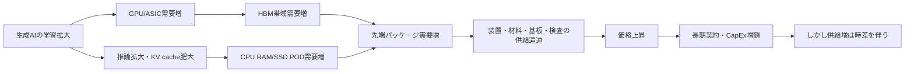
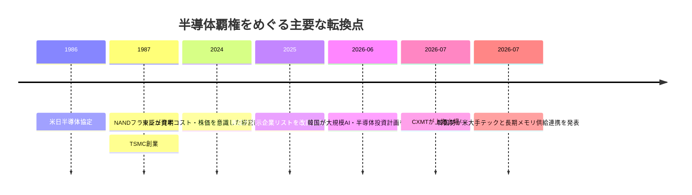
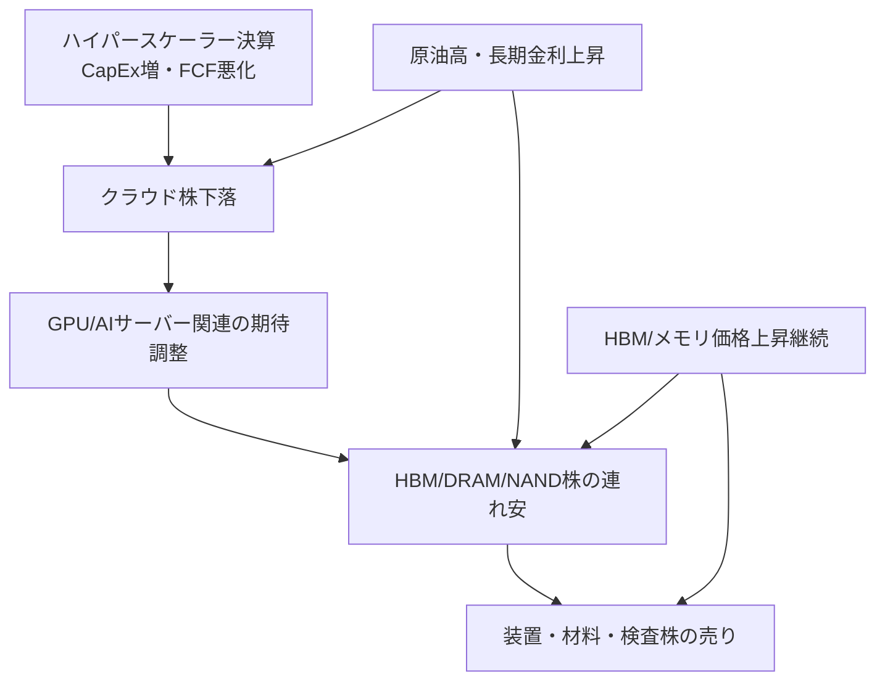

# AI半導体メモリ争奪戦の構造と日本株投資への示唆

## エグゼクティブサマリー

本レポートの結論は明確です。**いま起きているのは「半導体全体の一律ブーム」ではなく、AIシステムのボトルネックがGPUからメモリ帯域・容量・パッケージング・電力・冷却へと広がった結果、メモリが“戦略資産”に昇格した局面**です。Micronは2026年通期のHBM供給について価格・数量の契約を完了済みと説明し、TrendForceは2026年3QのDRAM契約価格を前期比13–18%上昇、NAND契約価格を10–15%上昇と予想しています。Samsungも2026年1Qにメモリ事業が過去最高の四半期売上・利益を記録し、HBM4の初期量産販売開始を公表しました。つまり、**需要が価格に負けていない**というより、**供給が需要に追いついていない**のが本質です。 citeturn29view1turn24view0turn30view0

一方で、**株価はファンダメンタルズだけでは上がりません**。2026年7月第4週の市場は、Alphabetが2Qに449億ドルのCapExを計上し、フリーキャッシュフローがマイナス59億ドルになったことを受けて、「AIは成長だが、投資回収が遠い」という不安を織り込みました。Reutersは7月24日に、Tesla・Alphabetの大型投資が市場を動揺させ、同日の日本市場でもAdvantestと東京エレクトロンが急落したと報じています。つまり、**“好決算でも下がる”理由は、現在価値を決めるのが今期利益ではなく、将来の自由現金流・金利・地政学コストだから**です。 citeturn24view3turn13news32turn13search45turn38news30

機関投資家の観点では、AI半導体・メモリ株は「バブルか否か」を二者択一で見るより、**実需は本物、株価の一部は先回りし過ぎ**という整理が実務的です。BlackRockはAI構築ブームが「電力・メモリ・チップ・データセンター」という希少資源を押し上げるとし、Goldman Sachsも2026年のAI CapExが年7,650億ドル規模に達し得る前提を示しつつ、メモリとそのサプライチェーン全体が構造的な供給制約下にあると述べています。したがって、**実需バブルではなく、バリュエーションの局所過熱**として捉えるのが妥当です。 citeturn36search10turn36search4turn36search1

前提で未指定の点は以下です。**投資期間：無指定、許容リスク：無指定、ベンチマーク：無指定、通貨建て基準：無指定**。本稿では、2026年7月25日JST時点で入手できた公開情報に基づき、**中期の産業構造分析**と**来週のイベント・トリガー管理**の両方を重視して整理します。 citeturn24view11turn24view12

## 需給と価格

メモリが争奪戦になっている理由は、**AIの計算競争が「演算量」だけでなく「どれだけ近く・太く・多くメモリを置けるか」の競争に変わった**からです。HBMは3D積層SDRAMで、TSVとマイクロバンプによって高帯域・省電力・省面積を実現し、AI・HPC・大量データ処理向けに設計されています。MicronはAIシステムにおいてメモリが「戦略資産」へ変わったと述べ、BlackRockもAIインフラに必要な希少資源として“memory, chips, data centers, power”を並列に挙げています。 citeturn35search14turn29view2turn36search10

需要構造は、もはや学習用GPUのHBMだけではありません。TrendForceは2026年に入り、**推論時代のKV cache需要**と**CPU RAM／SSD POD需要**が新しいメモリ需要層を作っていると説明しています。Micronも自社サイトで、AI向けメモリ・ストレージの需要がクラウド、エンタープライズ、自動車、エッジAIへ広がっていると明示しています。つまり、**HBMは帯域の問題を解き、DRAMとNANDは容量・文脈保持・近傍ストレージの問題を解く**という役割分担が進んでいます。 citeturn37search3turn37search7turn33search0turn33search16

価格が上がっても需要が減りにくい理由は、第一に**代替性の低さ**です。HBMはGPU/ASIC周辺のパッケージ設計そのものに組み込まれ、他部材へ簡単に代替できません。第二に**システム全体のスケール効果**です。メモリコストが上がっても、モデル性能・スループット・消費電力効率が改善し、ラック当たり収益が大きくなるなら、ハイパースケーラーは投資継続を選びます。Alphabetは2Q CapExの約60%をサーバー、40%をデータセンター・ネットワークへ投じたと明かしており、MicrosoftもFY26 2QのCapEx 375億ドルの約3分の2がGPU・CPUなど短寿命資産向けだったと説明しました。 citeturn24view3turn5search23

供給側は、価格弾力性が低いどころか、**短期ではほとんど動きません**。Micronは「顧客需要を満たせない」と認め、2026年CapExを200億ドルへ増額、装置発注の前倒し・クリーンルーム増設・広島DRAM投資を進めています。Samsungも1Q26に「限定的な供給環境」の中でAI向け高付加価値品需要を取り込んだとし、SK hynixもAI需要による高付加価値製品販売増で過去最高業績を出しました。**新工場・新ノード・先端パッケージの立ち上がりには時間がかかるため、価格上昇だけで短期供給は増えません。** citeturn29view1turn30view0turn24view2

足元の数量・価格データでも同じ結論です。TrendForceは、2026年3Qのメモリ価格上昇は続くが、主にAIサーバー需要が支えているとし、DRAM契約価格は前期比13–18%、NANDは10–15%上昇と予想しています。さらに同社はAI推論向け新需要を受けて、2026年NAND市場規模見通しを大幅に引き上げました。**消費者向け需要は鈍っても、AI/データセンターが高価格帯の供給を吸い上げている**ため、需給は緩みにくい構造です。 citeturn24view0turn37search4turn37search2

下図は、現在のメモリ争奪戦を駆動している因果関係を、投資判断向けに単純化したものです。TrendForce、Micron、Samsung、Goldman Sachsの記述を整理すると、**エージェンティックAIの推論拡大 → KV cacheと近傍ストレージ需要の増加 → HBM/DRAM/NAND/パッケージの同時逼迫 → 価格上昇と設備投資継続**という流れです。 citeturn37search3turn29view2turn30view0turn36search1



## 争奪戦の構造

なぜ各国が半導体、とりわけメモリを「経済政策」ではなく「安全保障政策」として扱うのか。背景には、**半導体が民生・産業・軍事をまたぐ“汎用戦略財”になったこと**があります。米商務省高官は、Nvidia H200の対中出荷問題をめぐって、先端AIチップが軍事用途になり得ると説明し、今後のAI・チップ規制強化も示唆しました。台湾ではTSMC元幹部による対中技術流出容疑が国家安全法と営業秘密法で起訴されており、**先端半導体技術が各国で国家核心技術として扱われている**ことが分かります。 citeturn28view9turn14news31

歴史的には、現在の「半導体戦争」は突然始まったものではありません。1986年の米日半導体協定は、日本市場開放とダンピング防止を目的に締結され、1980年代の米日半導体摩擦を象徴しました。RIETIの研究も、日本が1980年代に世界首位だった半導体産業で、その後シェア低下を経験し、現在は供給網ショックと地政学競争の中で再び産業政策を強めていると整理しています。**つまり日本が半導体にこだわる理由は、かつての覇権産業を失った経験と、素材・装置の“チョークポイント”をまだ持っているという現実の双方にあります。** citeturn21search0turn21search9

台湾が半導体に固執する理由は、いわゆる**シリコンシールド**です。台湾政府系の技術移転とITRIが1970年代から半導体育成を主導し、1987年にTSMC創業へつながりました。今日では台湾は世界の先端製造の要であり、Brookingsは台湾が先端チップ供給網の中心であるため、台湾海峡の安定が世界経済安全保障と直結すると論じています。 citeturn22search0turn20search6turn15search12

韓国がメモリに執着する理由はもっと直接的です。韓国は1980年代にDRAMへ本格参入して以来、SamsungとSK hynixを通じて**メモリ覇権**を築き、現在はHBM時代にその延長線上で国家戦略を加速させています。2026年6月末には韓国政府が5,760億ドル規模のAI・半導体プロジェクトを打ち出し、7月24–25日にはSK Group/Nvidia連携やSamsung/Broadcom連携など、米テックとの長期供給・共同投資を発表しました。これは単なる景気対応ではなく、**AI時代の“交渉力の源泉”をメモリで維持する戦略**です。 citeturn22search11turn23search9turn31news15turn31news17

中国がメモリにこだわる理由は、輸入依存と制裁脆弱性です。Reutersは、CXMTとYMTCがAIブームの中で価格決定力を強め、CXMTは2026年7月に86億ドルを調達する大型上場へ進んだと報じています。さらにCXMTはHefei市など国家・地方政府の支援で成長した典型例として紹介されています。**先端ロジックで遅れても、DRAM/NANDで自給率を高めればAIシステム全体の制裁耐性を上げられる**ため、中国はメモリを国家主導で押し上げています。 citeturn28view7turn24view10turn23search4

米国が半導体へ執着する理由は、製造回帰だけではありません。米国は設計・装置・IP・規制で依然優位にあり、そこへAI・国防・輸出管理を重ねています。Reutersは7月14日、商務省高官がH200対中出荷を「ごく少量」としつつ、AI・半導体の追加規制が来ると述べたと伝えました。さらにAppleとMicronが中国メモリ採用を巡って政権に働きかけているとの報道は、**メモリが米国でも価格・安全保障・国内投資の三つ巴の政治問題になっている**ことを示しています。 citeturn28view9turn14news30

次のタイムラインは、「なぜ各国がそこまで半導体にこだわるのか」を、投資判断に必要な節目だけに絞って示したものです。 citeturn21search0turn9search3turn22search0turn21search9turn23search9turn24view10



## 地政学・政策・設備投資

地政学リスクは、今やメモリ株の**需給要因**であると同時に**バリュエーション要因**でもあります。中東情勢の悪化でBrentは一時1バレル100ドルを上回り、Reutersは7月24日に現物原油の一部グレードが110ドル近辺まで上昇したと報じました。さらに同日、投資家は原油高と米長期金利上昇が株式ラリーを脅かすと懸念していました。**原油高 → インフレ再燃 → 利上げ懸念 → 長期金利上昇 → 高PERグロース株の割引率上昇**という、AI半導体株にとって最も嫌なルートが再び現実味を帯びています。 citeturn18news26turn18news28

日本ではこれに円安が重なります。Reuters Tankanは7月、製造業が半導体需要に支えられる一方、非製造業は中東紛争・円安・金利上昇によるコスト増に直面していると示しました。ReutersのBOJ観測記事でも、弱い円とAI需要によるコスト圧力がインフレの上振れ要因として挙げられています。したがって、**円安の一次効果は輸出比率の高い製造業に追い風になりやすい一方、輸入エネルギー・原材料依存の高い内需業種には逆風**という整理が実務的です。これは公開データに基づく投資上の推論です。 citeturn28view4turn28view5

それでも企業が設備投資をやめない理由は、**いま止めるコストの方が高い**からです。Micronは、需給逼迫が2026年を超えて続くと見ており、装置発注前倒し・クリーンルーム増設・新工場前倒しを進めています。TSMCも4月にAI需要へ対応するためCapExを増やすとし、SamsungはAI向け高付加価値メモリの販売拡大を継続、SK hynixもAI需要で過去最高収益を更新しました。要するに、**失うのは一時的なFCFではなく、顧客ポジションと次世代ノードの席次**なのです。 citeturn29view1turn38search8turn30view0turn24view2

さらに、設備投資には国策資金が入っています。日本は2026年7月21日に骨太方針2026を閣議決定し、半導体を含む成長投資の推進姿勢を継続しています。Reutersは7月14日に、Tower Semiconductorが日本で30億ドル投資を進め、うち10億ドルを政府補助金で賄うと報じました。日本がMicronやTowerを支援するのは、単なる雇用創出ではなく、**先端メモリとアナログ/パワーを含む供給網の地政学的分散**を狙っているからです。 citeturn24view4turn14search11

韓国でも同じです。6月末の大規模投資構想に加え、7月24–25日にはSK GroupがNvidiaと5000億ドル超のAIデータセンター/次世代メモリ構想、SamsungがBroadcomと最大2000億ドル規模のメモリ・ファウンドリ・AIアクセラレータ連携を発表しました。台湾は先端技術流出を国家安全問題として締め、米国は輸出管理を維持・強化し、中国はCXMT/YMTCを資本市場で大型調達させています。**設備投資が止まらないのではなく、各国政府が“止まらないようにしている”**のが現状です。 citeturn31news17turn14news31turn23search1turn24view10

この点から見ると、AI半導体関連株が軒並み上がっている現象は、**一部はバブル的、基礎需要は構造的**です。Goldman SachsはAI CapExの長期規模を大きく見積もり、BlackRockはAI構築が「一世代に一度の産業ビルドアウト」と説明しています。他方でReutersは、AI支出の重さがAlphabet・Tesla・日本の半導体株を同時に押し下げたと報じました。したがって、**“需要の存在”と“株価の妥当性”は別問題**であり、割高局面では同じ良い企業でも深く売られます。 citeturn36search4turn36search0turn13news32turn13search45

## メモリ関連の重要日本企業

以下は、**半導体メモリを作る・積む・測る・支える**という観点で重要度が高い日本企業10社です。あえて完成品メモリメーカーだけでなく、**チョークポイントを握る装置・材料・検査・テスト**を含めています。機関投資家の実務では、むしろ後者の方が価格決定力と分散効果を持つことが少なくありません。各行の根拠は会社資料・公式サイトベースです。 citeturn9search16turn9search4turn35search17turn9search11turn10search0turn10search10turn10search15turn12search1turn11search9turn35search3

| 企業 | 主な役割 | 強み | 主なリスク | 主な根拠 |
|---|---|---|---|---|
| キオクシア | NANDフラッシュ/SSD本体 | NANDの発明企業で、3D NAND「BiCS FLASH」を持ち、スマホからデータセンターまで用途が広い | NAND市況変動、設備負担、競争激化 | citeturn9search3turn9search9 |
| 東京エレクトロン | DRAM/NAND向けエッチング、成膜、コーター/デベロッパ | DRAM/NANDの前工程で深掘りエッチ・難成膜に強み | WFE循環、対中規制、顧客投資の先送り | citeturn9search4turn9search10 |
| SCREEN | 洗浄装置 | 洗浄は歩留まりの土台で、微細化・積層化ほど重要度が上がる | 前工程CapExの変動、競争 | citeturn35search17turn35search5 |
| DISCO | ダイシング/グラインディング | 薄ウェハ加工とダイ分割で高シェア、HBMや先端実装で重要 | 設備投資循環、後工程市況 | citeturn9search8turn9search11 |
| SUMCO | シリコンウェハ | 先端メモリや積層型メモリ向けウェハ供給、品質評価が高い | 稼働率変動、価格交渉、顧客集中 | citeturn10search0turn10search6 |
| 信越化学工業 | シリコンウェハ/フォトレジスト/マスクブランク等 | 半導体材料の裾野が広く、基盤材料で強い | 素材市況、設備負担、対中規制 | citeturn10search1turn10search10 |
| KOKUSAI ELECTRIC | 成膜装置 | 3D NAND成膜で強く、先端DRAMの高難度成膜でも採用拡大 | NAND投資回復の遅れ、顧客集中 | citeturn10search15turn10search5turn10search8 |
| TOWA | HBM4向け先端封止/パッケージ技術 | HBMの超狭ギャップ封止など後工程の難所に対応 | 先端パッケージ投資の変動、技術競争 | citeturn12search1turn34search5 |
| HOYA | EUV/DUV向けマスクブランク | 微細化に不可欠なマスクブランクでEUV対応を主導 | 先端露光投資の変動、技術更新負担 | citeturn11search0turn11search9 |
| アドバンテスト | DRAM/NAND/HBMテスト | メモリのウェハソート・最終テストを担い、高速メモリ検査が可能 | サイクル変動、顧客設備投資 | citeturn35search3turn35search11 |

メモリがなぜここまで重要視されるのかを一言で言えば、**AIの性能は「どれだけ賢い計算器か」だけでなく、「どれだけ速くデータを食べ、どれだけ長く文脈を保持できるか」で決まる**からです。HBMは学習・推論アクセラレータに近接して帯域を供給し、DRAMは主記憶としてモデル動作と推論文脈を支え、NAND/SSDはモデル、データ、KV cacheのオフロード先として容量を提供します。MicronとKioxiaはいずれも、用途がAI/HPC・データセンター・エッジへ広がっていることを明示しています。 citeturn35search14turn33search0turn33search5turn33search16

防衛・航空宇宙に近い用途でも、メモリの重要性は高まっています。Micronは航空宇宙システム向けメモリ/ストレージを掲げ、KioxiaのSSDはHPEの宇宙エッジ計算実験にも使われています。ここから分かるのは、**メモリはスマホやPCの部品というより、あらゆる高信頼コンピューティングの基礎インフラ**であるという点です。投資家にとっては、用途が広いほど市況調整局面でも完全に需要が消えにくいことを意味します。 citeturn33search3turn33search1

## 株式市場の連鎖とディフェンシブ

AI半導体株が下がるとき、最初に崩れやすいのはメモリそのものではなく、**AI投資の最終財布を握るハイパースケーラー**です。今回の7月第4週もそうで、Alphabetの巨額AI投資とFCF悪化が市場不安の起点となり、Reutersは米国でNasdaq・SOX指数が下落、日本ではAdvantestと東京エレクトロンが同日急落したと報じました。**株価の伝播順序は「クラウドCapEx・FCF → GPU/AIサーバー → HBM/メモリ → 装置・材料」になりやすい**、というのが実務上の観察です。 citeturn24view3turn13news32turn13search45turn38news30

この連鎖を投資家向けに整理すると、先行指標は次の順で見るのが有効です。第一は**ハイパースケーラーのCapExガイダンスとFCF**、第二は**米長期金利と原油**、第三は**HBM/DRAM/NANDの価格見通し**、第四は**パッケージング・WFEの注文コメント**です。なぜなら、AI投資のROI不安はまずクラウド株に表れ、次に金利上昇でバリュエーション全体が圧縮され、その後に部材・装置へ二次波及するからです。 citeturn24view3turn18news28turn24view0turn29view1

下図は、この「連れ安」の典型パスを示します。Reutersの7月23–24日市場報道、TrendForceの価格コメント、Micron/Samsungの需給説明を統合したものです。**短期の株価は、現物需給よりも“CapEx持続性への信認”に左右されやすい**点が、いまのAI株の最大の特徴です。 citeturn38search13turn13search45turn24view0turn30view0



では、AI半導体以外で**ディフェンシブに置けるTOPIX型銘柄**は何か。ここでは「景気敏感・AI設備投資の一撃を受けにくく、なおかつ国策・日本優位性・内需価格転嫁の要素を持つ」業態を選びました。厳密には防御力と成長性のバランスを見ており、典型的な“完全ディフェンシブ”だけではありません。なお、以下は**TOPIX構成銘柄**を前提にした選定です。位置づけは投資上の分析であり、個別推奨ではありません。関連するマクロ背景として、TSE改革・政府方針・円安コスト転嫁・海外資金流入を参照しています。 citeturn24view5turn24view4turn28view0turn28view4

| 業態 | 銘柄 | 注目理由 |
|---|---|---|
| 通信 | NTT | 国内インフラ色が強く、景気耐性と政策整合性が高い。 |
| 通信 | KDDI | 安定キャッシュフローと価格改定余地。 |
| 通信 | ソフトバンク | 配当・国内通信基盤・データセンター接点。 |
| 鉄道/運輸 | JR東日本 | 国内観光・運賃改定・不動産収益の複合。 |
| 鉄道/運輸 | JR東海 | 東海道軸の独占性と内需回復。 |
| 保険 | 東京海上HD | 金利上昇局面に相対的に強く、海外利益も厚い。 |
| 保険 | MS&AD | 金利正常化と価格転嫁の恩恵。 |
| 銀行 | 三菱UFJFG | 金利正常化・ガバナンス改善・株主還元。 |
| 商社 | 三菱商事 | 資源・非資源分散と円安耐性。 |
| エネルギー/電力 | JERA持分関連の東京電力HD・中部電力を含む電力株群 | 電力政策・供給制約・値決め力の改善余地。 |

上表の補足として、**通信・保険・銀行・鉄道・商社・電力**がAI半導体株の代替先として選ばれやすいのは、現在の市場が「AI支出・長期金利・原油」に集中しているからです。Reutersは7月24日に、AI支出懸念のなかで米国では不動産や素材が相対的に上昇したと伝えており、日本でも同様に**長期金利に耐えるキャッシュフロー業種**への資金回帰が起こりやすいと考えられます。これは市場構造に基づく分析です。 citeturn38news30turn18news28

次に、**日経225構成銘柄**の中で、AI半導体以外のディフェンシブ候補を10社に絞ると、以下のようになります。Nikkei銘柄は指数寄与度の観点から、海外投資家のローテーション対象になりやすい点も重要です。 citeturn24view5turn28view1

| 業態 | 銘柄 | 注目理由 |
|---|---|---|
| 通信 | NTT | 国内通信の基盤性。 |
| 通信 | KDDI | 高い継続課金モデル。 |
| 通信 | ソフトバンク | 配当妙味と通信・データセンター接点。 |
| 鉄道 | JR東日本 | 価格改定と観光回復。 |
| 鉄道 | JR東海 | 高シェア路線と安定需要。 |
| 食品/日用品 | 花王 | 国内消費の底堅さとブランド力。 |
| 医薬 | 第一三共 | 外部景気より新薬モメンタムの影響が大きい。 |
| 医薬 | 武田薬品 | グローバル医薬で景気循環との相関が低い。 |
| 保険 | 東京海上HD | 金利・保険料率の改善余地。 |
| 銀行 | 三菱UFJFG | 日本の金利正常化と株主還元。 |

インフレ期に株式保有が重要である理由も、ここにつながります。現金は名目価値が固定されやすく、長期債もインフレで実質価値が毀損しやすいのに対し、**株式は企業の価格転嫁力・名目売上成長・実物資産の再評価を通じて、長期的にはインフレの一部を吸収できる**からです。ただしIMF研究やBIS研究が示すように、短期では株式が完全なインフレヘッジではなく、**金融政策の引き締めと長期金利上昇が先に株価を押す**ことも普通に起きます。だからこそ、インフレ局面では「株式なら何でもよい」ではなく、**価格転嫁力・国内制度改革・資本効率改善**を持つ株が優位になります。 citeturn19search8turn19search12turn24view5turn28view0

## 日本株改革・海外資金・来週の注目イベント

日本株がこれからも強いといわれる理由は、単なる景気循環ではなく、**東証再編後の“資本効率改革”が企業行動を変え始めたこと**です。東証は2024年から「資本コストや株価を意識した経営」の開示企業リストを公表し、2025年には更新日表示や月次更新へ改訂しました。Reutersは2026年6月、ガバナンス改革のコード改訂が日本企業の1.8兆ドル規模の現預金活用を促し、M&Aや株主還元への期待を高めていると報じました。**PBR1倍割れの放置が許されにくくなったこと**が、日本株の構造変化です。 citeturn24view5turn28view0

政府側でも同方向です。骨太方針2026は7月21日に閣議決定され、日本の挑戦を起動する成長投資路線を継続しました。半導体だけでなく、賃上げ・設備投資・資産運用立国の文脈で、企業が余剰資金を抱え続けるより、**投資・還元・再編へ資本を回す方向**が政策的に押されています。こうした制度変更は、海外投資家が日本株を「安いから買う」段階から、「改善余地が制度的に担保されているから買う」段階へ移ったことを意味します。 citeturn24view4turn28view0

海外投資家のフローもそれを裏づけます。Reutersは4月、海外投資家が1週間で2.96兆円を日本株へ純流入させたと報じ、JPXと財務省は現在も週次・月次で投資部門別売買状況を公表しています。海外勢が日本株を買う理由は、低バリュエーション、企業改革、円安余地に加え、**米中対立の中で日本が“同盟国で供給網の要”であること**です。とくに半導体では、装置・素材・基板・検査の複数チョークポイントを日本が握っているため、地政学プレミアムが乗りやすいのです。 citeturn28view1turn28view2turn28view3turn21search9

来週のイベントは、AI半導体・メモリ株にとって非常に密集しています。**最大の焦点は、日米の金融政策会合と米大型テック決算が、CapEx持続性にどのような評価を与えるか**です。以下では、7月27日週に投資家が最低限追うべき日程を整理します。 citeturn24view11turn24view12turn25view2turn16search3turn24view7turn27search4turn17search7turn24view10

### 来週のイベントカレンダー

- **7月27日 月曜日**  
  中国CXMTが上海市場で取引開始予定。中国メモリの資本市場評価は、世界メモリ価格・対中規制・中国サプライチェーン再編のセンチメントに影響します。 citeturn24view10

- **7月28–29日 火–水曜日**  
  **FOMC**。Fed公式カレンダーでは7月28–29日に会合予定。原油高・AI投資・長期金利上昇の文脈で、タカ派トーンなら高PER AI半導体株に逆風です。 citeturn24view11turn18news28

- **7月29日 水曜日 米国引け後**  
  **Microsoft FY26 4Q決算**。同社は次回決算を7月29日と案内済み。Azure/AI ARRだけでなく、CapExと回収見通しが最重要です。 citeturn25view2turn17search8

- **7月29日 水曜日 米国引け後**  
  **Meta 2Q26決算**。Meta投資家ページは7月29日1:30PM PTの2Q決算コールを掲載。AIインフラ投資の継続性と広告収益の耐久性が焦点です。 citeturn16search3turn16search15

- **7月30–31日 木–金曜日**  
  **日銀金融政策決定会合**。BOJ公式スケジュールでは7月30–31日。弱い円とAI需要を伴うコスト上振れをどう扱うかが、日本の金利・円相場・半導体バリュエーションに直結します。 citeturn24view12turn28view5

- **7月30日 木曜日 米国引け後**  
  **Amazon 2Q26決算**。Amazonは7月30日に決算コールを予定しています。AWSのAI需要とCapExの持続力が、サーバー・SSD・ネットワーク株に波及します。 citeturn24view7

- **7月30日 木曜日 米国引け後**  
  **Apple Q3 2026決算コール**。Appleは7月30日2:00PM PTにQ3 2026 call実施予定。端末需要というより、中国メモリ採用問題とサプライチェーン解釈が注目です。 citeturn27search0turn27search4turn14news30

- **7月30日 木曜日 韓国時間**  
  **Samsung Electronics 2Q26決算コール**。同社IRは7月30日10:00 a.m. KSTを案内。HBM4/HBM4E、ファウンドリ、メモリASPのコメントがアジア半導体株の方向性を左右します。 citeturn17search7turn17search19

投資戦略としては、来週は**「価格」よりも「言葉」**が動きます。つまり、メモリ価格そのものより、**Microsoft・Meta・Amazon・Samsung・BOJ・FOMCが、AI投資を“維持”と語るのか、“精査”と語るのか**が最重要です。需給は依然として強いので、株価下落が起きる場合は、業績失速より**バリュエーション圧縮**である可能性が高いとみます。 citeturn24view0turn13news32turn38news30turn28view5

最後に、投資家としての総括を述べます。**メモリ需要はなくならない**という主張には、かなり強い根拠があります。なぜなら、AIが学習偏重から推論偏重へ広がるほど、HBMだけでなくDRAM/NAND/SSDを含むメモリ階層全体が必要になるからです。他方で、**メモリ株が永遠に上がる**という主張には根拠が弱い。理由は、株価は需給だけでなく、CapEx回収と金利と地政学の三変数で決まるからです。したがって、YouTube台本の骨子としては、  
**「メモリ需要は構造的に強い」**  
**「ただし株価はCapExと金利で大きく振れる」**  
**「だから押し目の質を見分けるには、価格表ではなく長期契約・設備投資・政策・金利を見る」**  
という三段論法にすると、根拠とバランスの両方が揃います。 citeturn37search3turn29view2turn18news28turn36search10turn36search1

## 主要出典URL

公的機関・公的色の強い資料は、ご要望に合わせてまず7件に絞って掲出します。

```text
[公的機関・公的資料]
1. Cabinet Office Japan 骨太方針2026
https://www5.cao.go.jp/keizai-shimon/kaigi/cabinet/honebuto/2026/decision0721.html

2. Japan Exchange Group 東証の資本コスト・株価を意識した経営開示リスト改訂
https://www.jpx.co.jp/english/news/1020/20250115-01.html

3. JPX 投資部門別売買状況
https://www.jpx.co.jp/markets/statistics-equities/investor-type/

4. 財務省 対外及び対内証券売買契約等の状況
https://www.mof.go.jp/policy/international_policy/reference/itn_transactions_in_securities/data.htm

5. Federal Reserve FOMC meeting calendars
https://www.federalreserve.gov/monetarypolicy/fomccalendars.htm

6. Bank of Japan Release Schedule
https://www.boj.or.jp/en/about/calendar/index.htm

7. RIETI Chips in Japan: Industrial policy, decline and renewal
https://www.rieti.go.jp/jp/publications/dp/25e116.pdf
```

企業・業界・金融機関・主要報道の主要URLです。

```text
[企業・業界・金融機関・報道]
Micron investor relations Q3 FY2026 / HBM supply remarks
https://investors.micron.com/news-releases/news-release-details/micron-technology-inc-reports-record-results-third-quarter
https://investors.micron.com/static-files/530bd7ed-a8c8-4687-af4a-8c129f740e09

Micron Japan HBM product page
https://jp.micron.com/products/memory/hbm

Samsung Q1 2026 Results
https://news.samsung.com/global/samsung-electronics-announces-first-quarter-2026-results
https://www.samsung.com/global/ir/ir-events-presentations/events/

SK hynix Q1 2026 Results
https://news.skhynix.com/en/q1-2026-business-results/

TrendForce 3Q26 memory price outlook
https://www.trendforce.com/presscenter/news/20260703-13134.html
https://www.trendforce.com/presscenter/news/20260529-13068.html
https://www.trendforce.com/insights/ai-inference-drives-memory-demand

Alphabet 2026 Q2 earnings call
https://abc.xyz/investor/events/event-details/2026/2026-Q2-Earnings-Call-2026-GgTAq7Is0z/default.aspx

Microsoft investor relations / next earnings date
https://www.microsoft.com/en-us/investor/default
https://news.microsoft.com/source/2026/07/08/microsoft-announces-quarterly-earnings-release-date-68/

Meta investor relations
https://investor.atmeta.com/home/default.aspx

Amazon IR Q2 2026 call
https://ir.aboutamazon.com/news-release/news-release-details/2026/Amazon-com-to-Webcast-Second-Quarter-2026-Financial-Results-Conference-Call/default.aspx

Apple earnings call page
https://www.apple.com/investor/earnings-call/
https://investor.apple.com/investor-relations/default.aspx

BlackRock AI buildout / midyear outlook
https://www.blackrock.com/us/individual/insights/energy-and-the-ai-buildout
https://www.blackrock.com/corporate/insights/blackrock-investment-institute/publications/outlook

Goldman Sachs AI investment / AI buildout
https://www.goldmansachs.com/insights/articles/ai-investment-is-shifting-as-inference-enterprise-adoption-accelerate
https://www.goldmansachs.com/insights/articles/tracking-trillions-the-assumptions-shaping-scale-of-the-ai-build-out

Kioxia
https://www.kioxia-holdings.com/en-jp/about.html
https://www.kioxia-holdings.com/en-jp/product-technology.html

Tokyo Electron
https://www.tel.com/ir/library/ar/pjsoh100000000rc-att/ir2025_all_en.pdf
https://www.tel.com/product/lithius.html

SUMCO
https://www.sumcosi.com/english/aboutus/growth.html

Shin-Etsu Chemical
https://www.shinetsu.co.jp/en/products/electronics-materials/silicon-wafers/
https://www.shinetsu.co.jp/wp-content/uploads/2025/07/Business-Activity.pdf

KOKUSAI ELECTRIC
https://www.kokusai-electric.com/en/company/industry
https://www.kokusai-electric.com/sites/default/files/2024-08/IR%20Day2024_Part2_text%20version_E_03.pdf

TOWA
https://www.towajapan.co.jp/en/wp-content/uploads/sites/3/2025/03/news_20250321_eng.pdf

HOYA
https://www.hoya.com/en/business/informationtechnology/
https://www.hoya.com/ir/2025/en/review/it.html

Lasertec
https://www.lasertec.co.jp/en/ir/individuals/euv.html
https://www.lasertec.co.jp/en/news/2019/20190912_2936.html

Advantest
https://www.advantest.com/en/products/semiconductor-test-system/memory/t5833/
https://www.advantest.com/en/products/semiconductor-test-system/memory/t5835/

Reuters major articles used
https://www.reuters.com/technology/tesla-alphabet-spook-investors-earnings-season-kicks-off-2026-07-24/
https://www.reuters.com/world/asia-pacific/japans-nikkei-falls-more-than-2-ai-spending-worries-2026-07-24/
https://www.reuters.com/business/energy/physical-oil-prices-jump-with-some-nearing-110-iran-ukraine-wars-hit-supply-2026-07-24/
https://www.reuters.com/business/energy/investors-fret-that-spiking-oil-prices-rising-yields-could-threaten-stock-rally-2026-07-24/
https://www.reuters.com/world/china/us-official-says-shipments-h200-chips-china-have-begun-2026-07-14/
https://www.reuters.com/world/china/chinas-memory-chip-makers-ride-ai-boom-new-power-us-scrutiny-2026-07-24/
https://www.reuters.com/world/asia-pacific/chinese-chipmaker-cxmt-list-shanghai-july-27-after-asias-biggest-ipo-this-year-2026-07-23/
https://www.reuters.com/business/media-telecom/nvidia-sk-group-unveil-500-billion-plus-ai-data-centers-initiative-memory-2026-07-24/
https://www.reuters.com/business/media-telecom/south-korea-president-lee-looking-open-new-era-ai-with-global-tech-companies-2026-07-25/
https://www.reuters.com/world/asia-pacific/taiwan-indicts-ex-tsmc-employee-over-alleged-theft-trade-secrets-use-china-2026-07-20/
https://www.reuters.com/world/asia-pacific/japan-manufacturers-stay-upbeat-chip-demand-services-hit-by-costs-2026-07-14/
https://www.reuters.com/world/asia-pacific/boj-alert-price-risks-that-may-lead-faster-rate-hikes-sources-say-2026-07-22/
https://www.reuters.com/world/asia-pacific/nearly-half-japanese-firms-hurt-by-boj-interest-rate-hikes-2026-07-15/
https://www.reuters.com/world/asia-pacific/japan-governance-reforms-set-prise-open-18-trillion-cash-hoard-2026-06-11/
https://www.reuters.com/business/finance/foreign-investors-pour-1865-billion-into-japanese-stocks-return-after-three-2026-04-09/
```

