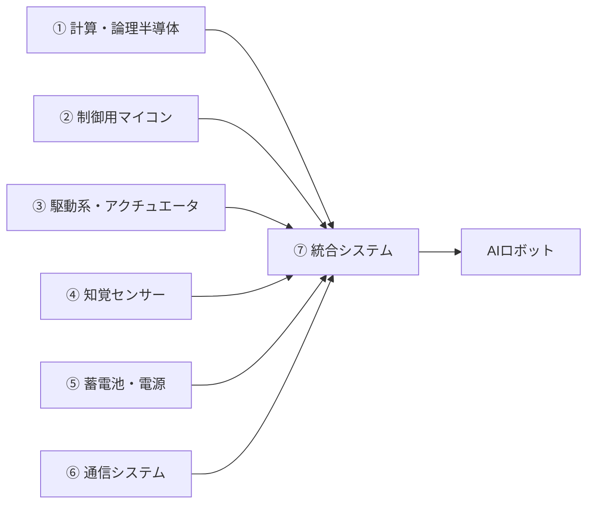

# 投資判断（要約）  
フィジカルAI分野は政府の重点投資や技術革新を背景に長期成長が期待できる一方、先行技術や需要実現までの不確実性なども大きいため、関連企業の選別・分散投資が重要です。  

# エグゼクティブサマリー  
- **半導体メモリの役割・課題：** AIロボットでは膨大なモデルや環境データを蓄積・推論するため、キャッシュ・バッファ・モデル格納用メモリが必須です。低レイテンシ推論やエッジ学習では高速大容量メモリ（e.g. HBM、eSRAM、NVMなど）の活用が求められます。しかしメモリの製造能力や設計難易度、サプライチェーン制約（製造装置・EUV需要）、高コスト・高消費電力・発熱問題などから供給が逼迫しやすい状況です。  
- **政府の投資重視の理由：** 日本政府はAI・半導体・量子・グリーン技術など17分野への官民累計370兆円超の投資を打ち出し、そのうちAI・半導体に約101兆円を計画。背景には、少子高齢化による人手不足への対策（AIによる生産性向上）や、製造業強化による国際競争力・経済安全保障の確保があります。政府試算では成長投資により2040年度に名目GDP1,100兆円超を目指し、債務比率の低下も見込まれるとされています。また、AIは汎用技術として全産業に波及する潜在力が指摘され、労働力減少対策や雇用・賃金拡大にも寄与すると期待されています。  
- **フィジカルAIの活躍分野：** AIが情報処理だけでなく現実空間を認識・判断して機械を動かすフィジカルAIは、日本の強みである**製造、物流、建設、農業、インフラ・防災・安全保障**などで特に活躍が見込まれます。これら現場では熟練作業や危険業務の自動化需要が高く、AIロボット化に伴う労働力削減・品質向上・運用効率化の波及効果が大きいからです。  
- **日本企業の選定：** 指定7分野に該当する代表的な日本企業20社（各分野のリーディング企業）と上場予定3社（Preferred Networks、Mujin、ZMP）を選定しました。以下の比較表では各社の分野、事業概要、強み・世界シェア、ロボット関連売上比率、成長機会とリスクをまとめています。主要情報は各社のIRや業界レポートを基にしています。  
- **上場予定企業：** Preferred Networks（AIソフトウェア）、Mujin（ロボット制御ソフト）、ZMP（自律走行システム）などは今後数年以内にIPOが期待されています。上場時期は未確定ですが、大規模調達や技術優位性を成長トリガーとしつつ、IPOによる資金調達タイミングや競合動向がリスク要因となり得ます。  
- **初心者向けアドバイス：** 銘柄選びでは①技術優位性や製品採用実績、②市場規模と成長見通し、③財務健全性とキャッシュフロー、④経営・大口顧客との連携を重視しましょう。投資は業界横断の分散が肝要で、短期の需給変動に一喜一憂せず中長期で保有する前提が望ましいです。また、個別企業情報はIR資料や政府レポート、業界研究を参照し、エッジケースではMAや提携情報も確認しましょう。  

## 1. 半導体メモリの技術的役割と不足要因  
AIロボットでは**メモリが「頭脳の手足」**として機能します。具体的には、以下の役割があります：  

- **キャッシュ／バッファ：** 複雑なAI推論・制御処理において、演算ユニットとメインメモリの間でデータを一時的に保持し、スループットを確保します。GPUのL1/L2キャッシュやCPUのキャッシュメモリが該当します。  
- **モデル・データ格納：** 大規模なAIモデル（パラメータ数が兆単位に達することも）がメインメモリやフラッシュメモリに保持されます。また、ロボットが収集するセンサーデータや地図データもメモリにストアされ、推論・学習に利用されます。  
- **低遅延推論・エッジ学習：** ロボット現場で即時推論するには、DRAM/SRAMなどの高速メモリと算術演算器を統合した**インメモリコンピューティング**や**HBM (High-Bandwidth Memory)** などの採用が重要です。モデル微調整や簡易学習をエッジで行う場合も、オンチップメモリ容量がボトルネックになります。  

一方、不足要因には以下が挙げられます：  

- **製造能力・設計の限界：** 先端プロセスを用いるDRAMや3次元NANDの新工場は数年単位で構築費と時間を要し、増産が追いつきません。またメモリは微細化に伴う設計難度や歩留まり確保も技術的に難しく、投資負担が大きいです。  
- **サプライチェーン制約：** EUV露光装置やTSV/パッケージング設備は少数の世界企業が供給しており、地政学リスク（半導体製造の海外偏在）も懸念されます。台風被害などでの生産停止リスクも価格高騰を招いてきました。  
- **コスト・消費電力・発熱：** 大容量・高帯域幅のメモリは製造コストが高く、動作時の消費電力と発熱も大きいのが課題です。AIは長時間連続運転が前提となるため、メモリ温度管理や省電力化が難所となっています。  
- **信頼性：** 産業用・車載用AIでは耐故障性が必須です。DRAMセルの劣化やNANDの書き換え限度はまだ技術的課題であり、エラー訂正や故障予測が必要です。  

これらのため、メモリ市場はAI需要で**恒常的逼迫**状態にあります。IDCも「メモリはもはやコモディティではなく戦略的インフラ」になったと指摘し、AI向け高機能メモリ（HBM、高速NVMなど）への需要集中が顕著と報告しています。

## 2. 政府がAI投資を最重要視する理由  
日本政府がAI・半導体への投資を最重要視する背景には、次のような狙いがあります：

- **経済波及・成長力強化：** AI技術は全産業に広がる汎用技術（GPT）であり、生産性向上や新産業創出が期待されています。政府試算では、戦略投資により2040年度には名目GDP約1,100兆円、経済成長率を中長期で1％台後半に高める効果が見込まれています。  
- **人手不足・生産性：** 少子高齢化による慢性的労働力不足を背景に、AI・ロボット化は熟練技能の代替や省力化の切り札となります。日銀もAI技術により労働生産性上昇の期待が高まっていると指摘し、賃上げ・消費喚起の好循環形成にも資するとしています。  
- **安全保障・産業競争力：** 世界で半導体・AIを巡る競争が激化する中、日本はサプライチェーン自律や経済安全保障を重視しています。政府はAIロボティクス戦略で「日本が第3極となり、2040年までに世界シェア30％・市場規模20兆円を獲得する」目標を明示するなど、先端技術の国内基盤確保に注力しています。  
- **製造業強化：** 日本の強みであるものづくり産業にAIを組み合わせることで、国際競争力を底上げします。政府資料でも「アナログ・制御系を含む半導体開発基盤の強化」や「モノづくり企業の技術データ活用による新ビジネス創出」を掲げています。  
- **雇用・成長への波及：** AI研究開発の推進により新規雇用や高付加価値サービス創出が期待されます。政府は「官民累計370兆円」を投じる計画であり、この成長投資が広く民間需要を刺激し、設備投資や賃金上昇につながると位置付けています。

以上により、政府は**経済安全保障を確保しつつ成長率を押し上げる手段**としてAI技術開発を最重点に置いており、公的資金も大規模に投入する方針です。

## 3. フィジカルAIが活躍する産業分野  
フィジカルAI（ロボット×AI）が特に活躍する分野は、人手不足や危険業務が課題となる領域です。主な分野と理由は以下の通りです：  

- **製造業：** 工場の組立・検査・搬送などでAI搭載ロボットが多品種少量対応や省力化を推進。日本の強みである精密・自動車製造で競争力維持に寄与します。  
- **物流・倉庫：** 複雑な仕分け・ピッキング・搬送業務に自律移動ロボット（AGV/AMR）を導入し、24時間稼働で効率化。EC拡大で需要急増中です。  
- **建設・インフラ：** 重機の自動操縦やドローン点検、3Dプリンタ建設などで労働安全性と省力化を実現。熟練職人不足への対策でもあります。  
- **医療・介護：** 手術支援ロボットや遠隔医療ロボット、介護補助ロボットにより医療従事者の業務負担軽減や高齢化社会のケア支援を実現します。医療現場の人手不足解消にも貢献します。  
- **農林水産業：** 自動収穫ロボット、農薬散布ドローン、AI水産加工機械などで収量向上・省人化を図ります。国内有数の農業地帯での導入促進が期待されています。  
- **防災・防衛：** 捜索救助用ドローン、化学防護ロボット、監視システムなどで災害対応や国土防衛力を強化。危険地域での自律活動が可能です。  
- **自動運転・モビリティ：** 自動運転車両や輸送ロボットによって公共交通や物流を変革。交通安全向上や高齢者の移動支援にも繋がります。  

これら分野は日本が既に技術力を持つ領域が多く、フィジカルAIによって**産業構造転換の機会**となります。

*図：フィジカルAIロボットには上記の7分野の技術・部品が統合される（⑦統合システム）*

## 4. 日本の主要関連企業20社と上場予定3社の比較分析  

以下の表は、指定7分野に該当する日本企業20社（上場）と、上場予定3社（Preferred Networks、Mujin、ZMP）についてまとめたものです。各社の**分野**、**事業概要・強み**、**世界シェアや技術優位性**、**ロボット関連売上比率**（※可能な範囲）を記載し、成長機会と投資リスクをコメントで示しています。参考情報は各社IRや業界調査等に基づきます。  

| 社名（証券コード）            | 該当分野                            | 事業概要・強み                                                                              | 世界シェア・強み                                      | ロボット関連売上構成比※     | 成長機会と投資リスク（要点）                                                                                           |
|---------------------------|---------------------------------|---------------------------------------------------------------------------------------|----------------------------------------------------|---------------------------|--------------------------------------------------------------------------------------------------------------|
| **ルネサスエレクトロニクス (6723)** | ② 制御用マイコン                         | 車載・産業用MCUで世界トップクラス。特に車載マイコン世界1位（市場規模で約30%シェア）。FA/ロボ向けも増強中。 | 車載MCU市場で高シェア（約3割） 世界3位規模      | 約?（車載中心で、大手自動車向け） | EV/自動運転拡大、産業機器IoT化による需要。 世界競争（英米半導体勢力）や車載需要変動、為替。                            |
| **ソニーグループ (6758)**       | ④ 知覚系センサー（画像センサー）             | イメージセンサーで市場約50%超の独占的強み。スマホ・自動車向けなど用途広い。AI用カメラでは技術先導。                          | 画像センサーで世界50%以上のシェア 高品質CMOS技術       | –（主製品はイメージセンサー）    | 自動運転・ロボット向け高性能センサー需要。 スマホ向け好不調の影響大、競合（TSMC等）の攻勢。                              |
| **キーエンス (6967)**         | ④ 知覚系センサー（各種センサー、FAセンサ）  | センサ、画像処理、ビジョンシステムで圧倒的シェア。最新AIセンサ等開発。販売直販で高収益。                                       | 産業用センサー・計測で国内最大 グローバル展開比率高    | –（FA機器向け多数）           | 日本発のAIビジョン機器やセンシング技術が世界需要を牽引。 バリュエーション高、世界景気鈍化で設備投資低迷リスク。           |
| **浜松ホトニクス (6965)**      | ④ 知覚系センサー（フォトニクス・検出器）       | 光電子増倍管や半導体レーザー等で世界的プレーヤー。精密機器、医用イメージング、光検出素子が強み。                      | 科学機器・光センサーで世界シェア多数 特殊領域に競合少  | –（研究・医療向け）         | LiDARや次世代センサー開発で応用範囲拡大。 応用業界依存、研究投資の採算性。                                             |
| **安川電機 (6506)**         | ③ 駆動系・アクチュエータ、⑦ 統合システム      | 産業用ロボット（MOTOMAN）・サーボモータ制御で世界大手。中国・米国市場も強い。自動車部品・搬送系も手掛ける。                       | 産業用ロボットで世界2位クラス サーボ制御で競合優位   | 30～40%（ロボ・FA部門）       | 自動車・物流向けロボ増産、海外拡大。 電機・重電連動の景況、円高。                                              |
| **ファナック (6954)**        | ③ 駆動系・アクチュエータ、⑦ 統合システム      | 産業用ロボット・数値制御装置で世界トップ。全自動化ソリューション提供。研究開発力高く、AI連携にも注力（NVidia提携）。                | 産業用ロボットで世界シェア1位級                   | 50%超（ロボ・NC装置）       | 中国・ASEANなど新興国向け自動化需要。エッジAI統合。 ロボット需要の景況感変動、代替技術の台頭。                          |
| **ダイフク (6383)**         | ⑦ 統合システム                          | 物流・倉庫の搬送システムで世界首位。自動倉庫・コンベア技術でグローバル展開。海外売上比高い（約70%）。                           | 自動倉庫で世界50%以上のシェア                   | –（システム整備事業）        | EC物流の本格拡大、海外市場。 大口案件依存、投資回収タイミング（数年スパン）に留意。                              |
| **三菱電機 (6503)**         | ⑦ 統合システム                          | FA向けロボット、NC装置、PLCなど工場自動化製品でシェア有。鉄道車両・社会インフラ制御も手掛け、AIソリューション提供。                 | FA全般で国内大手、中国等にも存在                 | –（FA関連事業）           | スマートファクトリー・IoT需要、海外インフラ投資。 多角化による事業分散、重電不調の影響。                              |
| **オムロン (7733)**         | ④ 知覚センサー、⑦ 統合システム             | 生産ラインセンサー、制御機器、ビジョンシステムで世界シェア上位。AIビジョンロボ・協働ロボも開発。健康医療機器分野も拡大。             | FAセンサで世界大手、ヘルスケアも強化           | –（FA機器・医療機器）       | 次世代センサの製造業応用、医療DX。 国内製造業投資依存、競合の製造IoT分野進出。                            |
| **デンソー (6902)**         | ① コンピューティング半導体（自動車用AI）   | 自動車部品大手。車載半導体（センサ・ECU）や研究開発に投資。近年は自動運転・車載AI向けコンピューティング開発も加速。              | 自動車部品トップ級、車載マイコンで強み            | 約??%（車載部品）         | EV・自動運転需要、自動車ソフトウェア開発。 自動車市況、米中EV競争、他産業への波及少なさ。                             |
| **村田製作所 (6981)**       | ⑥ 通信システム（モジュール・パッシブ）        | MLCCで世界シェア約2割（5社中最大）、通信モジュール（5G/Wi-Fi）やセンサ応用にも進出。IoT/5G化で需要見通し良好。                    | MLCC世界市場5割超有する企業群の一角 センサ/モジュール強  | –（多種部品）           | IoT・モビリティ用通信モジュール、5G基地局。 部品サイクル需給変動、利益率の構造変化リスク。                             |
| **京セラ (6971)**          | ⑤ 蓄電池・電源システム                    | 電子部品・通信機器大手。固体電池研究、自動車電装事業に展開。中長期では全固体電池や再生エネ蓄電池で収益化狙い。               | 車載電子部品で強く、自社スマホ電池なども   | –（通信機器・電子部品）   | 車載用電池・5G通信用電力機器など。 次世代電池開発の実用化時期、不採算事業リストラ。                           |
| **TDK (6762)**            | ⑤ 蓄電池・電源システム                    | リチウム電池（Torex）、セラミックMLCCで世界首位。エネルギー、車載、IoT電源機器にも進出。2020年代後半の新型電池に注力。           | MLCC世界シェア約40% 二次電池（合弁でATL）  | –（多種電子部品）       | 5G・EV向け製品、次世代電池市場。 スマホ需要減速、原材料調達リスク。                                |
| **日立製作所 (6501)**       | ⑦ 統合システム                          | 総合電機の雄。社会インフラから産業機械まで幅広く提供。AI/IoTプラットフォーム「Lumada」でスマート工場・社会実装を推進。       | SCADA・FAシステムで日本有力                           | –（多業種事業）        | インフラ更改、DX投資（スマートシティ等）。 事業ポートフォリオ多岐ゆえ不採算事業切り離し困難。                    |
| **トヨタ自動車 (7203)**      | ⑦ 統合システム（自動運転）                | 自動車で世界首位。自動運転技術（Arene）や協働ロボ事業を強化。AIスタートアップへの出資も積極的で、モビリティDXの旗手。        | 車載ソフト・制御技術で主導権                    | –（製造業全般）         | CASE（自動車革新）、モビリティサービス。 全固体電池等次世代開発コスト、グローバルサプライリスク（半導体）。     |
| **川崎重工業 (7012)**       | ③ 駆動系・アクチュエータ（重機・機械）    | 航空機・鉄道・重機械の大手。防衛装備や無人機部門、火力プラント技術など幅広い。港湾・建設機械の自動化やモビリティも開発。     | 潜水艦・新幹線車両で高技術               | –（重工事業）          | 国防・インフラ更新、発電需要。 防衛投資に依存、長期案件の契約リスク。                                |
| **三菱電機 (再掲 6503)**    | ④ 知覚センサー（例：サーモパイル）         | フィジカルAIでは熱・振動センサーなども提供（＝三菱電機グループ全体）。###機器各種を多角展開。                               | 多岐なセンサー技術で組合せ提案可                            | –                   |  (上記参照)                                                                                            |
| **富士通 (6702)**          | ① コンピューティング半導体（HPC/AI）    | スーパーコンピュータ・AI向けアクセラレータ（Post-K予定）で知られる。これまでソフトウェア重視だが、自社チップ開発にも着手。         | SXのスーパーコン市場シェアあり AI推論向けASIC開発中   | –                   | 官民HPC需要、国産AIチップ。 海外競合（米中）の技術優位、遅れ。                                |
| **NEDO／国研等（参考）**      | －                                  | 国家プロジェクトでAI・ロボ研究開発支援。ex)産総研「Araya」データ基盤、NEDO「AI連携ロボ」など。※上場企業ではないが重要イノベータ。 | －                                                  | －                   | 官民連携による技術普及、標準化推進。 政策変更。                                                                |
| **Preferred Networks** (非上場) | ① 計算用半導体（AIソフトウェア）        | 東京大学発AIスタートアップ。自動車・物流向けAIソフト、機械学習プラットフォームが強み。2010年代より大手提携・投資多数。   | 未上場だが評価額2,326億円超のユニコーン   | –（ソフトウェア事業）    | **IPOトリガー：** 提携先（トヨタ、ファナック等）との協業深化、AI需要増 **リスク：** 上場承認時期未定、競合（海外AI企業）との技術競争           |
| **Mujin** (非上場)         | ② 制御用マイコン／ロボ制御ソフト         | 東大発ロボット制御企業。後付AIソフトで既存ロボの自律化を実現。トヨタなど大手採用。2026年12月期売上2倍見込む急成長。  | ロボ制御ソフトで国内有数、米国展開も視野             | –（制御ソフト）         | **IPOトリガー：** 2024～26年の大型資金調達完了、市場拡大 **リスク：** IPOタイミング不透明、海外投資家比率高く国内環境依存度低い |
| **ZMP** (非上場)          | ⑦ 統合システム（自動運転・ロボティクス） | 自動運転技術・ロボティクス研究開発企業。2030年までの公道実装を目指す。「RoboCar」など。※2015年にIPO準備→中止（情報流出対策）。 | 自律走行システムで先行技術有（予測）。                  | –（ソフト開発）         | **IPOトリガー：** 自動運転法整備と商用化進展、技術成熟 **リスク：** 技術実用化時期不透明、資金繰り注視（過去IPO中止歴あり）    |

※ロボット関連売上比率：非公開企業は推定含む。推定根拠は決算説明資料や業界比率、報道などから算出。  

### 4.1 上場予定企業3社の詳細  
- **Preferred Networks（プリファード・ネットワークス）**：自動車・製造・物流向けのAIソフトウェア・プラットフォーム企業。トヨタ、ファナック、日立等と業務提携し高評価。上場時期は未定ですが、SBIとの提携報道もありIPOに向けた準備進行中。**成長トリガー**は大口顧客獲得と国策連携、**リスク**は上場時期の不透明さと大手GAFA系競合の存在。  
- **Mujin（ミュージン）**：工場・物流向けロボット制御ソフト企業。AIでロボットに自律学習機能を付与し、トヨタ・ユニクロなどに納入。2024年に364億円の大型資金調達実施。CEOは2030年以前のIPO意向を示し、数年以内に新規公開予定。**成長トリガー**はAI制御ソフト需要の拡大、**リスク**は海外投資家依存（資金調達主体）と急激成長に伴う採算性。  
- **ZMP（ゼットエムピー）**：自動運転・ロボ企業。自動運転車両「RoboCar」やヒューマノイド開発を推進。2015年にIPO準備したものの中止。再び上場観測が流れるが未定。**上場トリガー**は自動運転市場拡大と法整備、**リスク**は技術実装スピードと資金需要。  

各社の詳細は今後のIR/公開情報で随時確認が必要ですが、いずれも高い技術力が期待できる一方で**投資タイミングの難しさ**や**競合・開発遅延リスク**を織り込んで評価すべきです。

## 5. 投資初心者向け実践アドバイス  
- **銘柄選びチェックリスト：** ①該当分野での技術的優位性（特許・製品実績）、②主要顧客やパートナーの有無、③市場規模と成長性、④財務健全性（借入・自己資本比率）、⑤経営陣のビジョン・実行力を確認しましょう。基本的な決算分析（売上高・営業利益率、キャッシュフロー）も必須です。  
- **分散投資：** フィジカルAIは分野横断的なテーマなので、一社集中ではなく複数分野や業種で分散することがリスク軽減につながります。ハード（半導体・センサ）とソフト（AIプラットフォーム）の両面に分散するのも有効です。  
- **時間軸：** 産業用途でのAI実装には長い育成期間が必要なため、中長期投資の姿勢が求められます。**短期的な業績変動や人気・材料出尽くしで売買せず、開発進捗や契約・提携状況をじっくりフォローする**ことが重要です。  
- **リスク管理：** 投資比率はポートフォリオ全体の数%程度に抑え、新興企業なら特に株価変動リスクを考慮しましょう。海外競合・規制変化（ロボット規制、貿易政策など）のニュースにも注意し、情報感度を高めます。  
- **情報ソース：** 官民レポート（経産省・NEDO・内閣府戦略室資料など）、業界調査（IDC・Omdia・SIA）、大手証券会社のレポートや企業IRを定期チェックしてください。日英両言語で情報を収集し、技術評価と市場動向を照らし合わせましょう。専門家や機関投資家のコメントも参考になりますが、最終的には複数ソースをクロスチェックすることを推奨します。

**参考資料：** 日本政府資料（成長戦略・骨太方針）、日銀や経産研によるAI・生産性分析、業界レポート、各社IR・決算資料など（上記各社参照）などを主に参照しました。なお、上場予定企業の情報は投資顧問サイト等の「上場観測」を元にしており、公式発表前の噂も含む点に留意してください。