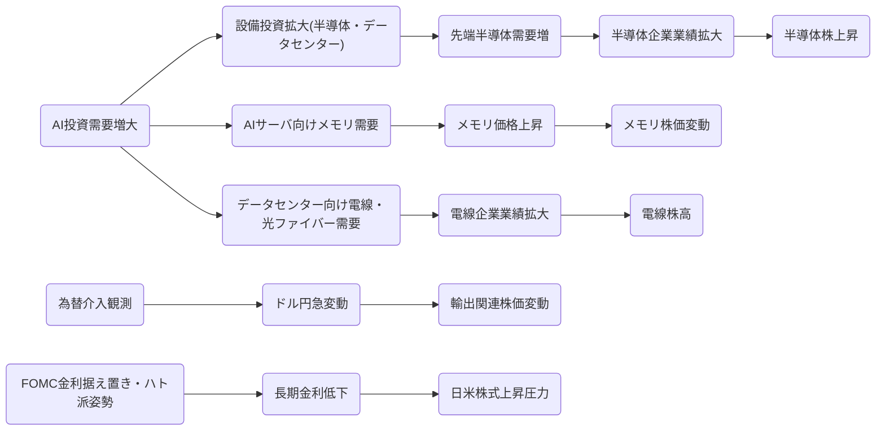

# エグゼクティブサマリー  
2026年7月24～31日の期間、日経225指数は足元の米半導体ブーム期待や円高進行の影響で大幅な変動を示し、週末にかけて急反発した（7/31:+4.0%）。TOPIXはこれに比べ緩やかな動きにとどまった（同:-0.7%）。ハイテク・半導体株（東京エレクトロン、アドバンテスト、ルネサス、TDKなど）は大幅増益決算を背景に総じて株価上昇した一方、メモリや電線関連（キオクシア、SKハイニクス、富士倉（フジクラ）など）は需給見通しや価格変動を巡り乱高下した。  
また週後半には日本・米国・韓国当局による為替介入観測が広がり、7/30に日本政府・日銀が約6.4～9.6兆円規模で円買い・ドル売り介入を実施、翌31日には米財務省が米銀に円売り介入準備の通知を行った（米介入観測）。これらの為替動向が輸出企業の株価や金利動向にも影響した。一方、7/28-29のFOMCでは政策金利据え置きを決定、景気「堅調」、インフレ「高止まり」の表現を維持した。以上を踏まえ、来週は米中間選挙前の地政学リスクに警戒しつつも、企業決算動向と為替変動・流動性に注目したシナリオ分析が求められる。米・イスラエルによるイラン攻撃ならば、短期的には原油急騰と株価下落、円高・長期金利低下などリスクオフ資産への逃避が想定され、中長期ではエネルギー供給不安とインフレ持続、米国景気の一段の減速リスクが高まる。  

## 株価推移（7/24～7/31）  
表1は日経225およびTOPIXの日次終値と変化率、図1は同期間の日経・TOPIX指数推移を示す（Bloombergデータより作成）。日経225は7/28に大幅安となった後、7/31に再び上昇した。一方TOPIXは週央まで堅調推移した。  

| 日付      | 日経225始値 | 日経225終値 | 前日比(%) | TOPIX始値 | TOPIX終値 | 前日比(%) |
|:---------|-----------:|-----------:|----------:|---------:|---------:|---------:|
| 7/24 (金) | 65,584.07 | 64,611.42 | -1.49%    | 2,178.58 | 2,151.20 | -1.28%   |
| 7/27 (月) | 65,164.13 | 64,931.04 | -0.36%    | 2,165.94 | 2,160.68 | -0.02%   |
| 7/28 (火) | 64,539.67 | 62,364.43 | -3.94%    | 2,152.44 | 2,086.34 | -3.44%   |
| 7/29 (水) | 62,734.68 | 61,433.79 | -1.98%    | 2,075.08 | 2,047.70 | -1.37%   |
| 7/30 (木) | 61,258.06 | 61,867.65 | +0.99%    | 2,040.87 | 2,042.71 | +0.10%   |
| 7/31 (金) | 61,957.73 | 64,362.21 | +4.01%    | 2,066.41 | 2,051.04 | +0.95%   |

日経225およびTOPIXの2026年7月24～31日の日次終値（JPX・Bloomberg参照）  
日経225（青）とTOPIX（橙）の7/24～7/31推移（Bloombergデータより筆者作成）  

また日経225構成株の上位銘柄（AI・半導体関連）とTOPIX上位（非AI主要株）の株価変動を拾う。日経採用の代表的半導体関連として東京エレクトロン(8035)、アドバンテスト(6857)、ルネサス(6723)、TDK(6762)、ソフトバンクG(9984)などを、TOPIX主要非AIとしてトヨタ(7203)、ソニー(6758)、三菱UFJ(8306)、日立(6501)、三井住友FG(8316)を対象とする。7/24終値を基準に7/31終値との騰落率をまとめると、**東京エレクトロン**や**アドバンテスト**は＋10%前後と大きく上昇し、**ルネサス**も7/31に決算好感で7.7%急騰。一方、**SKハイニクス(000660.KS)**などメモリ株はFOMC後の上昇傾向から4-6月期決算発表（7/29）で利益が市場予想を下回り、29日に約10%急落。電線銘柄の**富士倉(5803)**はデータセンター向け光ケーブル需要増で上方修正したものの、7/14決算後急騰から需給調整圧力もあり乱高下している。**TOPIX非AI株**は概ね小動き～やや下落傾向で、ソニーやトヨタは週半ばに下落した後持ち直し、MUFG・三井住友FGは7月利上げ見送り観測から上昇した。これら株価動向は後段で詳述する。

## 日米中韓台の主要AI半導体関連企業  
各国の主要半導体/AI関連企業の最新決算概要と7/24–7/31の株価推移は以下の通り。  

- **日本（AI・半導体系）**: 東京エレクトロン(8035)の2026年4-6月期決算は、AI用半導体向け設備需要で売上高7,324億円(+33.3%)、営業利益2,114億円(+46.1%)と急成長。中間決算で下期予想も上方修正しており、7/30発表後に株価は急騰した。アドバンテスト(6857)も4-6月期に売上3,675億円(+39%)、営業利益1,900億円(+53%)と市場予想を大幅上回り、通期営業利益予想を6275億→8460億円に約35%引き上げた。**ルネサス**(6723)の2026年4-6月期（第2四半期）は売上高4,530億円（+24.8%）で営業利益1,327億円（営業利益率32.7%）と大幅増益となり、決算発表翌営業日(7/31)に株価は前日比+7.7%の3,442円と急騰。**TDK**(6762)は2026年4-6月期の純利益が前年同期比+94.3%の805億円に達した（売上7,410億円、営業利益863億円）。これら好決算を受け同期間、半導体関連株は概ね上昇した。なお**ソフトバンクG**(9984)はAIデータセンター投資計画などが好感され過去高値近辺で推移しているものの、7月決算は未発表で材料出尽くし感もある。

- **米国**: インテル(INTC)の2026年4-6月期決算では、売上高が前年同期比+25.4%の161.3億ドル、調整後EPS0.42ドルと市場予想を大幅に上回った。同社は次期ガイダンスもコンセンサス超え（3Q見通しUSD15.8～16.8B vs 15.1B予想）と発表し、7/23発表後に株価は時間外で+5.2%上昇した。AMD、NVIDIAなど他の米AI半導体大手も前年から大幅増益を続けており、7月は上述インテル決算に加えAmazon・MicrosoftのAI投資拡大の報道などが相次ぎ、半導体株全般を押し上げた。

- **中国**: 世界的なAI需要逼迫を受け、中国のSMIC(0981.HK)は4-6月期に過去最高益を記録したものの、市場予想に届かず株価は7/29に下落した（SKハイニクス同様）。同社は海外顧客の受注が増加していると説明している。またAIチップ設計大手バイドゥ、アリババ（9988.HK）、テンセント（0700.HK）などはクラウド/AI事業に注力中だが、7月は欧米半導体規制の影響や中国景気不安もあり、反応は限定的だった。一方、中国系AI半導体スタートアップ（寒武紀：688109.SH等）も業績期待先行でハイボラティリティとなっている。

- **韓国**: Samsung Electronics(005930.KS)は2026年4-6月期に四半期売上高171.5兆ウォン、営業利益89.5兆ウォンの過去最高益を報告。ただし、SKハイニクス(000660.KS)は5月にメモリ価格上昇で1Q好調だった反動か、第2四半期決算がアナリスト予想（64兆ウォン）を下回ったため、29日に株価が約10%急落した。両社ともに半導体在庫調整局面やメモリ市況の先行きが株価を大きく左右している。

- **台湾**: TSMC(2330.TW)は7/13発表の2026年4-6月売上高が前年同月比+36%の1.27兆台湾ドル（約396億ドル）と記録的伸長となった。AI向け受託製造需要が堅調で、7月末時点でも年初来で株価+57%上昇している。UMC(2303.TW)やRealtek(2379.TW)もスマートデバイス需要回復期待で上昇傾向だった。

以上各社とも、7月末にかけて発表された四半期決算が概ね増益であったことが株価を支えた。中でも**東京エレクトロン**や**アドバンテスト**はAI向け投資の加速を受けてガイダンス上方修正したことで投資家心理を後押しした。一方、**メモリ系**（キオクシア、SKハイニクス）と**電線ケーブル系**（富士倉、住友電工など）は半導体在庫やAI需要への過度な期待、原材料需給を巡り変動率が大きかった。図2に主要企業の因果関係を示した。  

半導体・AI需要の拡大と株価・設備投資動向の因果フロー（作成：筆者）  

## AI半導体市場動向（7月下旬）  
この週はAI関連市場でいくつか重要な動きがあった。まずインテルは7月23日に予想を上回る第2四半期業績と増収予想を発表し、AIブームによるサーバーチップ需要増を強調した。同社は第3四半期売上予想も従来コンセンサスを大幅に上回り、今後の設備投資拡大も表明したため、一部で半導体需給逼迫観測が高まった。また、日本半導体装置協会(SEAJ)が7/2に公表した報告によれば、2026年度の半導体・FPD製造装置販売額は前年比+26%増の6.55兆円と予測され、特にAI用先端ロジックやDRAM(HBM)向けの投資が牽引する見通しとされた。この通り、AI需要の拡大を背景に業界内では設備投資増加が確実視されている。一方、台湾TSMCのQ2売上高が36%増で過去最高を記録したことも、供給不足感を投資家心理に喚起した。  

一方で市場の不確実要因も顕在化した。SKハイニクスの決算がアナリスト予想に届かなかった要因は、「HBMに依存したメモリ構成と、メモリ価格の変動」などと指摘されており、AI需要の持続性への不安も浮き彫りとなった。キオクシアも急騰したAI特需期待の中で株価が激しく乱高下しており、6月末の上場来高値から7月6日には約25%下落している。同社は6月期の四半期決算で売上高1兆円（前年同月比+290%）、営業利益5,991億円（+16倍）と大幅増益を報告し、7-9月期も売上1.75兆円(5.1倍)、営利1.3兆円(29倍)と予想している。ただし市場では「ここまでの成長率が持続可能か予想困難」という声が強まっており、特にアメリカ大手企業のAI投資が行き詰まるとメモリ需要も急減するとの懸念が残った。  

また7/30には韓国と日本で為替介入が実施された。日本政府・日銀は米国市場時間帯で約6.4～9.6兆円規模の円買い介入を実施し、ドル/円は一時2ヶ月ぶり安値の約157円台まで急落した。韓国も7/30にウォン安を防ぐため介入したと伝えられた。さらに7/31には米財務省が銀行に円売り介入準備を通知した模様で、日米両国で連日為替介入の意向が浮上した（海外ニュース参照）。これら介入は輸出企業の業績に直結する為替レートを動かし、日本株の特に輸出・IT銘柄に短期的な振幅を与えた。  

## 為替介入の影響と3カ国の構造要因  
今週の日米による為替介入は株式市場にも大きく影響した。円買い介入でドル安・円高が進むと、輸出企業や海外売上比率の高い半導体企業の利益への逆風となり、特に輸出系銘柄の株価は7/30に軟化する場面が見られた。一方で円高は輸入コスト低減や投資マネー流入を通じて内需系株にはプラスに働く場合もある。31日も米介入観測でリスク資産が一時調整し、NY株が続伸する中でドル/円は約158.2円まで下落した。  

世界で繰り返し為替介入が行える主な国としては、日本、中国、スイスが挙げられる。日本は外貨準備高が約1.3兆ドルと巨大で、為替相場介入を通じて輸出競争力維持に動くことが歴史的に多い（2022年9月と本件2026年7月を参照）。中国も準備高3兆ドル超を有し、資本移動の管理を通じた為替安定策を常用してきた。スイスは準備高こそ日本・中国より小さいものの（約0.9兆ドル）独自通貨の小規模市場ゆえ、介入効果が大きく、2011年のユーロ防衛介入などで世界市場に影響を与えてきた。これら国は「国際収支の不均衡調整能力」「資本移動規制や金融市場の規模」「政策信頼度」が大きく、市場介入を通じて為替を動かす力を持つとされる。  

## FOMCの現状認識と市場への示唆  
7/28-29の米連邦公開市場委員会（FOMC）では、政策金利（FF金利誘導目標レンジ）を現状の3.50～3.75%で据え置く決定が行われた。声明文では景気について「堅調」、失業率は「ほとんど変化なし」、インフレは「高止まっている」との評価を継続し、追加利上げの明確な示唆は見送られた。一部メンバー（3人）が0.25%利上げを望んで反対票を投じたが、総じて「インフレ抑制に専念する」とのスタンスを維持した。市場は本会合後、短期金利見通しとドル安が進行したが、一方で長期金利はやや上昇し（株価下落圧力）、依然として「インフレ持続か期待インフレ安定か」を注視している。FRBは「目先の経済指標よりも広範な需給・物価動向を慎重に見極める時期」としており、当面は現状維持・ハト派姿勢で臨む見通しだ。従って市場への影響としては、米長短金利差やドル動向、金融市場のボラティリティ指数（VIXなど）に注目しておく必要がある。  

## 来週の市場展望（シナリオ別）  
**** 米中間選挙・夏季休暇期のまっただ中だが、経済指標や企業決算は概ね底堅い水準を保つと想定する。日米株は堅調推移し、ナスダック等ハイテク株が牽引役を担う。為替は米利回り差を背景にドル安・円高が進む可能性が高いものの、介入警戒で急変動は一旦沈静化するとみられる。原油は中東緊張はあっても大規模な実害なく落ち着き、95～100ドル台で推移。政府イベント（財務・日銀談話）や日銀会合（8/4-5）での政策スタンス変化には注目。日本では決算発表本番（7-9月期）が始まり、決算サプライズやガイダンスが株価を左右する。主要な確認指標は、世界の半導体受注・在庫動向、半導体価格指数（メモリ・FPD価格）、ドル円レート、米10年金利、日本企業の海外受注動向など。  

**** 米FRBが利上げサイクルを打ち止め、金融引き締めのピークアウト示唆が出る。米経済指標が弱まるも、FRBが過度な景気刺激を懸念せず柔軟に対応すると好感される。AI特需期待がさらに高まり、半導体・機械受注好調、メモリ価格上昇が支持される。円高は一定の限度で推移、輸出株価への逆風は限定的。原油高懸念が後退し（イスラエル・イランは予想外に回避）、リスクオンで株価大幅上昇。こうした状況下では日米の大型成長株（AI関連企業）が上値を牽引し、TOPIX/日経とも前週末比+5%超も想定される。監視指標としては、「半導体在庫動向」「メモリスポット価格」「日米金利差拡大率」「主要AI企業の受注・出荷状況」「日銀短観・企業調査」など。  

**** 米経済指標や企業決算が予想を下回り、FRBが追加利上げ観測を再燃させる。米長期金利が再び上昇し、ドル高・円安反転となれば日本企業の輸出採算が悪化し株安要因となる。加えて中東情勢が急激に悪化し（米・イスラエルがイランに実質的な軍事行動）、原油価格が急騰・安全資産買いが起こる。為替介入が大規模化し、流動性懸念も高まって市場は混乱状態に陥る可能性がある。こうなると日経TOPIXとも週足-5%を超える急落リスクが生じ、リスク回避的な円高・米長期金利低下（株への逆風）も重なる。下落局面では、企業収益悪化の度合い（為替影響、原油影響）や中央銀行の対応姿勢（量的緩和再導入の可能性）に注目したい。

## 中東情勢（米・イスラエル vs イラン）の影響シナリオ  
米国とイスラエルがイランを攻撃した場合、市場・経済・エネルギー・商品価格に甚大な影響を及ぼす可能性がある。**短期（1～数週間）**では、石油供給不安から原油価格が急騰し、エネルギー関連株・軍需株・金価格が上昇する一方、株式市場全般はリスクオフで下落し、米国債が買われ金利は低下する（安全資産への逃避）。円もリスクオフ通貨として買われ円高・ドル安となることが想定される。過去の経験では、10%程度の原油高でも日本企業の経常利益影響はTOPIXベースで1%程度に留まると試算されており、日本経済そのものへの即時ダメージは限定的だが、企業業績にはマイナス材料になる。航空・船舶運賃の高騰、サプライチェーン混乱による輸入コスト増、観光客激減など幅広い負担も考えられる。

**中期（数ヶ月～1年）**では、事態の長期化や拡大の度合い次第でシナリオが分かれる。 (1) *衝突拡大シナリオ*: イスラエル・米軍とイランの全面戦争に進展すれば、原油価格は100ドル超に張り付き、インフレ加速と世界景気の深刻な悪化が想定される。日本はエネルギー輸入費負担増、金融緩和期待高まりで円安・株安圧力、国際リスクプレミアム増大の三重苦に直面する可能性がある。一方、核合意再開や外交的解決への試みが行われない限り中東不安は拡大し続ける。 (2) *局地的衝突・鎮静化シナリオ*: 被害が限定的で早期に落ち着けば、原油は一時反発後落ち着き、中東リスクプレミアムも徐々に剥落する。株価と債券は短期調整後戻るものの、地政学的不透明感は残る。いずれにせよ、供給網リスク（原油・LNG価格）、米国債先物市場の動向、日本の中央銀行対応（為替・金融政策）、企業収益の「ドル建てコスト増加」といった指標・事象に注目すべきである。エネルギー以外では、地政学的波及効果としてロシアや中国への影響、米中関係の緊張、サプライチェーン再編などが中期的リスク要因となる。  

**参考:** 2016年の伊朗危機時には、海峡封鎖懸念から原油価格が20%超急騰し、株価は一時-3%程度下落した。その後、米国・国際社会による調整で半年以内にリスクプレミアムは剥落している（Nomuraリサーチ他）。だが今回は米国が直接介入する可能性を示唆しており、不透明性はより高い。以上を踏まえ、次週の市場では主要原油価格と国債利回り、為替（特にドル・円、ドル・中東系通貨）、安全資産（米国債・金）と原油ETF動向、主要企業の業績見通し修正に注視したい。

**参考資料:** SEAJ半導体需要予測、東京エレクトロン・アドバンテスト決算速報、ルネサス決算（Investing.com）、SKハイニクス決算（Reuters）、キオクシア株価動向（IG Japan）、Fujikura上方修正（Reuters）、FOMC声明分析、NY市場要約、イラン情勢の影響（Nomura）。