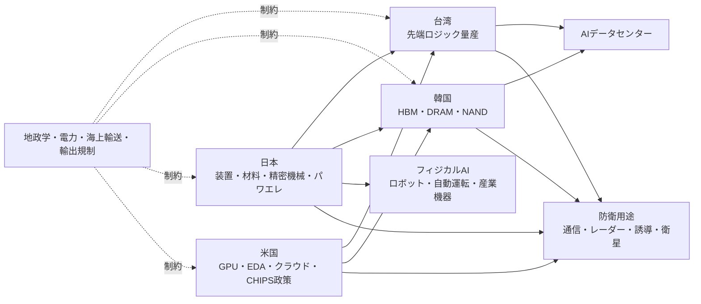

# AI半導体の直近動向と投資判断の多面的分析

## エグゼクティブサマリー

本レポートの結論を先に述べると、直近のAI半導体株の急落は、**バリュエーション調整・AI投資持続性への疑念・金利上昇懸念・地政学リスク**が同時に重なった「ポジション整理主導のスピード調整」であり、ファンダメンタルズ崩壊ではありませんでした。実際、戻り局面では、Micronの巨額投資・長期供給契約、MetaのAIチップ内製前進、TSMC/ASMLの高水準CapEx・受注残、韓国メモリーの需給期待が、**“成長の実需”が依然として強い**ことを再確認させました。Goldman Sachsも、現状は過去のバブルと韻を踏む面はあるが、主導企業の利益成長・財務体質・競争構造はドットコム期と異なると整理しています。 citeturn34search3turn34news30turn20view0turn15view0turn16view0turn40view0

投資判断としては、**コアAI半導体は「全面バブル」ではなく、「中核ボトルネック資産は強気維持、周辺テーマは選別強化」**が妥当です。とくに、先端製造・装置・HBM・先端パッケージング・電源/冷却・ロボティクス/エッジAIに近い銘柄群は、需給の物理制約と政策資本の両方で支えられています。一方で、円安・JGB利回り上昇・BOJ独立性への市場懸念は、日本株の割引率を押し上げ得るため、**日本では「円安メリットが利益に直結する輸出AI銘柄」と「国内設備投資の恩恵銘柄」を分けて見る必要**があります。 citeturn12view2turn13view1turn17view1turn20view0turn43view4turn24view1turn24view2

文中の各出典はクリック可能で、元URLに遷移できます。一次資料は各社IR、政府公表資料、BlackRock/Goldman Sachs公式、BOJ、Reutersを優先しています。 citeturn25view0turn25view3turn12view2turn40view0

## 主要結論

- **短期の投資判断**  
  先週から本日にかけての下落は、需給悪化というより「AI相場のスピード調整」です。7月7日のSOX指数下落は、AIラリー持続性への疑念、Samsung決算への失望、DeepSeekの自社AIチップ報道、Fed高金利観測が重なったことが主因でした。その後の7月9日から10日にかけては、Micronの対米大型投資、戦略顧客契約、MetaのAIチップ進展、SK Hynixの大型上場期待が反発の中心でした。 citeturn34search3turn34search0turn36news11turn36news12

- **中期の投資判断**  
  オーバーウェイト維持は、**TSMC、ASML、東京エレクトロン、Advantest、Micron、韓国HBM系、さらに日本のロボティクス/エッジAI関連**です。理由は、受注の長期化、設備増強の不可逆性、政策補助、技術ロックイン、サプライチェーン代替の難しさです。 citeturn17view1turn17view2turn20view0turn16view0turn44view0turn32search1

- **バブル判定**  
  「AI株全体」は一部過熱ですが、**AI半導体の中核層はドットコム型の空洞バブルではない**という見方が妥当です。Goldman Sachsは、現相場は高集中・高バリュエーション・資本集約化というバブル類似要素を認めつつも、主導企業の業績伸長と強いBS、競争の集中を相違点として挙げています。 citeturn40view0turn40view2

- **日本株の見方**  
  日本は、先端半導体の設備・材料に加え、**フィジカルAIの社会実装で不可欠な「精密機械、モーション、センサー、品質保証、電源・受動部品」**を握っています。高市政権の成長戦略、METIのAI・半導体エコシステム政策、日米のTechnology Prosperity Dealは、日本企業の設備投資と案件創出を後押しし得ます。円安局面では、Advantestのように利益感応度が高い銘柄が有利ですが、国内金利上昇が割引率を押し上げる点には注意が必要です。 citeturn25view4turn44view0turn32search1turn24view1turn43view4

## 直近相場の急落と反発

直近1週間のAI半導体株の値動きは、単一要因ではなく、**期待の修正と確信の再構築**が数日単位で交錯した相場でした。先行シグナルは6月23日の広範な半導体売りで、ReutersによればSOX指数は約8%下落し、Nvidiaも約4%下げました。7月7日には疑心暗鬼が再燃し、SOX指数は4.65%安、Micronは4.7%安、Sandiskは7.3%安となり、背景には「AIデータセンター需要の飽和懸念」「Samsung決算が高い期待を満たさなかったこと」「中国DeepSeekの自社AIチップ報道」がありました。7月9日には一転してSOX指数が3.06%上昇し、Micronの4.5%高を中心に反発。7月10日の東京市場前場でも、日経平均は1.77%高、SUMCOは15%超高、Advantestと東京エレクトロンは3%超高でした。 citeturn36search4turn34search3turn34search0turn34news30turn37view0

financeturn2finance0

### 時系列整理

| 日付 | 市場反応 | 主因 | 定量ファクト |
|---|---|---|---|
| 6月23日 | 半導体全面安 | 高値警戒、Fed高金利観測、利益確定 | SOXほぼ8%安、Nasdaq 2.2%安、Nvidia約4%安。 citeturn36search4turn34search1 |
| 7月6日 | 半導体に一時安心感 | BroadcomとAppleの2031年までの提携延長 | Apple向け売上はBroadcom年商の約20%。長期供給安心感が支援。 citeturn34news31 |
| 7月7日 | 急落再開 | AI投資継続性への疑念、Samsung決算失望、DeepSeek報道 | SOX 4.65%安、Micron 4.7%安、Sandisk 7.3%安、Nasdaq 1.16%安。米株出来高は175億株で20日平均233億株を下回る。 citeturn34search3turn34search6 |
| 7月8日 | アジア・欧州で波及安 | メモリー期待の剥落、AIプレミアム圧縮 | Samsung 7.6%安、SK Hynix 5.2%安。欧州テックも売られ、ASML下落がセンチメント悪化を増幅。 citeturn1news36turn1news37turn1search8 |
| 7月9日 東京 | 日本株反発 | 米半導体高、Nvidia H200の対中販売一部容認報道、MetaのカナダDC報道 | 日経平均 1.38%高、東証プライム売買代金 9.60兆円。AI・半導体株が主導。ただしETF分配金捻出売り警戒は約1兆円。 citeturn35view0 |
| 7月9日 米国引け | 反発本格化 | Micronの対米大型投資、MetaのAIチップ進展、SK Hynix ADR期待 | SOX 3.06%高、Micron 4.5%高、Applied 3.2%高、Sandisk 7.6%高。 citeturn34news30turn36news11 |
| 7月10日 東京前場 | 続伸 | 前日の米ハイテク高、KOSPI急伸、年金資金の国内投資拡大観測 | 日経平均 1.77%高、一時6万9000円回復。SUMCO 15%超高、Advantest/TEL 3%超高、前場売買代金 5.28兆円。 citeturn37view0turn43view2 |

### 主要銘柄の比較

| 銘柄 | 急落局面の論点 | 反発局面の論点 | 投資上の含意 |
|---|---|---|---|
| Micron | AIメモリー需要のピーク懸念に最も敏感で、7月7日に4.7%安。 citeturn34search3 | 7月9日は大型投資計画と戦略顧客契約で4.5%高。Q3 2026売上は414.6億ドル、Q4ガイダンスは500億ドル±10億ドル。 citeturn36news11turn20view1 | 需給ひっ迫が続く限り高ベータで上向くが、メモリーは循環性が大きい。 |
| Broadcom | 7月初にApple依存不安が残存。 citeturn34news31 | Appleとの2031年までの供給契約延長で安心感。 citeturn34news31 | カスタムAI ASICと非AI事業の分散が強み。 |
| TSMC | AI供給逼迫への期待は強いが、グローバル景気やコスト増が重荷。 citeturn17view1 | AI需要を受けてCapEx上積みを継続。高度実装も「very tight」。 citeturn15view0turn17view2 | 先端ロジックと先端パッケージのボトルネック保有者。 |
| ASML | バリュエーション調整時に売られやすい装置大手。欧州テック安の象徴。 citeturn1search8 | 2025年末受注残388億ユーロ、Q4受注132億ユーロが下値支え。 citeturn16view0 | 短期ノイズでも中期受注残が厚い。 |
| Samsung・SK Hynix | 高期待に対し決算・需給期待が届かず7月8日に急落。 citeturn1news36turn1news37 | 7月10日にはKOSPI急伸、SK Hynix米上場期待がセンチメント改善。 citeturn36news12 | HBM主導の回復余地は大きいが、価格期待修正に脆弱。 |
| Advantest・東京エレクトロン | 日本のAI/半導体代表株としてボラティリティが高い。 citeturn35view0 | 7月9〜10日に日本市場の指数上昇をけん引。 citeturn35view0turn37view0 | 日本株の中ではAI需要を最も直接的に利益へ変換するグループ。 |

今回の反発が重要なのは、戻りの材料が「ショートカバー」だけではなく、**設備投資・長期契約・製品投入・政策連携**という、将来CFに直接つながるイベントだった点です。言い換えると、相場は「AI capexは過熱か」という問いから、「どの企業が実需と契約でその投資を回収できるか」という問いへ移りつつあります。 citeturn20view0turn20view2turn34news30turn37view0

## 設備投資継続の根拠とバブル判定

### 設備投資が止まらない理由

企業が投資を継続する理由は、単なる「強気の経営者心理」ではありません。第一に、**需給のひっ迫と長期可視性**です。Micronは、2026年HBM供給について価格・数量契約を完了済みとし、その後さらに、戦略顧客契約に基づく**220億ドルの金融コミットメント（うち約180億ドルが現金預託）**を見込むと開示しました。これは同社の2026年見込みCapEx約270億ドルの約67%を事実上前受け資金でカバーし得る規模で、外部資金依存を大きく下げます。 citeturn15view1turn20view0

第二に、**先端製造・実装の物理制約**です。TSMCは2026年CapExを**520億〜560億ドルレンジの高位**に引き上げ、Q1時点で「全社稼働率が想定以上に高い」と説明しました。加えて、先端パッケージング能力は「very tight」で、AI需要を満たすためクリーンルーム建設と工具調達の前倒しを進めています。これは供給制約が短期で解けないことを意味します。 citeturn17view1turn15view0turn17view2

第三に、**装置側の長い受注残**です。ASMLの2025年末受注残は**388億ユーロ**で、2025年売上327億ユーロの**約1.19倍**に達しました。Q4受注は132億ユーロ、そのうちEUVが74億ユーロでした。AI向けロジック・メモリーの微細化が進むほど露光回数が増えるため、AI普及そのものがASMLの装置需要を増やす構造です。 citeturn16view0turn15view2

第四に、**大企業顧客側の巨額投資継続**です。BlackRockは、米大手テックの2026年AI関連支出が**約8,000億ドル**に達し、2030年までの累積額が**10兆ドル**規模になり得ると見ています。Goldman Sachsも、AI相場の主導企業は従来型バブルと違って強いバランスシートを持ち、投機一本槍ではないと評価しています。つまり、供給側の投資は、需要側の資金調達能力と整合的です。 citeturn12view2turn40view0

### 投資継続の定量比較

| 企業 | 需要可視性 | 投資額・受注残 | 稼働・需給の示唆 | 投資上の含意 |
|---|---|---|---|---|
| TSMC | AIアクセラレータ需要の長期CAGRを「50%台後半」と説明。 citeturn17view2 | 2026年CapExは520億〜560億ドルの高位。Q1 CapExは111億ドル。 citeturn17view1turn18view0 | Q1は全社稼働率が想定以上、先端パッケージは「very tight」。 citeturn17view1turn17view2 | 供給制約を抱えたまま成長、価格決定力が維持されやすい。 |
| Micron | 2026年HBM供給の価格・数量合意済み。戦略契約にボリューム拘束。 citeturn15view1turn20view0 | 2026年CapEx約270億ドル。戦略顧客契約の金融コミットメント220億ドル、うち現金預託180億ドル。 citeturn20view0 | 需給タイトは2026年超まで持続と会社説明。Q3時点で記録的業績。 citeturn15view1turn20view1 | 需給悪化シナリオへの耐性が同業比で高い。 |
| ASML | AI採用拡大で半導体産業は強いと説明。 citeturn15view2 | 2025年末受注残388億ユーロ、Q4受注132億ユーロ。2026年売上見通し360億〜400億ユーロ。 citeturn16view0turn15view2 | EUV/DUVの装置供給は長サイクル。短期ノイズより中期需給に左右。 | 装置セクターの中核ボトルネック。 |
| NVIDIA | FY2026売上2159億ドル、FY2027 Q1売上816億ドル。 citeturn14search7turn14search3 | 高収益で自己資金創出力が非常に大きい。 | 需要側も強いFCFで供給チェーン投資を可能にする。 | サプライチェーン全体の投資継続を支える起点。 |

簡易感度分析を置くと、Micronの**180億ドル現金預託 ÷ 270億ドルCapEx ≒ 67%**であり、仮にAI需要が短期的に1割鈍化しても、すでに拘束された長期契約があるため、設備投資の回収見通しは一気には崩れません。ASMLも、受注残が前年売上の1.19倍あるため、仮に今後の新規受注が1割減っても、直近年度の売上には即時にフルインパクトしにくい構造です。TSMCは高CapExですが、Q1時点で営業CFがTWD6990億、Q1 CapExがTWD3510億で、**営業CFの約半分を投資に回しても配当を維持**しています。つまり、設備投資継続は「楽観」ではなく「契約とCF」に支えられています。 citeturn20view0turn16view0turn18view0

### バブルか否か

結論として、**AI半導体のコア領域は「バブルではない」と断言するのではなく、「ドットコム型の空洞バブルではまだない」**という表現が最も適切です。Goldman Sachsは、絶対バリュエーション上昇・市場集中・資本集約化・ベンダーファイナンスなど、過去のバブルに似た要素を認めつつも、現状のテック上昇は「将来夢想」より**実際の利益成長**に支えられており、主導企業のBSが強いこと、競争が少数の既存大手に集中していることを差異として挙げています。 citeturn40view0

Stanford HAIの2026 AI Indexは、生成AIの人口普及率が**3年で53%**に達し、PCやインターネットより速いと示しました。また、米国のAI民間投資は2025年に**2859億ドル**、米国内のデータセンターは**5427カ所**で、主要AIチップの大半が台湾TSMCに依存していると指摘しています。これは、AIがドットコム期の「将来使われるかもしれない技術」ではなく、すでに実装が進み、しかも物理供給制約を伴うインフラ産業化の段階にあることを示します。 citeturn40view3

| 論点 | ドットコム期 | 現在のAI半導体相場 | 投資判断 |
|---|---|---|---|
| 収益性 | 利益なき成長企業が多く、IT投資拡大に占めるドットコム要因は一部だった。 citeturn39search1 | NVIDIA FY2026売上2159億ドル・粗利率71.1%、TSMC Q1粗利率66.2%、ASML 2025粗利率52.8%、Micron Q3粗利率84.6%。 citeturn14search7turn18view0turn16view0turn20view1 | コア層は現実の利益を伴う。 |
| 顧客実装 | ネット利用の普及は速かったが、事業化の質が未成熟。 | 生成AI普及率53%、消費者便益も年1720億ドル相当。 citeturn40view3 | 実装の厚みは過去より大きい。 |
| ハード制約 | 主にソフト・通信・広告。供給ボトルネックは限定的。 | HBM、先端露光、先端パッケージ、電力・冷却が制約。 citeturn17view2turn12view2 | 供給制約が参入障壁になる。 |
| サプライチェーン | 比較的分散。 | 先端AIチップの多くが台湾の単一大手ファウンドリ依存。 citeturn40view3 | 地政学プレミアムが不可避。 |
| 国家介入 | 産業政策は現在ほど強くない。 | CHIPS、輸出規制、補助金、戦略投資が前提。 citeturn30search3turn25view4turn30search2turn30search5 | 政策が収益機会とリスクの両方。 |

したがって、投資実務では「AIはバブルか」という二分法より、**どのレイヤーが“価格だけ先行”で、どのレイヤーが“供給ボトルネック＋契約＋政策”の三重支援を持つか**で切り分けるべきです。前者は周辺ソフト・物語株、後者は先端製造・装置・HBM・ロボティクス実装群です。 citeturn40view0turn12view2turn20view0

## 半導体戦争と国家戦略

半導体をめぐる各国の政策は、景気対策ではなく、**産業競争力・経済安全保障・軍事優位の同時追求**です。日本のMETIは半導体を「産業のコメ」と位置づけ、2026年改訂戦略で**AI技術利活用・フィジカルAI・半導体製造・デジタルインフラ・サイバー・人材**を一体で見るエコシステム戦略へ移行しました。高市政権下の日本成長戦略でも、AI・半導体は17の戦略分野の筆頭に置かれています。 citeturn44view0turn12view1

米国は、半導体を16の重要インフラすべてに不可欠と位置づけ、軍事・エネルギー・通信・医療での依存を国家安全保障問題として扱っています。商務省は2026年1月時点で、台湾系・技術系企業による対米直接投資を少なくとも**2500億ドル**とし、さらに商務長官の説明では半導体案件の累計公表投資は**2790億ドルから5550億ドルへ倍増**したとしています。韓国は**26兆ウォン**規模の半導体エコシステム支援策を打ち出し、台湾は**37.7億台湾ドル**の12インチ先端パイロットラインなどで“先端製造の戦略的パートナー”としての地位維持を狙っています。 citeturn30search3turn28search1turn28search9turn30search2turn30search5

### なぜ四カ国が注力するのか

| 国 | 歴史的背景 | 直近の政策論理 | 投資家にとっての意味 |
|---|---|---|---|
| 日本 | 1980年代のメモリー覇権から後退したが、装置・材料・製造品質で優位を保持。半導体不足と経済安全保障で再投資へ。 citeturn44view0turn28search10 | AI・半導体を成長戦略の最上位分野に置き、フィジカルAIまで含む戦略に拡張。 citeturn12view1turn44view0 | 装置・素材・ロボティクス・パワエレが再評価されやすい。 |
| 米国 | 設計・EDA・クラウドで優位だが製造空洞化への危機感。 | 半導体は重要インフラと軍事力の基盤。国内製造回帰と同盟再編を推進。 citeturn30search3turn30search7turn28search1 | 設計と政策補助の両面で主導。だが対中規制と台湾依存がリスク。 |
| 韓国 | DRAM/NAND/HBMの圧倒的蓄積。輸出主導の国家戦略産業。 | 26兆ウォン支援でエコシステム全体を強化し、世界半導体競争で主導権維持。 citeturn30search2 | HBMサイクルの最重要市場。高βだが供給規律が鍵。 |
| 台湾 | 先端ファウンドリ集積で世界AI供給の心臓部。 | 研究機関運営の先端パイロットライン整備と装置産業育成でリーダー維持。 citeturn30search5turn30search1 | 地政学的リスクは最大だが、ボトルネック価値も最大。 |

### 半導体戦争の構図

防衛面では、日米の公的資料が、半導体・マイクロエレクトロニクスをAI・5G・次世代兵器・レーダー・慣性誘導・GPS・衛星・製造制御の中核と位置づけています。日本の防衛省有識者レポートは、各国が半導体を最重要技術とみなし、懸念国依存を避けようとしていると指摘し、米国防総省は、半導体不足が先進兵器システムを遅らせたと認めています。つまり、半導体戦争は商業競争であると同時に、**軍民両用の基盤技術をめぐる安全保障競争**です。 citeturn28search2turn29search3turn29search8turn29search17

### 金融機関レポートと高市政権の政策評価

BlackRockは、2026年のAI投資を「速度と希少性」のテーマで捉え、**テック単独ではなく、電力・インフラ・アジア供給網に投資レンズを拡張すべき**と示唆しています。同社は、AI普及で米大手テックのAI支出が2026年に約8000億ドル、2030年までに累計10兆ドルに達し得るとみる一方、メモリー需給は少なくとも2年間、需要が供給を20〜30%上回ると分析しています。日本企業にとっては、半導体そのものだけでなく、電源、冷却、設備、部材、FAまで含めた周辺レイヤーに長期案件が波及するという意味です。 citeturn12view2turn13view1

Goldman Sachsは、AI相場にバブル類似要素を認めつつも、「今のところはバブルではない」として、上昇が**実際の利益成長・強いBS・少数 incumbents 主導**に支えられていると評価しました。これは、日本企業に当てはめると、物語株よりも、事業基盤・契約・現場導入のある企業が優位という解釈になります。 citeturn40view0turn40view2

高市政権の政策面では、第一に、2026年の日本成長戦略会議でAI・半導体を17の戦略分野の最上位とし、分野横断課題として投資促進・金融・人材を並行処理する枠組みが導入されました。第二に、Reutersが確認した経済青写真では、戦略分野への官民投資を**2040年度までに370兆円超**へ拡大する方針が示され、AI・半導体はその中核です。第三に、施政方針演説でも、地域クラスター形成・インフラ整備・行政AI化が打ち出されました。総合すると、政策は「補助金単発」ではなく、**長期の案件創出、国内立地、国内調達、データセンター、地方製造拠点形成**を促す方向です。 citeturn25view3turn25view4turn25view0turn12view1

## フィジカルAIと日本企業

フィジカルAIの社会実装で日本が重要になる理由は、AIモデル開発力よりも、**現場実装に必要な精密機構・センサー・画像認識・制御・アクチュエーション・高信頼量産**を厚く持っているからです。METIは2026年改訂戦略でフィジカルAIを明示的に政策対象に入れ、Stanford HAIは先端AIチップ供給が台湾単一大手に依存する一方、社会実装には電力・設備・産業機器まで含む広いエコシステムが必要と示しています。 citeturn44view0turn40view3

ロボティクスでみると、日本は2024年の産業用ロボット導入で世界第2位、稼働ストックは45万台超です。さらにIFRによれば、日本は依然として世界有数のロボット生産国であり、製造現場の自動化ノウハウと部品供給力の蓄積が厚い。これはヒューマノイドやAMRだけでなく、**工作機械、物流、半導体搬送、検査、車載組立**など、フィジカルAIの現実的立ち上がり局面に強いことを意味します。 citeturn33search5turn33search12

米国が日本に「ものづくり」を期待する理由も、同盟関係だけではありません。2025年の日米首脳共同声明、2025年のU.S.-Japan Technology Prosperity Deal、2026年の日米戦略投資イニシアティブは、AI、先端半導体、量子、重要鉱物、サプライチェーン強靭化を共通課題としています。米国は設計・クラウド・研究を、そして日本は装置・材料・精密実装・量産品質を担うという、**機能分業型の同盟産業政策**が見えてきています。 citeturn33search3turn32search1turn32search4turn32search8

### 注目の日本企業

| 企業 | 業種別役割 | 事業内容・強み | 関連製品 | 主な投資リスク |
|---|---|---|---|---|
| FANUC | 産業ロボット・CNC | FA、ROBOT、ROBOMACHINEを一体提供できる総合力。工場自動化の標準インフラ企業。 citeturn45search4 | 産業用ロボット、CNC、サーボ | 設備投資循環、中国景気、FA受注の振れ。 |
| 安川電機 | モーション制御・ロボット | MOTOMANとACドライブ/サーボの接続性向上を進める、ロボットと駆動の強い統合プレーヤー。 citeturn45search1 | MOTOMAN、ACサーボ、インバータ | 中国依存、FAサイクル、競争激化。 |
| キーエンス | 視覚AI・工場検査 | ルールベースとAIを組み合わせた画像検査に強く、ダウンタイム削減と歩留まり改善に直結。 citeturn33search2turn33search6 | AIビジョン、センサー、コード読取 | 高評価バリュエーション、設備投資鈍化時のマルチプル圧縮。 |
| オムロン | 制御・モバイルロボット | AI搭載コントローラ、i-BELT、モバイルロボットで“現場データ→制御”の閉ループを持つ。 citeturn45search2turn45search5 | AIコントローラ、AMR、制御機器 | 収益改善の継続性、競合との価格競争。 |
| ルネサス | エッジAI半導体 | Edge AI・Physical AIを資本市場説明会で明示。プロセッサ、電源、アナログ、接続をまとめて出せる。 citeturn45search3turn45search6turn45search9 | MCU、SoC、産業/車載Edge AI | 車載・産業需要の循環、統合後シナジー実行。 |
| 村田製作所 | センサー・エッジAIモジュール | 小型高信頼モジュール化が得意で、Edge TPU搭載MCMや車載MEMS/レーダー周辺に強い。 citeturn46search0turn46search6turn46search12turn46search21 | Edge AIモジュール、MEMS、mmWave | スマホ比率、価格競争、顧客集中。 |
| THK | 精密モーション・ヒューマノイド部材 | LMガイド、ボールねじ、アクチュエータで“動きの品質”を担う。ヒューマノイド開発も進める。 citeturn46search14turn46search5turn46search2 | LMガイド、アクチュエータ、ロボット部材 | 工作機械循環、量産立上げの時間差。 |
| ニデック | モーター・駆動系 | AI社会基盤、半導体搬送ロボット、精密減速機、サーボ領域まで展開。モーター起点の実装力。 citeturn46search4turn46search7turn46search10turn46search16 | 精密モーター、ロボット用駆動、e-Axle | M&A統合、収益性ばらつき、EV需要変動。 |
| アドバンテスト | テスト・品質保証 | AIの戦略的重要性拡大を見込み、中計目標を引き上げ。AIサーバー用SoC/HBMのテスト需要を享受。 citeturn22search6turn24view1 | SoCテスタ、メモリテスタ | 半導体投資サイクル、高評価、顧客集中。 |
| 東京エレクトロン | 半導体製造装置 | 輸出は円建て中心で為替影響が小さく、AI半導体向けWFE需要の質で勝負できる。 citeturn24view2turn21search6 | 成膜、エッチング、洗浄、塗布現像 | WFE循環、輸出規制、最先端投資のタイミングずれ。 |

私の見立てでは、フィジカルAIで日本企業が最も強いのは、**「頭脳」より「身体」を構成するレイヤー**です。つまり、センサー、視覚、モーション、精密搬送、品質保証、エッジ実装です。米国が日本に期待するのもこの部分で、米国がアルゴリズム、モデル、クラウド、先端設計を押さえ、日本が量産品質・部材・装置・機械を押さえる役割分担は、経済合理性と地政学合理性の双方に合致しています。 citeturn32search1turn32search4turn44view0turn33search5

## 円安政策と投資インパクト

「なぜ日本は円安を止める気がないのか」という問いに対しては、厳密には、**日本は円安を放置しているのではなく、止めるコストが高すぎるため、急速な是正を選んでいない**という理解が適切です。BOJは2026年6月に政策金利を**1%**へ引き上げており、これは31年ぶりの水準です。ただし、Reutersによれば、高市政権は積極財政と慎重な利上げ志向を持ち、市場ではBOJ独立性への懸念から10年JGB利回りが**2.865%**と30年ぶり高水準まで上昇しました。つまり、円安是正のために大幅利上げを急げば、国債市場と財政に逆風が出る構図です。 citeturn43view4turn42search2turn43view1

政策面では、高市政権の経済青写真は、BOJに「より強い経済」を支えるよう求める文言を残しつつ、独立性への言及を後から補強するという綱渡りになっています。Reutersは、政府が従来の単年度PB黒字目標を外し、債務GDP比の安定的低下を主目標へ切り替える方向だと報じています。これは、利上げで需要を抑えるより、**名目成長と投資で債務負担を相対的に薄める戦略**に近い。結果として、通貨防衛より成長と投資を優先していると市場に映りやすいのです。 citeturn25view4turn43view3turn43view4

一方で、政府は円安対策を完全に諦めたわけでもありません。7月10日には、GPIFを含む年金基金の**国内資産投資拡大**という、為替介入ではなく資本フロー構造を変えるアプローチが報じられ、円は162円近辺から161.285円まで戻しました。これは、短期のドル売り介入よりも、**国内資産への恒常的な資金還流で円を支える**発想です。 citeturn43view2

### 為替感応度の投資インパクト

日本のAI・半導体関連株では、円安の効き方がかなり異なります。Advantestは2026年度の会社前提として、**対ドル1円の円安で営業利益が約40億円増加**すると開示しています。これをそのまま使えば、たとえば想定為替150円/ドルに対し実勢が160円/ドルなら、単純計算で営業利益押上げは**約400億円**です。他方、東京エレクトロンは、輸出売上を原則円建てとしており、通常の範囲では為替影響は「軽微」と説明しています。Renesasは2Q 2026見通しで、**対ドル1円の変動が売上約180億円、営業利益約80億円**に相当する感応度を示しています。 citeturn24view1turn24view2turn24view0

| 企業 | 為替感応度 | 投資上の読み方 |
|---|---|---|
| Advantest | 対ドル1円の円安で営業利益 +40億円。 citeturn24view1 | 円安継続の最大受益銘柄の一つ。 |
| Renesas | 1円変動で売上 +約180億円、営業利益 +約80億円相当の感応度テーブルを開示。 citeturn24view0 | 為替が業績弾性を大きく左右。 |
| 東京エレクトロン | 輸出は円建て中心で利益影響は軽微。 citeturn24view2 | 為替よりWFEサイクルが主因。 |
| 日本の内需・小売 | 円安はコスト増・消費圧迫要因。Fast Retailingも4Qへの悪影響を警戒。 citeturn41news34 | 円安“勝ち組/負け組”の選別が必要。 |

投資判断としては、円安が続く間、日本のAI・半導体では**輸出比率が高く、為替感応度が明示されている企業**を優先しやすい一方、JGB利回り上昇と日銀・政府の政策不透明感は、日本株全体の割引率上昇要因です。したがって、2026年後半の日本株戦略は、「円安メリット × AI需要直結 × 政策支援」の三条件を満たす銘柄に絞るのが最も合理的です。 citeturn43view4turn24view1turn44view0turn25view4