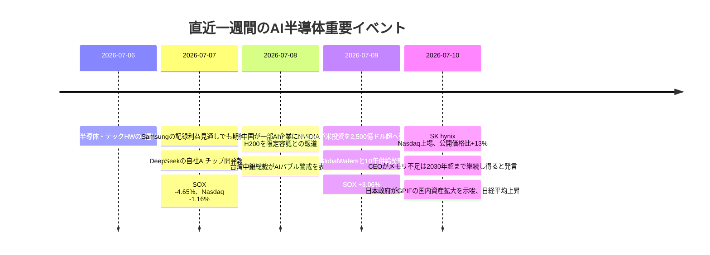

# AI半導体投資アップデート

## エグゼクティブサマリー

今回の急落は、**ファンダメンタルズ崩壊ではなく、AI半導体に対する「高すぎる期待」の巻き戻し**として理解するのが最も正確です。起点は、サムスン電子の記録的な利益見通しですら投資家の期待を満たせなかったこと、DeepSeekの自社AIチップ開発報道がNVIDIA依存の長期持続性に疑義を投げかけたこと、そしてヘッジファンドが半導体・テックハードウェアを4週連続で売っていたことです。しかも7/7の下落は、米株全体の売買代金が20日平均を大きく下回る「軽い出来高」で起きており、投げ売りというより**混み合ったロングの整理**でした。Reutersによれば7/7のPHLX半導体指数は4.65%下落し、米国取引所の総出来高は175億株と20日平均233億株を下回りました。 citeturn43view2turn45search2

7/9〜7/10の戻りも、単なる自律反発ではありません。**買い手は長期資金・ETF・セクター資金で、材料は「供給不足が続く」という確信の再確認**でした。Micronは7/9に米国内投資計画を2035年までに2,500億ドル超へ引き上げ、同日にGlobalWafersとの10年供給契約も公表しました。7/10にはSK hynixのNasdaq上場が公開価格比13%高で着地し、同社CEOはメモリ供給不足が2030年を超えて続く可能性を示しました。あわせて、7/8週には米国株ファンドへ249.7億ドル、米テックファンドへ97.1億ドル、グローバル技術セクターへ114.9億ドルの資金流入が確認されています。 citeturn12search0turn12search1turn12search4turn13news24turn45news15turn45news13

したがって、企業が設備投資を止めない理由は明快です。**需要見通しが鈍っていないから**です。TSMCは2026年の設備投資見通しを520億〜560億ドルへ引き上げ、AI需要を「極めて力強い」と述べました。ASMLは2026年売上見通しを360億〜400億ユーロへ引き上げ、需要が供給を上回るとしています。Micronは220億ドルの受注を確認し、自動車向けではGM・Fordと戦略契約、原材料ではGlobalWafersと10年契約を結びました。SK hynixは「2027年に史上最悪の供給不足」とまで述べています。つまり今の投資は、景気敏感な循環投資というより、**AI計算資源・HBM・先端製造能力という“構造的不足資産”への前倒し投資**です。 citeturn13search0turn13search1turn13search2turn13search5turn12search1turn12search3turn13news24

バブルかどうかについての私の結論は、**「インデックス全体としてはドットコム型バブルではないが、個別銘柄とテーマの一部には明らかな過熱がある」**です。BlackRockは重要なのは歴史的バリュエーションの高さではなく将来利益の持続性だと論じ、S&P500の12カ月先予想PERは約21倍と説明しています。UBSはPHLX半導体指数のフォワードPERを約26倍とし、ドットコム期ピークの150倍超とは構造が異なると述べます。Goldman Sachsも、今のAI相場はファンダメンタル成長・強いバランスシート・少数の既存覇者に支えられている点で、通常のバブル形成と異なると整理しています。ただし、Taiwan中央銀行総裁が7/9にAIバブル・レバレッジのリスクへ警鐘を鳴らした通り、**“良い産業”と“良い株価”は別問題**です。 citeturn42view0turn42view5turn31search6turn30news31

日本株の観点では、最も重要なのは**「フィジカルAIは日本の勝ち筋に直結する」**という政策・産業の一致です。7/10の高市内閣・人工知能戦略本部資料は、バーティカルAIとフィジカルAIを明示的に日本の重点領域と位置付け、国内で開発・製造されるAIインフラ、半導体、ロボティクス、多用途ロボット、自動運転の研究開発と社会実装を加速するとしています。半導体だけでなく、精密位置決め、サーボ、減速機、画像検査、FAセンサー、ロボットSI、現場データを一体で持つ日本企業群は、**“AIが物理世界に降りる局面”で不可欠なサプライヤー**です。 citeturn19view0turn20view0turn20view1turn20view2

## 直近一週間の市場変動

本稿では、ユーザー指定に従い**2026-07-04〜2026-07-11 JST**を「先週から今日」までの期間として整理します。足元の終値ベースでは、NVIDIAは210.96ドル、SMHは611.03ドル、SOXXは581.34ドルで、7/10時点の日経平均は68,557.73円でした。7/7に米半導体が大きく崩れた一方、7/9〜7/10にかけて米国ではPHLX半導体指数が3日続伸、日本では年金国内回帰観測とAI関連の再評価が重なり、日経平均も上昇しました。 citeturn27finance0turn27finance4turn27finance5turn29search4turn43view1

financeturn27finance5



上のタイムラインが示す通り、急落と反発は同じ根っこを持っています。すなわち、**AI需要そのものではなく、その需要の“継続期間”と“誰が儲けるか”の再価格付け**です。7/7は「利益は出ているが期待がさらに上だった」局面、7/9〜7/10は「やはり供給不足は長く続く」局面でした。 citeturn43view2turn9search16turn11search16turn13news24turn29news15

### 急落した理由

最も直接的なトリガーは7/7の米国市場です。Reutersによれば、Samsungの“19倍増益”級の強いガイダンスでも投資家は満足せず、Micronが4.7%安、Sandiskが7.3%安、PHLX半導体指数が4.65%安となりました。背景には、AIデータセンター投資の伸びの持続性に対する疑念と、「良い決算でも上がらない」ほど高くなった期待値がありました。Reutersはこの日の米市場総出来高が175億株と20日平均233億株を下回ったと伝えており、**需給主導のリスク削減**色が強かったことが分かります。 citeturn43view2

これに重なったのが、7/7のDeepSeek自社AIチップ開発報道です。これはすぐにNVIDIAの売上を剥落させる話ではありませんが、投資家には「モデル層・クラウド層・大口顧客が内製へ進むなら、GPUの超過利潤は将来どこまで続くのか」という問いを突き付けました。AI相場の本質は絶対需要ではなく、**誰が利益プールを独占するか**なので、この種の報道は株価には大きく効きます。 citeturn43view2turn9news21

ポジショニング面では、Goldman Sachsのプライムブローカレッジ・データを引用したReuters系報道で、**ヘッジファンドがテックハードウェアと半導体を4週連続で売っていた**ことが意識されました。私はこれを、景気後退を織り込むディフェンシブ回転というより、H1までのAI勝ち組ポジションを守るための利益確定とみています。つまり、下落の本体は“弱気の新規建て”より“過密ロングの縮小”です。 citeturn45search2turn45search1

オプション市場も、全面崩壊のシグナルというより**ヘッジを伴った強気残存**を示していました。Cboeの7/7オプション市場総出来高は6,725万契約でした。個別ではNVDAのオープンインタレスト・ベースのプット/コール比率は0.82、7/7時点の30日出来高ベースのプット/コール比率は0.2605、足元セッションの出来高ベースでは0.44、内訳はプット74.6万枚・コール167.8万枚でした。定義の異なる指標を横並びで読む際には注意が必要ですが、**プット買いが増えても、コール優位そのものは崩れていない**というのが実態です。これは、暴落を見込むより「上昇テーマを持ちながらヘッジを厚くした」取引像と整合的です。 citeturn44search1turn44search0turn44search11turn44search14

### 戻った理由

7/9の戻りは、Micronが市場心理を一気に変えたことが大きいです。Reutersによれば、Micronは米国内投資を2035年までに2,500億ドル超へ引き上げ、同時に最大30億ドルの米サプライチェーン強化投資、GlobalWafers向け5億ドル支援、さらに**10年の生シリコンウエハ供給契約**を打ち出しました。これは単なる設備増強ではなく、**原材料から長期調達を固定し、AIメモリ不足を前提に供給網を押さえにいく行動**です。市場はこの日、Nasdaqが1.30%高、PHLX半導体指数が3.06%高で反応しました。 citeturn12search0turn12search1turn11search16turn8view1

加えて、7/8には中国がAlibaba、ByteDance、DeepSeekなど一部の中国AI企業にNVIDIA H200を限定的に認める方向と報じられました。数量は限定的でも、重要なのは**中国売上がゼロに向かうシナリオが後退した**ことです。NVIDIAにとって中国は数量・エコシステム・競争上の重要市場であり、このニュースは需給の最悪ケースを和らげました。 citeturn9search16turn9search5

7/10にはSK hynixのNasdaq上場が公開価格149ドルに対して170ドルで引け、13%高で着地しました。さらに同社CEOは、メモリ供給不足が2027年に「最悪水準」となり、その後も2030年を超えて需要が供給を上回る可能性を示しました。HBMサイクルの中心企業がこの見方を示したことで、Micron、Samsung、装置・材料株まで含めた**メモリ供給鎖全体のマルチプル再拡大**が起きやすくなりました。 citeturn43view1turn13news24

買い手の性格も重要です。週次フローでは、7/8までの1週間に米国株ファンドへ249.7億ドル、米テクノロジー・セクターファンドへ97.1億ドル、グローバルではテクノロジー・セクターへ114.9億ドルの流入がありました。いっぽう、ヘッジファンドは前段で売っていたため、7/9〜7/10の反発は、**長期資金・ETF・セクターファンドの押し目買いとショート／アンダーウエートの買い戻し**が主体だった可能性が高い、というのが私の見立てです。これは推論ですが、ファンドフロー統計とGoldman系のポジション情報はその解釈を支持します。なお、7/10の米市場総出来高は145億株と20日平均224億株を下回っており、反発は本格的な“総強気復帰”よりも**選択的な再参入**でした。 citeturn45news15turn45news13turn45search2turn43view1turn27finance4turn27finance5

## 設備投資継続とバブル論

### 企業が設備投資を止めない理由

TSMCは2026年4月に、通年売上見通しを引き上げ、**2026年設備投資を520億〜560億ドルへ増額**しました。さらに6月の株主総会では、CEOが「AI需要は極めて力強く、緩和の兆しはない」と述べています。先端ロジックの実需に対してボトルネックは依然として製造能力側にあり、顧客はNVIDIA、Apple、AMDなど巨大顧客で、注文の質も高い。したがって、TSMCが投資を止める理由は現在ほぼありません。 citeturn13search0turn13search1turn13search6

ASMLも同じ景色を見ています。Q1 2026で同社は2026年売上見通しを360億〜400億ユーロへ引き上げ、ReutersによればAI起因の需要が供給を上回ると説明しました。CFOは2026年のLow-NA EUV出荷を60台へ増やす計画に言及しています。つまり、EUV装置のような最上流のボトルネックすら**解消方向ではなく、逼迫継続**です。 citeturn13search2turn13search5

Micronはさらに踏み込んでいます。6/24の決算後に同社は**220億ドルの受注**を確認し、7/1にGM、7/6にFordと自動車向け長期メモリ供給契約を結び、7/9にはGlobalWafersと10年の供給契約を伴う戦略投資を公表しました。これは、需要・顧客・原材料の三層で将来を固定しに行く動きであり、設備投資の継続を財務的・契約的に裏打ちしています。ここまで長期契約が入るサイクルは、典型的な半導体バスト局面の直前には通常見られません。 citeturn12search1turn12search3turn12search4turn11search16

SK hynixのメッセージも重い意味を持ちます。7/10のReuters報道でCEOは、世界のメモリ供給不足が2027年に史上最悪となり、**2030年以降も需要が供給を上回り得る**と述べました。UBSも、AIワークロード需要は中期的に強く、ハードウェア供給制約が価格決定力を支えると説明しています。これは投資家にとって、「増設してもすぐ供給過剰になる」のではなく、**数年単位で不足が続く市場**という認識を補強します。 citeturn13news24turn42view6

政府支援も継続投資の重要な柱です。米国ではCHIPS and Science Actが半導体研究・製造・人材へ500億ドル規模を用意しています。日本ではMETIが半導体復活戦略を掲げ、高市政権はAI・半導体を含む17戦略分野に2040年まで370兆円超の官民投資を見込む枠組みを打ち出しました。韓国はK-Chips法改正で税額控除率を大企業20%、中小30%へ引き上げ、さらに50兆ウォンのハイテク戦略産業ファンドを設けています。台湾もIC Taiwanの下で先端半導体R&Dセンターと12インチ先端試作ラインを立ち上げています。**企業はもはや単独で賭けているのではなく、国家戦略の一部として賭けている**のです。 citeturn24search5turn15view2turn26search0turn26search7turn25search9turn25search16

### バブルか否かとドットコム期との構造差

結論から言えば、**「産業は本物、株価の一部は過熱」**です。BlackRockは7/6の週次コメントで、問題は歴史比較のバリュエーションではなく、AIが将来利益を持続可能な形で生むかどうかだとし、S&P500の12カ月先予想PERは約21倍で“利益期待の伸び”を考慮すれば極端ではないと論じました。UBSも7/6時点でPHLX半導体指数は高値から約14%調整したが、フォワードPERは約26倍で、ドットコム期ピークの150倍超とは隔たりが大きいと整理しています。Goldman Sachsは、今のAI相場はファンダメンタル主導、強いバランスシート、少数の既存覇者支配という点で、典型的バブルと異なると述べています。 citeturn42view0turn42view5turn31search6

ドットコム期との最重要な差は、**資金調達と収益の質**です。Morgan Stanleyは、2028年までに約2.9兆ドルのAI関連インフラ投資が流れると推計し、その多くがまだ先に残っている一方、資金の1.4兆ドル分はハイパースケーラーのキャッシュフローで賄えると示しています。J.P. Morgan Asset Managementも、2026年の米5社ハイパースケーラーCAPEXを6,970億ドルと試算しつつ、半導体セクターの2026年利益成長率は98%としています。つまり、今は「売上のない夢」に資金が集まっているというより、**巨額の現金を持つ既存企業が、実際に設備を建て、注文を出し、部材を押さえている**局面です。 citeturn42view2turn42view3

ただし、楽観一色ではありません。台湾中央銀行総裁は7/9、AI関連での投機と過剰借り入れに警戒を示しましたし、Reutersは7/7の急落を「AIデータセンター建設に関わる株が高くなり過ぎた」という懸念の表出と説明しています。したがって、投資戦略としては、**半導体“すべて”を買う相場ではなく、供給不足・受注残・長期契約・寡占性が確認できる銘柄へ絞る相場**だと考えるべきです。 citeturn30news31turn43view2

| 論点 | ドットコム期 | 今回のAI半導体相場 | 投資含意 |
|---|---|---|---|
| 利益の有無 | 赤字企業の時価総額先行が多かった | 主要勝者は高利益・高FCF・高シェア企業が中心 | 指数より寡占勝者を選ぶ局面 citeturn42view0turn42view2 |
| 資金源 | エクイティ依存が大きい | 既存大企業の営業CF・社債・JV資金で調達 | 金利高でも即崩れしにくいが、ROI検証は必要 citeturn42view2turn42view3 |
| 供給構造 | 参入障壁が相対的に低い領域が多かった | 先端ファウンドリ、HBM、EUVは強い寡占 | 装置・材料・HBM・テストの“ボトルネック”が有利 citeturn13search1turn13search5turn13news24 |
| 政策の位置づけ | 民間ITブーム中心 | 経済安全保障・国策・補助金・現地生産が一体化 | 国家支援が下値を支える一方、地政学リスクは増幅 citeturn24search5turn15view2turn26search7turn25search9 |

## 半導体地政学と日本の戦略的重要性

半導体製造が各国で「産業政策」から「国家安全保障」へ昇格したのは、供給網の細さとAI・軍事・通信基盤への直結性が明確になったからです。米国は設計と装置では依然優位でも、製造の海外依存是正を狙ってCHIPSを実施しています。日本は1980年代のメモリ優位から凋落した後、今は経済安全保障と先端製造回帰を軸に再建を進めています。韓国はメモリ輸出立国としての優位を守るため、税制・資金・巨大クラスターで支援を強化し、台湾は国家主導の産官学連携とITRI／Hsinchuクラスター、そしてTSMCを核に、世界の先端製造を実質的に引き受ける体制を築いてきました。 citeturn24search5turn24search0turn26search0turn26search7turn26search6turn25search9turn25search12

台湾の地政学的重要性は、典型的な「シリコンシールド」論だけでは捉え切れません。Reutersは台湾中銀総裁のAIバブル警戒報道の中で、台湾が世界AIサプライチェーンの中心であり、NVIDIAやAppleといった大手が台湾へ依存していると指摘しました。つまり台湾は単に“守るべき島”なのではなく、**世界のAI投資収益率そのものを左右する供給ハブ**です。米・日・韓が国内生産へ走るのは、台湾代替というより、台湾依存を少しでも下げる「耐遮断性」構築です。 citeturn13news25

日本がここで有利なのは、最先端ロジックの“量”ではなく、**装置・部材・精密モーション・現場実装**における厚みです。高市内閣のAI基本計画案は7/10、国内で開発・製造されるAIインフラ、データセンター、計算基盤、半導体の生産能力拡大と供給能力拡大を明記し、さらに「産業用ロボットや自動車産業で培った我が国サプライチェーンの強み」を活用して多用途ロボットやAIロボティクスを推進するとしました。これは、AIの主戦場がチャットから物理世界へ移るほど、**日本の相対優位が増す**ことを政府自身が認識していることを意味します。 citeturn19view0turn20view1

高市政権の政策インパクトは三つあります。第一に、AI・半導体を含む17戦略分野へ2040年まで370兆円超の官民投資枠を示したことで、企業の投資予見可能性が上がること。第二に、7/10のAI戦略本部でバーティカルAI・フィジカルAIを重点化し、官民投資集中を打ち出したことで、**工場・物流・医療・防災・行政**といった日本の得意領域にAI導入補助・規制改革・標準整備が波及すること。第三に、政府・自治体へのAI率先導入やデータ連携基盤構築が、国内企業にとって最初の大型需要になることです。半導体装置・FA・ロボット・センサー・エッジ半導体企業にとっては、これが**国内市場の立ち上がり**になります。 citeturn15view2turn18view0turn19view0turn20view0turn20view2

エネルギー面も重要です。METIの戦略エネルギー計画は、十分な脱炭素電源を確保できなければ、日本はデータセンターや半導体工場への投資機会を失うと明記しています。AIの社会実装は、計算資源だけでなく電力と送配電の問題です。したがって、半導体・ロボットだけでなく、電力制御、冷却、産業ソフト、設備保全を含む広い日本企業群が、**フィジカルAI・データセンター投資の二次受益者**になります。 citeturn24search8

主要な政府一次資料のURLは以下です。

```text
https://www8.cao.go.jp/cstp/ai/ai_hq/5kai/5kai.html
https://www8.cao.go.jp/cstp/ai/ai_hq/5kai/shiryo1_1.pdf
https://www8.cao.go.jp/cstp/ai/ai_hq/5kai/shiryo2_1.pdf
https://japan.kantei.go.jp/105/statement/202602/20shiseihoshin.html
https://www.nist.gov/chips
https://www.meti.go.jp/english/policy/index_information_policy.html
https://english.moef.go.kr/pc/selectTbPressCenterDtl.do?boardCd=N0001&seq=6117
https://english.moef.go.kr/pc/selectTbPressCenterDtl.do?boardCd=N0001&seq=6109
https://www.moea.gov.tw/MNS/doit_e/news/News_En.aspx?kind=6&menu_id=5673&news_id=121889
```

## フィジカルAIで注目の日本企業

下表は、**「AI半導体の恩恵を受ける」だけでなく、AIが現実世界を動かす局面で実際に必要になる日本企業**を、装置・検査・制御・ロボット・精密機構の観点から並べたものです。設備投資額は直近公表ベースを採用し、アクセス可能な公開資料で金額特定が難しいものは**未指定**と明記しました。主要顧客は会社が一般に開示する顧客群・用途ベースで記載しています。 citeturn19view0turn20view1turn20view2

| 企業 | 業種 | フィジカルAIでの役割 | 関連事業売上比率 | 直近設備投資 | 主要顧客層・用途 | 競争優位 | 投資着眼点 | 出典 |
|---|---|---|---|---|---|---|---|---|
| 東京エレクトロン | 前工程装置 | 先端ロジック/HBM向け成膜・エッチング・塗布現像 | 半導体製造装置が中核 | 未指定 | ファウンドリ・メモリ・IDM | 幅広い前工程ポートフォリオとプロセス統合力 | TSMC・HBM増設の最上流受益 | 会社IR・事業説明 citeturn24search0 |
| アドバンテスト | 半導体テスタ | AI GPU/HBM/SoCの高性能試験 | 実質100% | 未指定 | ロジック/メモリメーカー、OSAT | テスタ本体＋デバイスインターフェースのエコシステム | AI SoC複雑化で単価・台数とも追い風 | FY24決算説明会 citeturn34search9 |
| SCREEN HD | 洗浄装置 | 先端ノード・先端パッケージ向け洗浄 | 半導体製造装置が主力 | 半導体製造装置事業で127.67億円 | ファウンドリ・メモリ・先端パッケージ | 洗浄工程での高シェアと消耗サービス基盤 | 露光高度化ほど洗浄重要度が増す | 有報・統合報告書 citeturn34search10turn34search2 |
| DISCO | 切断・研削 | HBM、先端パッケージ、SiCで不可欠なダイシング/グラインディング | 100% | 2025年度開示で290.62億円、前年度698.35億円 | 半導体メーカー・OSAT | 装置＋砥石の高収益モデル | パッケージ高度化の直撃恩恵 | IR・有報 citeturn34search11turn34search7 |
| レーザーテック | 検査装置 | EUVマスク欠陥検査・先端検査 | 半導体関連装置76.6% | 未指定 | 先端ロジック・EUV導入顧客 | 代替困難なEUVマスク検査技術 | EUV世代の継続投資とサービス比率上昇 | 業績報告 citeturn41search0turn41search1 |
| FANUC | 産業用ロボット/CNC | 工場自動化、加工機・ロボット制御の中核 | 100% | 未指定 | 自動車、電子、一般機械 | 圧倒的なCNC/ロボットの実装基盤 | “AIの現場化”でロボット更新需要 | FY2025決算資料 citeturn35search3 |
| 安川電機 | サーボ/ロボット | 産業機械・搬送・アームの精密モーション制御 | モーションコントロール44%＋ロボット等 | 未指定 | 半導体、自動車、物流、一般産業 | サーボ・インバータとロボットを一体で供給 | フィジカルAIの“筋肉”に相当 | 有報・インベスターズガイド citeturn35search6turn35search8 |
| ハーモニック・ドライブ・システムズ | 精密減速機 | 協働ロボット・ヒューマノイド・半導体装置向け精密減速機 | 実質100% | 2024年度支払額37.6億円 | ロボット、半導体装置、医療機器 | 波動歯車装置の高精度・高耐久 | ヒューマノイド化で数量レバレッジ大 | HDS Report 2025 citeturn35search2 |
| THK | 直動部品 | リニアガイド・アクチュエータでロボット/装置の精密移動を担う | 産業機械61% | 未指定 | FA、半導体製造装置、工作機械 | 高剛性・長寿命・高精度のブランド力 | ロボット化と装置更新の両方に効く | Integrated Report 2025 citeturn36search2turn36search8 |
| キーエンス | FAセンサー/画像 | 画像検査・センシング・トレーサビリティの中核 | 実質100% | FY2025 4Qの設備投資133億円 | 電子、自動車、食品、薬品、機械 | 高付加価値センサー、ファブレス高収益モデル | “見るAI”の現場導入で最有力 | Annual Report 2025・FY2025決算資料 citeturn40search0turn40search1turn40search5 |

私の見方では、この10社は二つのグループに分かれます。前半の**TEL、Advantest、SCREEN、DISCO、Lasertec**は「AI半導体を作るためのボトルネック供給者」で、需要の一次受益者です。後半の**FANUC、安川、ハーモニック、THK、キーエンス**は「AIを物理空間へ実装するためのボトルネック供給者」で、導入フェーズが本格化した時に利益の弾性が高い。政策がフィジカルAIへ寄るほど、後者の相対評価余地が大きくなるとみています。 citeturn20view1turn20view2

## 日経平均10万円シナリオと円安政策の多面的分析

達成時期はユーザー未指定のため、ここでは**2030年前後**を中心に検証します。7/10終値の日経平均68,557.73円から10万円までは約45.9%の上昇が必要です。Reutersの5月調査ではアナリストの中央値は2027年69,000円程度、J.P. Morganは4月に年末目標を70,000円へ引き上げました。したがって**10万円は現時点では非コンセンサス**ですが、数学的には十分射程内です。 citeturn29search4turn29search5turn29search6

私の強気シナリオでは、第一にAI・半導体・ロボティクスの利益成長が日本の指数利益を押し上げること、第二に高市政権の370兆円投資枠・AI重点化・GPIF国内資産シフトが国内株への恒常需要を作ること、第三に円安とインフレ定着が名目売上・名目GDP・税収を押し上げること、第四に日本企業のROE改善と自社株買いが続くことが条件です。Nikkeiがすでに年初来36%上昇したこと自体、AI・円安・国内回帰期待の組み合わせが指数を大きく押し上げうることを示しています。 citeturn29news14turn15view2turn29news15

逆に言えば、10万円シナリオの本質はバリュエーションだけではありません。**指数EPSの大幅拡大**が必要です。私見では、Nikkei 10万円は「EPSが現在比で大きく伸び、かつPERが過度に縮まらない」ケースでのみ成立します。これは、AI半導体・装置・ロボット・電力設備・金融の複合相場が必要であり、単純な半導体一本足では到達しません。したがって投資戦略上は、指数全体よりも**指数利益寄与の大きい設備・部材・金融・TOPIX大型株**を合わせて持つ必要があります。これは本稿の推論ですが、現在の政策・フロー・利益トレンドから導かれる現実的な組み立てです。 citeturn15view2turn29search6turn29news15

円安については、「日本は円安を止める気がない」というより、**急速な円高を実現する政策選択が現政権にとって高コストすぎる**と見るべきです。6/16のBOJは政策金利を1%程度へ引き上げた後も、金融環境はなお緩和的で、今後も経済・物価・金融情勢を見ながら利上げを続けるとしました。しかしReutersが指摘するように、日本の政策金利は依然として他国より低く、Nomuraは「円安を止めるにはBOJの協力が必要」と述べています。つまり、**円安を本気で止めるには、より急ピッチの利上げが要る**のですが、それは景気・財政・債券市場に大きな負担をかけます。 citeturn22view4turn22view3

財政面でも急な円高志向は難しい。高市政権の経済青写真は、成長分野への戦略支出、名目GDP拡大、低金利志向を色濃く持ち、7/8にはBOJ独立性への懸念から長期金利が30年ぶり高水準に達しました。政府が真っ向から円高を目指して利上げを促せば、巨額債務の利払い増、株高の失速、設備投資減速を招きやすい。だからこそ政策は、口先介入や機動的介入を残しつつ、**GPIFの国内資産回帰のような構造的な円支え**へ軸足を移し始めています。 citeturn22view1turn22view2turn22view0turn21news34

また、政治経済的には円安の便益が無視できません。円安は輸出企業の円建て利益を押し上げ、株価と税収を支えます。Reutersによれば、政府はAI・半導体・宇宙などを通じて2040年にGDP1,100兆円近くを目指しており、この構想では**名目成長の維持**が極めて重要です。もちろん、輸入物価上昇や円安関連倒産が増えていることから、政府は円安を「完全放置」しているわけではありません。しかし政策の優先順位は、短期的な通貨正常化より、**成長・投資・株価・財政の同時安定**に置かれていると読むのが妥当です。 citeturn15view2turn22view2

## 大手機関資料の要約と投資含意

以下は、今回の相場を読むうえで有用性が高い**公的・公開の大手機関資料を5本に限定**して整理したものです。

| 機関 | 資料の要点 | 市場への含意 | 原典URL |
|---|---|---|---|
| BlackRock | AIバブル論の核心は歴史的高PERではなく、利益の持続性。S&P500の12カ月先PERは約21倍で、Earningsが価格上昇に追随している。 | 「高いから売る」ではなく、**利益継続性の高い供給不足領域へ集中**すべき。 citeturn42view0 | `https://www.blackrock.com/us/individual/insights/blackrock-investment-institute/weekly-commentary` |
| Goldman Sachs | 現時点ではAI相場は「まだバブルではない」。理由は、成長が実績に支えられ、主導企業のバランスシートが強く、少数インカンベントが支配しているため。 | 過熱を認めつつも、**ドットコム型全面崩壊と断定するのは早い**。 citeturn31search1turn31search6 | `https://www.goldmansachs.com/insights/top-of-mind/ai-in-a-bubble` |
| Morgan Stanley | 2028年までにAI関連インフラ投資は約2.9兆ドル。うち多くはこれからで、資金源の大きな部分はハイパースケーラーのCF。 | AI投資は投機というより**産業インフラ建設**。半導体・電力・DC関連を中長期で支える。 citeturn42view2 | `https://www.morganstanley.com/insights/articles/ai-market-trends-institute-2026` |
| J.P. Morgan Asset Management | 2026年の米5社ハイパースケーラーCAPEXは6,970億ドル見通し。半導体の利益成長は2026年に98%と、ハイパースケーラーを大きく上回る。 | 目先の不確実性はあるが、**AI供給鎖の利益弾性は依然半導体側が高い**。 citeturn42view3 | `https://am.jpmorgan.com/dk/en/asset-management/institutional/insights/market-insights/investment-outlook/technology-and-ai/` |
| UBS | AI向け半導体は調整後もフォワードPER約26倍で、ドットコム期150倍超とは違う。需要・供給制約・価格決定力が継続。 | 相場は揺れやすいが、**売却より分散と銘柄選別**が適切。装置・メモリ・プロセッサ優先。 citeturn42view5turn42view6turn42view4 | `https://www.ubs.com/global/en/wealthmanagement/insights/chief-investment-office/house-view/daily/2026/latest-06072026.html` |

私の解釈では、これら5社の見方は細部こそ違っても、共通点があります。第一に、**AI需要そのものを否定していない**こと。第二に、論点は需要の有無ではなく、ROIの配分とタイミングだということ。第三に、投資妙味は“AI一般”ではなく、**供給不足・寡占・価格決定力を持つボトルネック企業**にあるということです。これは日本株でいえば、前工程装置、検査、テスタ、精密モーション、FAセンシングへストレートに接続します。 citeturn42view0turn42view2turn42view3turn42view6

最後に、機関投資家としての実務的な結論を一文で言うなら、**「AI半導体の急落はトレンド終了ではなく、期待値の再基準化であり、押し目買い対象は“AI勝者”ではなく“不可欠なボトルネック供給者”である」**、です。直近のボラティリティは続くはずですが、需給・契約・国策・供給制約の四拍子が揃う限り、AI半導体とフィジカルAIの中核銘柄群は、依然としてグローバル株式市場の主要超過収益源であり続ける公算が大きいと判断します。 citeturn12search1turn13news24turn42view6turn19view0turn20view1